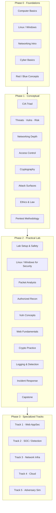

# Curriculum Progression

High-level path from absolute beginner to specialized tracks.

**Explanation:** Learners progress linearly through Phases 0–2. Phase 3 offers parallel specialized tracks; most learners pick one primary track (or a related pair such as Track 2 + Track 5 for purple-team focus).
