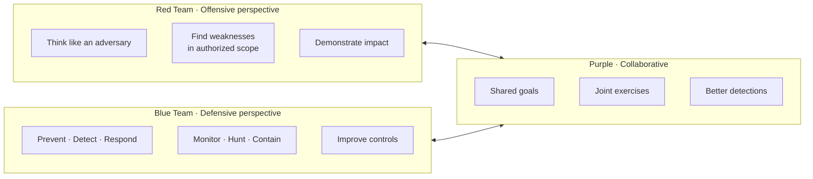

# Red Team vs Blue Team (Conceptual)

Introduced in Foundations; refined in later phases.

**Explanation:** In this curriculum, “red” activities are always performed against systems you own or have explicit written permission to test. Blue focuses on visibility and response. Purple combines both to improve the overall security posture of the lab environment.
