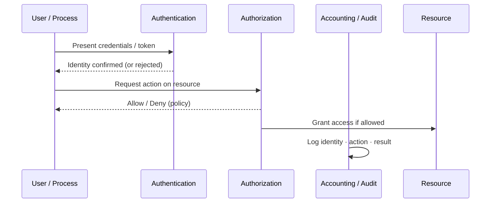

# Authentication · Authorization · Accounting (AAA)

**Explanation:**  
- **Authentication** answers “Who are you?”  
- **Authorization** answers “What are you allowed to do?”  
- **Accounting** records what happened for audit and detection.  

These three concepts appear throughout Phase-1 (access control), Phase-2 (logging), and Phase-3 (IAM, detection).
