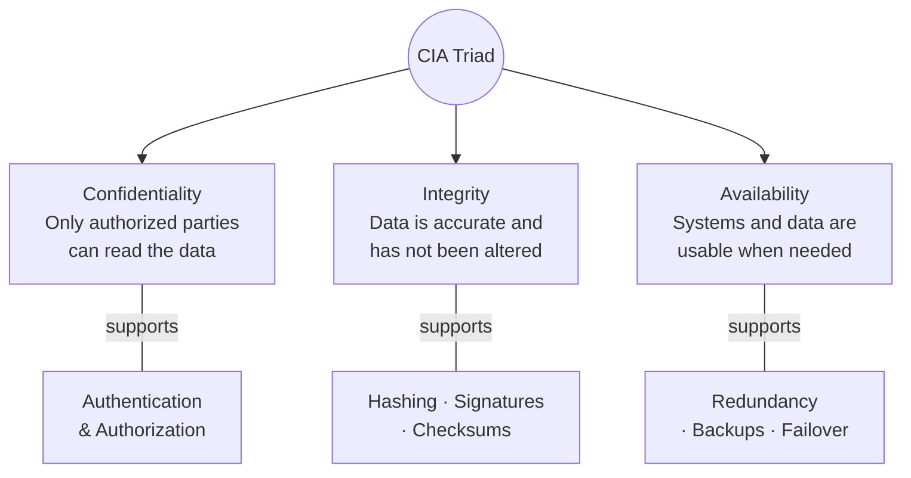

# CIA Triad

Core security goals taught in Phase-1.

**Explanation:** Every security control ultimately supports one or more of these three goals. When evaluating a control or an incident impact, ask which CIA properties are affected.
