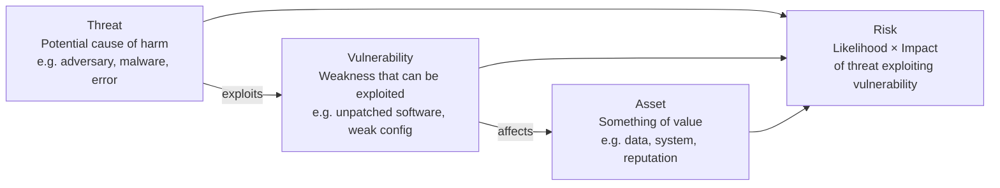

# Threat · Vulnerability · Risk Relationship

**Explanation:** Risk exists when a threat can exploit a vulnerability that affects an asset. Removing the vulnerability, reducing the threat, or lowering the value/impact of the asset all reduce risk. This model underpins prioritization in Phase-1 and vulnerability assessment in Phase-2.
