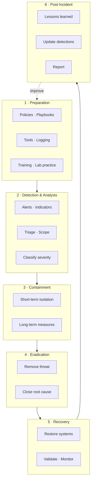

# Incident Response Lifecycle

Based on common industry models (NIST-style) used in Phase-2 Stage 10.

**Explanation:** Preparation is continuous. After every incident (or tabletop), feed lessons back into detection rules, playbooks, and training. In the curriculum, all practical IR steps are performed only against lab systems.
