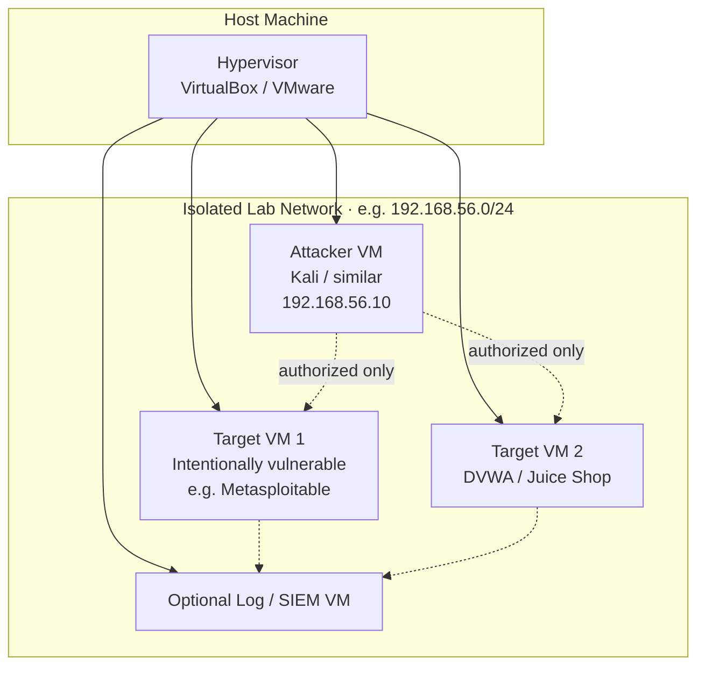

# Example Isolated Lab Topology

Recommended minimal layout for Phase-2 practical work.

**Explanation:** All offensive and defensive exercises stay inside the isolated lab network. No routing to the public internet for attack traffic. Snapshots before major changes are strongly recommended. This topology supports Phase-2 stages and Phase-3 tracks that require hands-on work.
