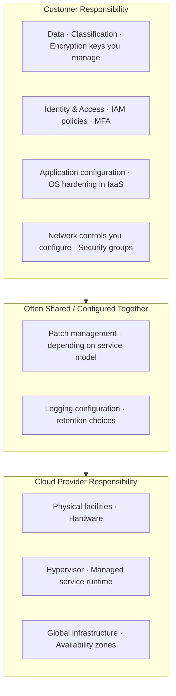

# Cloud Shared Responsibility (Conceptual)

Supports Phase-3 Track 4.

**Explanation:** Exact boundaries depend on IaaS vs PaaS vs SaaS. The diagram is a teaching model: the customer is always responsible for data, identity, and the configuration choices they make. Use provider documentation for precise service-level splits.
