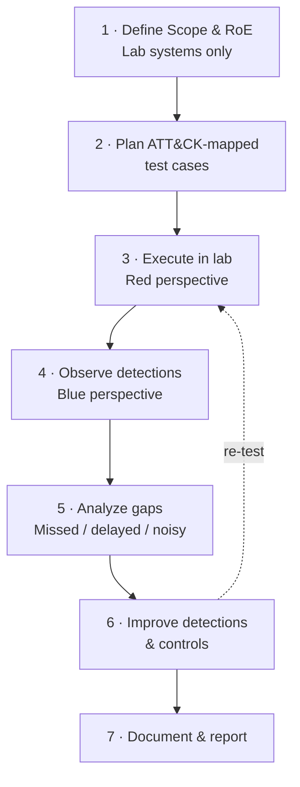

# Purple Team Loop

Supports Phase-3 Track 5 (Adversary Simulation) paired with Track 2 (SOC).

**Explanation:** Purple teaming is collaborative improvement, not pure competition. Every cycle stays inside the authorized lab boundary defined in the Rules of Engagement. Map each test case to ATT&CK technique IDs so results are comparable over time.
