# MITRE ATT&CK Enterprise · Tactic Flow (v19-aware)

Simplified left-to-right view of adversary goals. Not every intrusion uses every tactic.

```mermaid
flowchart LR
    REC[Reconnaissance] --> RES[Resource<br/>Development]
    RES --> IA[Initial Access]
    IA --> EXE[Execution]
    EXE --> PER[Persistence]
    PER --> PE[Privilege<br/>Escalation]
    PE --> ST[Stealth]
    PE --> DI[Defense<br/>Impairment]
    ST --> CA[Credential<br/>Access]
    DI --> CA
    CA --> DIS[Discovery]
    DIS --> LM[Lateral<br/>Movement]
    LM --> COL[Collection]
    COL --> C2[Command &<br/>Control]
    C2 --> EXF[Exfiltration]
    EXF --> IMP[Impact]

    style REC fill:#1a1a23,stroke:#6B7279,color:#fff
    style RES fill:#1a1a23,stroke:#6B7279,color:#fff
    style IA fill:#1a1a23,stroke:#6B7279,color:#fff
    style EXE fill:#1a1a23,stroke:#6B7279,color:#fff
    style PER fill:#1a1a23,stroke:#6B7279,color:#fff
    style PE fill:#1a1a23,stroke:#6B7279,color:#fff
    style ST fill:#2e2e3f,stroke:#6B7279,color:#fff
    style DI fill:#2e2e3f,stroke:#6B7279,color:#fff
    style CA fill:#1a1a23,stroke:#6B7279,color:#fff
    style DIS fill:#1a1a23,stroke:#6B7279,color:#fff
    style LM fill:#1a1a23,stroke:#6B7279,color:#fff
    style COL fill:#1a1a23,stroke:#6B7279,color:#fff
    style C2 fill:#1a1a23,stroke:#6B7279,color:#fff
    style EXF fill:#1a1a23,stroke:#6B7279,color:#fff
    style IMP fill:#1a1a23,stroke:#6B7279,color:#fff
```

**Explanation:**  
- **Stealth** and **Defense Impairment** replaced the single “Defense Evasion” tactic in ATT&CK v19.  
- Real intrusions skip, reorder, or repeat tactics.  
- Use this diagram for teaching the *why* of each stage; map concrete behaviors to technique IDs in `Lessons/*/MITRE-ATTCK-Enterprise/`.

**Related:** `Lessons/EN/MITRE-ATTCK-Enterprise/00_overview.md`
