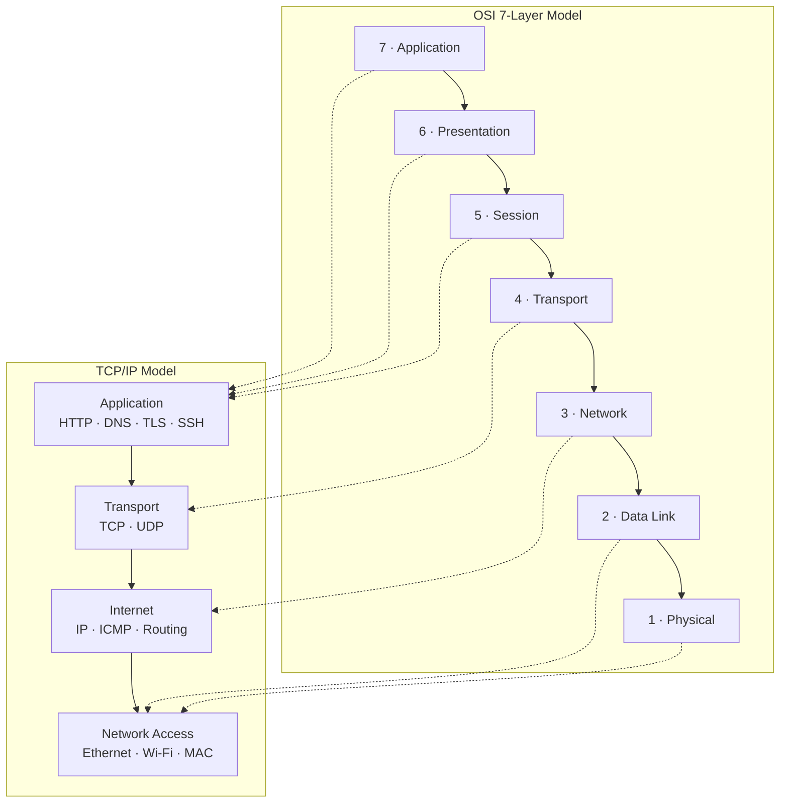

# OSI Model vs TCP/IP Model

Used in Foundations and Phase-1 networking lessons.

**Explanation:** The OSI model is a teaching and reference model; TCP/IP is the model actually used on the internet. Mapping between them helps place security controls (e.g., firewalls at Network/Internet, TLS at Application/Presentation, segmentation at Data Link/Network).
