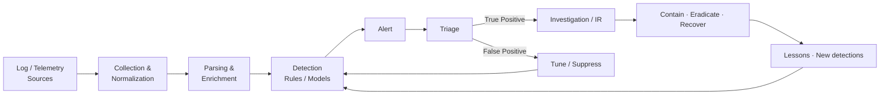

# SOC Detection Pipeline (Simplified)

Supports Phase-2 logging/detection and Phase-3 Track 2.

**Explanation:** Detection is a loop. False positives drive tuning; true positives drive investigation and, after resolution, new or improved detections. In the lab, practice each stage with controlled, authorized data.
