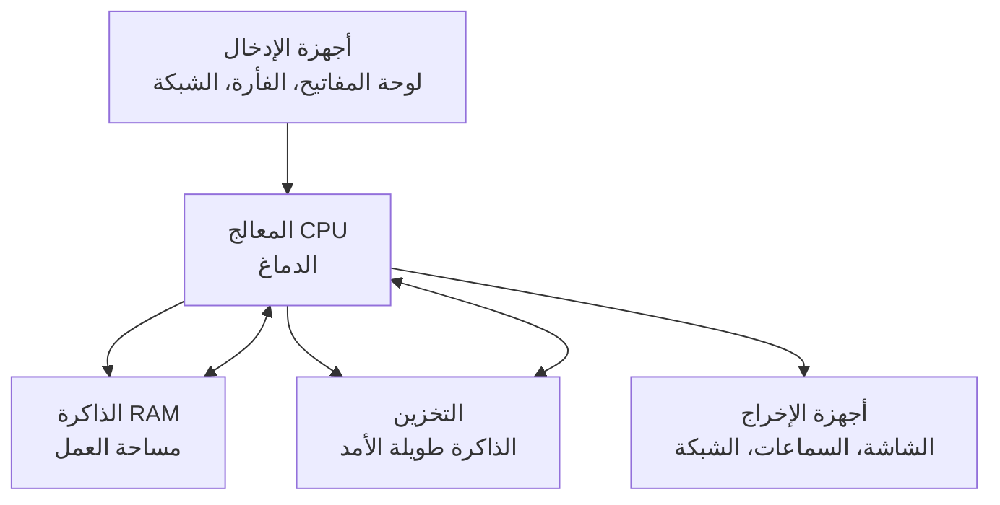

# المرحلة 0 · أساسيات الحاسوب

توفر هذه الوحدة النموذج الذهني الأساسي لكيفية عمل الحاسوب للمبتدئين تمامًا. كل ما يأتي لاحقًا في الأمن السيبراني يعتمد على هذه الأفكار.

---

## 1. هندسة الحاسوب (نظرة بسيطة)

الحاسوب آلة تتبع التعليمات. على أعلى مستوى يتكون من أربعة أجزاء رئيسية:

- **المعالج (CPU)** — ينفذ التعليمات واحدة تلو الأخرى.
- **الذاكرة العشوائية (RAM)** — مساحة عمل مؤقتة سريعة. تختفي محتوياتها عند انقطاع الكهرباء.
- **التخزين** — مكان دائم (أو شبه دائم) للبرامج والبيانات (SSD، HDD، USB، إلخ).
- **الإدخال / الإخراج** — طرق تواصل الحاسوب مع العالم الخارجي.

كل ما تفعله على الحاسوب يتحول في النهاية إلى تعليمات ينفذها المعالج باستخدام الذاكرة والتخزين.

---

## 2. كيف يعمل المعالج والذاكرة والتخزين معًا

### المعالج (CPU)
- يجلب تعليمة من الذاكرة.
- يفكك معناها.
- ينفذها (حساب، مقارنة، نقل بيانات، إلخ).
- ينتقل إلى التعليمة التالية.

المعالجات الحديثة تستطيع تنفيذ مليارات من هذه الخطوات الصغيرة في الثانية ولها نوى متعددة تعمل بالتوازي.

### الذاكرة (RAM)
- سريعة جدًا مقارنة بالتخزين.
- تحتفظ بنظام التشغيل والبرامج قيد التشغيل والبيانات التي تستخدمها حاليًا.
- محدودة الحجم. عندما تمتلئ يصبح النظام بطيئًا أو يبدأ باستخدام التخزين كفيضان طارئ (وهو أبطأ بكثير).

### التخزين
- يحتفظ بالبيانات حتى عند إيقاف تشغيل الحاسوب.
- أبطأ بكثير من الذاكرة.
- يأتي بتقنيات مختلفة (SSD أسرع من الأقراص الصلبة التقليدية).

**تشبيه يومي**  
فكر في المعالج كطاهٍ، والذاكرة كمنضدة المطبخ (وصول سريع للمكونات المستخدمة حاليًا)، والتخزين كالمخزن والثلاجة (مساحة كبيرة لكن أبطأ في الوصول).

---

## 3. نظام التشغيل والعمليات

**نظام التشغيل (OS)** هو البرنامج الرئيسي الذي يدير كل الأجهزة والبرمجيات. أمثلة شائعة: ويندوز، لينكس (أوبونتو، ديبيان، إلخ)، ماك.

المهام الرئيسية لنظام التشغيل:
- تشغيل وإيقاف البرامج.
- تحديد أي برنامج يحصل على المعالج ولمدة كم.
- إدارة الذاكرة والتخزين.
- توفير طريقة متسقة للبرامج للتحدث مع الأجهزة.
- فرض قواعد الأمن (من يمكنه فعل ماذا).

**العملية (Process)** هي نسخة قيد التشغيل من برنامج.  
يمكن لبرنامج واحد (مثل متصفح الويب) أن يكون له عمليات متعددة. كل عملية لها مساحة ذاكرة خاصة بها ومعزولة عن الأخرى للاستقرار والأمن.

---

## 4. الملفات والصلاحيات

كل شيء على الحاسوب يُخزن في النهاية كـ **ملفات** (مستندات، برامج، إعدادات، سجلات، إلخ).

**الصلاحيات** (تُسمى أيضًا الأذونات) تحدد:
- من يمكنه قراءة ملف.
- من يمكنه تعديل ملف.
- من يمكنه تشغيل برنامج.
- من يمكنه حذف شيء.

بدون الصلاحيات المناسبة، حتى المستخدم الشرعي قد يُمنع من أداء إجراءات معينة. هذا أحد أسس الأمن.

---

## 5. المستخدمون والمجموعات

- **المستخدم** هو هوية يمكنها تسجيل الدخول وامتلاك ملفات وعمليات.
- **المجموعة** هي مجموعة من المستخدمين يشاركون نفس الصلاحيات.

بدلًا من منح الصلاحيات لكل مستخدم فردي، يخصص المسؤولون الصلاحيات للمجموعات. ثم يُوضع المستخدمون في المجموعات المناسبة. هذا يتوسع بشكل أفضل بكثير في المؤسسات الحقيقية.

حسابات خاصة:
- **المسؤول / root** — لديه سيطرة كاملة (قوي جدًا، يجب استخدامه بحذر).
- **حسابات الخدمات** — تستخدمها البرامج وليس البشر.

---

## 6. الخدمات والمنافذ

**الخدمة** هي برنامج يعمل في الخلفية وينتظر لأداء عمل مفيد (خادم ويب، قاعدة بيانات، مشاركة ملفات، طباعة، إلخ).

غالبًا ما تستمع الخدمات على **منافذ**. المنفذ هو نقطة نهاية مرقمة على الحاسوب (0–65535).  
فكر في عنوان IP للحاسوب كعنوان الشارع للمبنى والمنفذ كرقم الشقة.

أمثلة شائعة (للفهم المفاهيمي فقط):
- حركة مرور الويب → المنافذ 80 / 443
- الإدارة عن بُعد → منافذ مختلفة حسب الأداة

معرفة الخدمات قيد التشغيل والمنافذ المفتوحة أساسية لكل من الدفاع وأعمال التقييم.

---

## 7. نموذج العميل / الخادم

تتبع معظم التطبيقات الشبكية نمط **العميل–الخادم**:

- **الخادم** ينتظر الطلبات ويوفر خدمة.
- **العميل** يبدأ الطلب ويستهلك الخدمة.

أمثلة:
- متصفح الويب (عميل) ↔ خادم الويب
- عميل البريد ↔ خادم البريد
- تطبيق الجوال ↔ واجهة برمجة خلفية

فهم من هو العميل ومن هو الخادم يساعد على التفكير في الثقة والمصادقة وأين يجب أن تجلس الضوابط الأمنية.

---

## 8. أساسيات الآلة الافتراضية

**الآلة الافتراضية (VM)** هي حاسوب كامل مُحاكى بالبرمجيات يعمل فوق حاسوب مادي حقيقي (المضيف).

فوائد ذات صلة بتعلم الأمن والعمل:
- يمكنك تشغيل أنظمة تشغيل مختلفة جنبًا إلى جنب.
- يمكنك إنشاء بيئات معزولة للاختبار.
- اللقطات تتيح لك العودة إلى حالة نظيفة بسرعة.
- الضرر داخل الآلة الافتراضية عادة محصور ولا يؤثر على المضيف.

تُستخدم الافتراضية بكثافة في مراكز البيانات الحديثة والحوسبة السحابية، وأيضًا من قبل محترفي الأمن للتجربة الآمنة.

---

**الخلاصة الرئيسية**  
الحاسوب هو معالج + ذاكرة + تخزين يديره نظام تشغيل يشغل عمليات تحت هوية مستخدمين، ويخزن كل شيء كملفات ذات صلاحيات، ويعرض خدمات على منافذ. العميل/الخادم والآلات الافتراضية هما الطريقتان الأكثر شيوعًا لتنظيم هذه القطع وعزلها في العالم الحقيقي.

تظهر هذه المفاهيم مرارًا وتكرارًا في لينكس وويندوز والشبكات وكل موضوع أمني سيبراني لاحق.