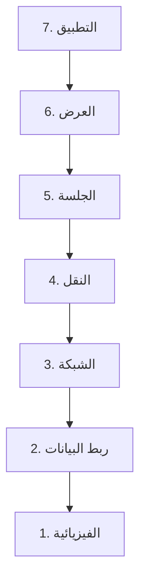

# المرحلة 0 · أساسيات الشبكات

الشبكات هي كيفية تواصل أجهزة الكمبيوتر مع بعضها. كل موضوع أمني سيبراني تقريبًا يتضمن في النهاية اتصالًا شبكيًا.

---

## 1. نموذج OSI

**نموذج OSI** إطار مفاهيمي يقسم التواصل الشبكي إلى سبع طبقات. يساعدنا على التحدث عن أين تجلس المشاكل والضوابط.

| الطبقة | الاسم | المهمة البسيطة |
|--------|------|----------------|
| 7 | التطبيق | ما يراه المستخدم أو البرنامج (HTTP، DNS، إلخ) |
| 6 | العرض | تنسيق البيانات، التشفير (غالبًا يجلس TLS هنا مفاهيميًا) |
| 5 | الجلسة | إدارة المحادثات |
| 4 | النقل | تسليم موثوق أو سريع (TCP / UDP) |
| 3 | الشبكة | العنونة والتوجيه (IP) |
| 2 | ربط البيانات | التسليم المحلي، عناوين MAC، التبديل |
| 1 | الفيزيائية | الكابلات، موجات الراديو، الإشارات الكهربائية |

لست بحاجة إلى حفظ كل تفصيل. معرفة الطبقة التي تنتمي إليها تقنية تساعد على التفكير في الضوابط الأمنية.

---

## 2. نموذج TCP/IP

في الممارسة تستخدم الصناعة **نموذج TCP/IP** الأبسط (أربع طبقات):

- التطبيق
- النقل
- الإنترنت
- الوصول إلى الشبكة

معظم النقاش في العالم الحقيقي يستخدم مزيجًا من مفردات OSI وTCP/IP.

---

## 3. IPv4 و IPv6

**عناوين IP** تحدد الأجهزة على شبكة.

- **IPv4** — عناوين 32 بت تُكتب كأربعة أرقام (مثل `192.168.1.10`). مساحة العناوين مستنفدة، لذا تُستخدم النطاقات الخاصة وNAT على نطاق واسع.
- **IPv6** — عناوين 128 بت، مساحة أكبر بكثير، تُكتب بست عشري مع نقطتين.

يمكن أن يتعايشا. يجب أن تتعامل أدوات الأمن والضوابط مع كليهما.

---

## 4. عناوين MAC

**عنوان MAC** معرف أجهزة محروق في واجهة شبكة (48 بت، عادة يُكتب كستة أزواج من الأرقام الست عشرية).  
يُستخدم في طبقة ربط البيانات للتسليم المحلي على جزء شبكة.

---

## 5. ARP

**ARP (بروتوكول حل العناوين)** يربط عنوان IP بعنوان MAC على شبكة محلية حتى يمكن تسليم الإطارات.  
هو آلية شبكة محلية أساسية وأيضًا نقطة اهتمام كلاسيكية للمهاجمين والمدافعين على حد سواء.

---

## 6. DNS

**DNS (نظام أسماء النطاقات)** يترجم الأسماء الودية للإنسان (`www.example.com`) إلى عناوين IP.  
هو هرمي وموزع. يمكن أن يؤدي اختراق أو التلاعب بـ DNS إلى إعادة توجيه المستخدمين إلى وجهات خبيثة، ولهذا فإن أمن DNS ومراقبته مهمان.

---

## 7. DHCP

**DHCP (بروتوكول التكوين الديناميكي للمضيف)** يعين تلقائيًا عناوين IP وإعدادات شبكة أخرى (البوابة، خوادم DNS، إلخ) للأجهزة عند انضمامها إلى شبكة.  
يبسط الإدارة بشكل كبير لكنه يعني أيضًا أن خادم DHCP خبيث يمكن أن يعطي العملاء إعدادات خطيرة.

---

## 8. TCP و UDP

**بروتوكولات طبقة النقل**:

| البروتوكول | الخصائص | الاستخدام النموذجي |
|------------|---------|-------------------|
| **TCP** | موجه للاتصال، موثوق، مرتب، له مصافحات وإقرارات | الويب، البريد، نقل الملفات، معظم التطبيقات التي تحتاج موثوقية |
| **UDP** | بلا اتصال، غير موثوق، عبء منخفض | بث الفيديو/الصوت، استعلامات DNS، الألعاب، أي شيء يفضل السرعة على التسليم المثالي |

غالبًا ما تتعامل الضوابط الأمنية مع TCP وUDP بشكل مختلف لأن سلوكهما وسطح هجومهما يختلفان.

---

## 9. HTTP و HTTPS

- **HTTP** — بروتوكول تطبيق الويب. الطلبات والردود عادة قابلة للقراءة.
- **HTTPS** — HTTP محمي بـ TLS. المحتوى مشفر أثناء النقل وهوية الخادم مصادقة عبر الشهادات.

معظم حركة مرور الويب الحديثة هي HTTPS.

---

## 10. TLS

**TLS (أمان طبقة النقل)** يوفر التشفير والسلامة والمصادقة للبيانات أثناء النقل.  
هو خليفة SSL الأقدم. يعتمد HTTPS وإرسال البريد الآمن والشبكات الافتراضية الخاصة والعديد من البروتوكولات الأخرى على TLS.

---

## 11. SSH

**SSH** توفر إدارة عن بُعد مشفرة ونقل ملفات. هي البديل الآمن القياسي للبروتوكولات القديمة ذات النص الواضح.

---

## 12. FTP

**FTP (بروتوكول نقل الملفات)** بروتوكول أقدم لنقل الملفات. يرسل FTP الكلاسيكي بيانات الاعتماد والبيانات كنص واضح؛ توجد متغيرات آمنة (FTPS، SFTP) ويجب تفضيلها.

---

## 13. SMTP

**SMTP (بروتوكول نقل البريد البسيط)** هو البروتوكول القياسي لإرسال البريد بين الخوادم. غالبًا ما يُجمع مع بروتوكولات أخرى للاسترجاع ومع TLS للحماية.

---

## 14. NAT

**NAT (ترجمة عناوين الشبكة)** تسمح للعديد من الأجهزة الخاصة بمشاركة عدد أصغر من عناوين IP العامة. شائعة جدًا في الشبكات المنزلية والمؤسسية. يغير NAT عنوان المصدر المرئي للحركة وله آثار تشغيلية وأمنية.

---

## 15. VLAN

**VLAN (شبكة محلية افتراضية)** تفصل منطقيًا الأجهزة التي تشارك نفس البنية التحتية الشبكية المادية.  
تُحسّن شبكات VLAN المستخدمة بشكل صحيح التقسيم وتحد من نطاق تأثير الحوادث.

---

## 16. التوجيه (Routing)

**التوجيه** هو عملية تحديد المسار الذي تأخذه الحزم بين الشبكات. تتبادل أجهزة التوجيه المعلومات (عبر بروتوكولات التوجيه) وتعيد توجيه الحزم نحو وجهتها.  
غالبًا ما تجلس أجهزة الأمن عند حدود التوجيه.

---

## 17. التبديل (Switching)

**المبدلات** تعيد توجيه الإطارات داخل شبكة محلية بناءً على عناوين MAC. تدعم المبدلات الحديثة شبكات VLAN وأمن المنافذ وضوابط أخرى تهم نظافة الشبكة.

---

## 18. الجدران النارية (Firewalls)

**الجدار الناري** يفرض قواعد حول أي حركة مرور مسموح لها بالمرور.  
يمكن أن تعمل الجدران النارية على طبقات مختلفة ويمكن أن تكون أجهزة أجهزة أو برمجيات على المضيفين أو خدمات سحابية. هي واحدة من أقدم وأهم الضوابط الأمنية وما زالت.

---

## 19. VPN

**VPN (الشبكة الافتراضية الخاصة)** تنشئ نفقًا مشفرًا عبر شبكة أقل ثقة (عادة الإنترنت).  
تُستخدم للوصول عن بُعد وربط المواقع بأمان. الحركة داخل النفق محمية بالتشفير (عادة IPsec أو قائم على TLS).

---

**الخلاصة الرئيسية**  
الشبكات طبقية. توجد عناوين على طبقات مختلفة (MAC، IP، المنافذ). لكل بروتوكول أساسي (TCP، UDP، DNS، HTTP/HTTPS، TLS، إلخ) خصائص أمنية مميزة. التقسيم (VLAN، الجدران النارية، NAT) والأنفاق المشفرة (VPN، TLS، SSH) لبنات دفاعية أساسية. تظهر هذه المفاهيم مرة أخرى في كل نقاش أمني لاحق تقريبًا.