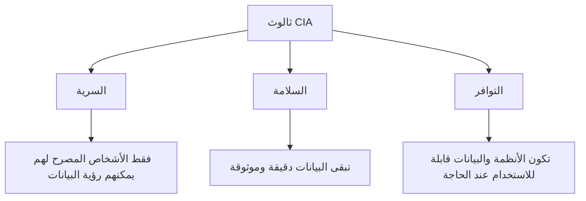

# المرحلة 2: ثالوث CIA والمفاهيم الأمنية الأساسية

## الأهداف الثلاثة الأساسية

تقريبًا كل تحكم أمني أو سياسة أو تقنية موجودة لدعم هدف واحد أو أكثر من ثلاثة أهداف. تُسمى معًا **ثالوث CIA**:

- **السرية (Confidentiality)**
- **السلامة / التكامل (Integrity)**
- **التوافر (Availability)**

هذه هي النجوم الشمالية للأمن السيبراني.

### 1. السرية (Confidentiality)

**المعنى:** المعلومات متاحة فقط للأشخاص (أو الأنظمة) المصرح لهم برؤيتها.

**تشبيه يومي:** الرسائل المختومة، المحادثات الخاصة، اليوميات المقفلة، السجلات الطبية التي يجب أن يراها الأطباء والمريض فقط.

**أمثلة على حماية السرية:**
- كلمات المرور والمصادقة متعددة العوامل
- التشفير (تحويل البيانات القابلة للقراءة إلى رمز غير قابل للقراءة)
- قواعد الوصول التي تحدد من يمكنه فتح ملفات معينة
- شاشات الخصوصية وسياسات المكتب النظيف

**ماذا يحدث عندما تفشل السرية:**  
تُكشف بيانات حساسة — تفاصيل شخصية، أسرار تجارية، معلومات مالية، إلخ.

### 2. السلامة / التكامل (Integrity)

**المعنى:** تبقى المعلومات دقيقة وكاملة وموثوقة. لم تُغيَّر بطريقة غير مصرح بها.

**تشبيه يومي:** كشف حساب بنكي يظهر كل معاملة بشكل صحيح، أو وصفة طبية لم يغيرها أحد إلا الطبيب.

**أمثلة على حماية السلامة:**
- المجاميع الاختبارية والتوقيعات الرقمية التي تكتشف إذا تم تعديل ملف
- التحكم في الإصدارات وسجلات التدقيق
- حماية الكتابة على السجلات المهمة
- التحقق من المدخلات (التأكد من أن البيانات المدخلة إلى النظام معقولة)

**ماذا يحدث عندما تفشل السلامة:**  
تُتخذ قرارات بناءً على معلومات خاطئة. يمكن نقل الأموال بشكل خاطئ، أو يمكن أن يستند العلاج الطبي إلى سجلات معدلة، أو يمكن أن يتصرف البرنامج بشكل غير متوقع.

### 3. التوافر (Availability)

**المعنى:** يمكن للمستخدمين المصرح لهم الوصول إلى الأنظمة والبيانات عندما يحتاجون إليها.

**تشبيه يومي:** متجر مفتوح خلال ساعات العمل، أو جسر يظل قابلاً للاستخدام لحركة المرور.

**أمثلة على حماية التوافر:**
- النسخ الاحتياطية وخطط الاستعادة
- الأنظمة الزائدة (خوادم إضافية أو مصادر طاقة)
- الحماية من الحمل الزائد (العرضي والمتعمد)
- الصيانة والتحديث المنتظم

**ماذا يحدث عندما يفشل التوافر:**  
لا يستطيع الناس أداء عملهم، لا يستطيع العملاء الوصول إلى الخدمات، قد تكون أنظمة الطوارئ غير قابلة للوصول.

## لماذا يهم الثالوث

الأمن هو دائمًا تقريبًا موازنة بين هذه الأهداف الثلاثة.

- جعل النظام *سريًا للغاية* (أقفال كثيرة، تشفير معقد، وصول محدود) يمكن أن يقلل التوافر.
- جعل النظام *متاحًا للغاية* (مفتوح للجميع، متصل دائمًا) يمكن أن يقلل السرية والسلامة.
- ضوابط السلامة القوية يمكن أن تبطئ الأنظمة أحيانًا.

التصميم الأمني الجيد يجد توازنًا مناسبًا للوضع المحدد. موقع ويب عام له أولويات مختلفة عن قاعدة بيانات استخبارات عسكرية.

## مفاهيم إضافية مهمة

### عدم الإنكار (Non-repudiation)
القدرة على إثبات أن شخصًا معينًا قام بفعل معين ولا يمكنه إنكاره لاحقًا. تدعم التوقيعات الرقمية وسجلات التدقيق المفصلة هذا.

### المصادقة مقابل التفويض
- **المصادقة (Authentication)** تجيب: "من أنت؟" (إثبات الهوية)
- **التفويض (Authorization)** يجيب: "ماذا يُسمح لك بفعله؟" (الصلاحيات)

عادة يجب المصادقة قبل تطبيق التفويض.

### الدفاع في العمق (Defense in Depth)
فكرة استخدام طبقات متعددة من الحماية بحيث إذا فشلت واحدة، تبقى الأخريات قائمة. مثل وجود سياج وباب مقفل وإنذار وخزنة داخل المنزل.

## ملخص

| الهدف | السؤال الأساسي | يبدو الفشل كـ |
|------|---------------|----------------|
| السرية | من يمكنه رؤيته؟ | الكشف غير المصرح به |
| السلامة | هل تم تغييره؟ | التعديل غير المصرح به |
| التوافر | هل يمكنني استخدامه عندما أحتاجه؟ | النظام أو البيانات غير متاحة |

كل ما تتعلمه لاحقًا في هذه السلسلة يخدم في النهاية واحدًا أو أكثر من هذه الأهداف الثلاثة.

---

**المرحلة التالية:** كيف تترابط التهديدات والثغرات والمخاطر.