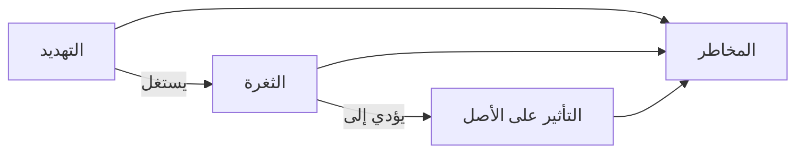

# المرحلة 3: التهديدات والثغرات والمخاطر

## العلاقة الأساسية

يفكر محترفو الأمن باستمرار من حيث ثلاث أفكار مترابطة:

- **التهديد (Threat)** هو سبب محتمل للضرر.
- **الثغرة (Vulnerability)** هي ضعف يجعل الضرر ممكنًا.
- **الأصل (Asset)** هو الشيء الثمين الذي يمكن أن يُضر.
- **المخاطر (Risk)** هي مزيج من مدى احتمالية الضرر ومدى شدة التأثير.

صيغة بسيطة تُستخدم مفاهيميًا غالبًا:

> **المخاطر ≈ الاحتمالية × التأثير**

(هناك طرق أكثر تطورًا لحساب المخاطر، لكن هذا يلتقط الفكرة الأساسية.)

## التهديدات

التهديد هو أي شيء يمكن أن يسبب ضررًا. يمكن أن تكون التهديدات:

| الفئة | أمثلة |
|-------|--------|
| **بشرية (خبيثة)** | مجرمو الإنترنت، موظفون داخليون يتصرفون بنية سيئة، جهات فاعلة تابعة لدول |
| **بشرية (عرضية)** | شخص ينقر على رابط سيء، يخطئ في تكوين نظام، يفقد جهاز كمبيوتر محمول |
| **تقنية** | أخطاء برمجية، أعطال أجهزة، انقطاعات الكهرباء |
| **بيئية / طبيعية** | فيضانات، حرائق، زلازل تؤثر على مراكز البيانات |
| **تنظيمية** | عمليات ضعيفة، نقص في التدريب، مسؤوليات غير واضحة |

مهم: ليس كل تهديد "قرصانًا". تبدأ العديد من الحوادث الخطيرة بأخطاء عادية أو أحداث طبيعية.

## الثغرات

الثغرة هي ضعف يمكن أن يستغله تهديد.

أمثلة (موصوفة على مستوى عالٍ فقط):

- برمجيات لم يتم تحديثها
- كلمات مرور ضعيفة أو معاد استخدامها
- أنظمة تُركت بإعدادات افتراضية
- غياب التشفير على البيانات الحساسة
- موظفون لم يتم تدريبهم على التعرف على الهندسة الاجتماعية
- وصول مادي سهل جدًا

توجد الثغرات في التكنولوجيا والعمليات والأشخاص.

## الأصول

أي شيء ذي قيمة تريد المؤسسة (أو الفرد) حمايته:

- البيانات (سجلات العملاء، الملكية الفكرية، المعلومات المالية)
- الأنظمة والأجهزة
- الخدمات والتطبيقات
- السمعة وثقة العملاء
- المرافق المادية التي تدعم العمليات الرقمية

تختلف الأصول في مستوى أهميتها. حماية موقع تسويقي عام عادة أقل أهمية من حماية قاعدة بيانات سجلات طبية.

## المخاطر

تجمع المخاطر القطع معًا. تسأل:

1. ما الذي يمكن أن يحدث خطأ؟ (تهديد + ثغرة)
2. ما مدى احتماليته؟
3. إذا حدث، ما مدى سوء العواقب؟

المخاطر ليست أبدًا صفرًا. الهدف العملي هو تقليل المخاطر إلى مستوى مستعد المؤسسة لقبوله (يُسمى **شهية المخاطر** أو **تحمل المخاطر**).

### خيارات معالجة المخاطر

بمجرد فهم المخاطر، تختار المؤسسات واحدًا أو أكثر من هذه الأساليب:

- **التجنب** — التوقف عن النشاط الذي يخلق المخاطر
- **التخفيف / التقليل** — إضافة ضوابط لخفض الاحتمالية أو التأثير
- **النقل** — تحويل المخاطر إلى شخص آخر (مثل التأمين، العقود)
- **القبول** — العيش مع المخاطر المتبقية عمدًا لأن المزيد من التقليل غير عملي

## لماذا يهم هذا النموذج

كل قرار أمني يمكن تتبعه إلى هذه الأسئلة:

- ما الذي نحميه؟ (الأصول)
- ما الذي يمكن أن يضره؟ (التهديدات)
- ما نقاط الضعف الموجودة؟ (الثغرات)
- ما مدى خطورة المزيج؟ (المخاطر)
- ماذا يجب أن نفعل حياله؟ (الضوابط / المعالجة)

هذا التفكير هو أساس إدارة المخاطر، وهو العمود الفقري المهني لبرامج الأمن السيبراني.

---

**المرحلة التالية:** كيف تعمل شبكات الكمبيوتر ولماذا يهم ذلك للأمن.