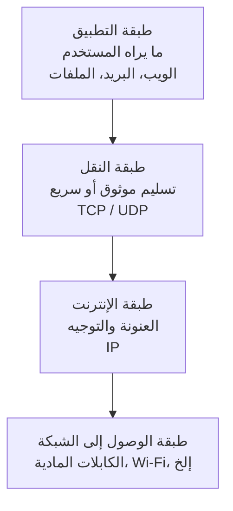

# المرحلة 4: أساسيات الشبكات (من منظور أمني)

## لماذا تهم الشبكات للأمن

تقريبًا كل نظام حديث متصل بأنظمة أخرى. الاتصال يخلق القيمة والمخاطر معًا. لفهم الأمن، تحتاج إلى نموذج ذهني أساسي لكيفية انتقال البيانات من مكان إلى آخر.

## أبسط صورة

عندما يريد جهازا كمبيوتر التواصل:

1. تُقسم البيانات إلى قطع صغيرة تُسمى **الحزم (Packets)**.
2. تُوسم كل حزمة بمعلومات المصدر والوجهة.
3. تسافر الحزم عبر شبكة واحدة أو أكثر.
4. يعيد جهاز الكمبيوتر المستقبل تجميع الحزم معًا.

يحدث هذا لصفحات الويب والبريد الإلكتروني ومكالمات الفيديو ونقل الملفات وكل شيء آخر تقريبًا.

## اللبنات الأساسية الرئيسية

### عنوان IP
تسمية رقمية تحدد جهازًا على شبكة (مشابه لعنوان الشارع).  
شكل مثال: `192.168.1.10` (IPv4) أو سلاسل أطول لـ IPv6.

### اسم النطاق (Domain Name)
اسم ودود للإنسان (مثل `example.com`) يُترجم إلى عنوان IP بواسطة نظام أسماء النطاقات (DNS).

### المنافذ (Ports)
فكر في المنافذ كأبواب مرقمة على جهاز الكمبيوتر. تستمع خدمات مختلفة على منافذ مختلفة.  
أمثلة شائعة (للفهم المفاهيمي فقط):
- حركة مرور الويب غالبًا تستخدم المنفذ 80 أو 443
- البريد الإلكتروني له منافذه التقليدية الخاصة

معرفة المنافذ المفتوحة تساعد المدافعين على فهم الخدمات المعرضة.

### البروتوكولات
قواعد متفق عليها للتواصل. العائلة الأهم هي **TCP/IP**.  
- **TCP** يوفر تسليمًا موثوقًا ومرتبًا.
- **UDP** أسرع لكنه أقل موثوقية.
- البروتوكولات ذات المستوى الأعلى (HTTP، HTTPS، إلخ) تجلس فوق هذه.

## رؤية طبقية (مبسطة)

تُوصف الشبكات غالبًا في طبقات. نسخة مبسطة جدًا مفيدة للتفكير الأمني:

يمكن تطبيق الضوابط الأمنية على طبقات مختلفة.

## الشبكات المحلية مقابل الإنترنت

- **الشبكة المحلية (LAN)** — أجهزة في نفس المبنى أو المنزل، عادة أكثر ثقة.
- **الشبكة الواسعة (WAN) / الإنترنت** — الشبكة العامة العالمية. الحركة التي تعبرها تُعتبر عمومًا غير موثوقة.

نمط دفاعي شائع هو وضع الأنظمة الأضعف أو المواجهة للعامة في منطقة شبه معزولة والاحتفاظ بالأنظمة الأكثر حساسية أعمق في الداخل.

## لماذا يهم هذا للأمن

- يهتم المهاجمون والمدافعون على حد سواء بـ **ما يمكن الوصول إليه** من أين.
- تتضمن العديد من الهجمات إرسال بيانات غير متوقعة أو خبيثة عبر الشبكة.
- فهم أنماط الحركة الطبيعية يساعد على اكتشاف غير الطبيعية.
- قرارات تصميم الشبكة (التقسيم، التصفية، التشفير أثناء النقل) تؤثر مباشرة على السرية والسلامة والتوافر.

لست بحاجة لأن تصبح مهندس شبكات. تحتاج فقط إلى مفردات كافية لفهم أين تجلس الضوابط الأمنية ولماذا بعض التصاميم أكثر أمانًا من غيرها.

---

**المرحلة التالية:** كيف نقرر من يُسمح له بفعل ماذا — التحكم في الوصول والهوية.