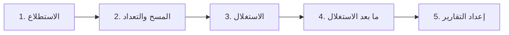

# المرحلة 9: منهجية اختبار الاختراق

## ما هو اختبار الاختراق

**اختبار الاختراق** (غالبًا يُختصر إلى "اختبار الاختراق" أو "Pentest") هو تقييم مصرح به ومحدود زمنيًا يحاكي أفعال مهاجم حقيقي من أجل اكتشاف وإظهار نقاط الضعف الأمنية.

غرضه **ليس** التسبب في ضرر. غرضه إعطاء المؤسسة صورة واقعية عن المخاطر حتى يمكن إصلاح نقاط الضعف قبل أن يجدها خصم حقيقي.

تصف هذه المرحلة العملية الكلاسيكية عالية المستوى. تبقى على المستوى المفاهيمي والمنهجي فقط.

## المراحل الخمس الكلاسيكية

تتبع معظم اختبارات الاختراق المهنية دورة حياة منظمة. بينما تختلف الأسماء والحدود الدقيقة قليلاً بين المنهجيات، فإن المراحل الخمس التالية معترف بها على نطاق واسع:

### المرحلة 1: الاستطلاع (جمع المعلومات)

**الهدف:** تعلم أكبر قدر ممكن عن بيئة الهدف باستخدام مصادر عامة ومصرح بها.

**الأنشطة عالية المستوى (مفاهيمية):**
- جمع المعلومات المتاحة للجمهور عن المؤسسة وتقنياتها وحضورها عبر الإنترنت.
- تحديد نقاط الدخول المحتملة والتقنيات المستخدمة.
- رسم الهيكل الظاهر للهدف (النطاقات، الشركات ذات الصلة، الخدمات العامة، إلخ).

**لماذا يهم:** يبدأ الخصوم الحقيقيون أيضًا بتعلم عن أهدافهم. فهم ما هو مرئي من الخارج يساعد على تحديد أولويات العمل اللاحق ويكشف معلومات ربما لا ينبغي أن تكون عامة.

**ملاحظة مهمة:** في مشاركة مهنية تقتصر هذه المرحلة على النطاق المتفق عليه وقواعد المشاركة. المعلومات مفتوحة المصدر (العامة) عادة مسموح بها؛ قد يُسمح أو لا يُسمح بالفحص النشط للأنظمة في هذه المرحلة حسب العقد.

### المرحلة 2: المسح والتعداد

**الهدف:** اكتشاف الأنظمة الحية والخدمات والنقاط المحتملة ذات الاهتمام ضمن النطاق المصرح به.

**الأنشطة عالية المستوى (مفاهيمية):**
- تحديد الأنظمة التي تستجيب على الشبكة.
- تحديد الخدمات التي يبدو أنها تعمل.
- جمع معلومات أكثر تفصيلاً عن تلك الخدمات وإصدارات البرمجيات المستخدمة (ما زال على مستوى الاكتشاف).

**لماذا يهم:** لا يمكنك تقييم ما لا يمكنك رؤيته. تبني هذه المرحلة خريطة أوضح لسطح الهجوم الذي يمكن الوصول إليه فعليًا.

**الموازاة الدفاعية:** تقوم المؤسسات باكتشاف مماثل بشكل مستمر كجزء من برامج إدارة الأصول وإدارة الثغرات.

### المرحلة 3: الاستغلال

**الهدف:** تحديد ما إذا كان يمكن استخدام نقاط الضعف المحددة فعليًا للحصول على وصول غير مصرح به أو تحقيق تأثيرات غير مصرح بها أخرى — ضمن الحدود الصارمة لقواعد المشاركة.

**طبيعة المرحلة عالية المستوى:**
- يحاول المختبرون إظهار التأثير بطريقة محكومة وغير مدمرة كلما أمكن.
- التركيز على إثبات أن نقطة الضعف حقيقية وفهم ما يمكن أن يحققه المهاجم.
- تتوقف العديد من النتائج المحتملة عند مرحلة "إثبات المفهوم" بدلاً من الاختراق الكامل، خاصة عندما يكون الهدف إظهار المخاطر بدلاً من أقصى ضرر.

**قيود حرجة:**
- فقط التقنيات والأهداف المدرجة في قواعد المشاركة مسموح بها.
- يُحرص على تجنب إلحاق الضرر بأنظمة الإنتاج أو البيانات.
- أي شيء يبدو أنه من المحتمل أن يسبب انقطاعًا أو فقدان بيانات يُناقش عادة مع العميل أولاً أو يُتجنب.

هذه المرحلة هي حيث تكون الحدود الأخلاقية والقانونية التي نوقشت في المرحلة 8 الأكثر أهمية.

### المرحلة 4: ما بعد الاستغلال

**الهدف:** فهم التأثير المحتمل بعد اكتساب موطئ قدم أولي (مرة أخرى، ضمن التفويض الصارم).

**أسئلة عالية المستوى يستكشفها المختبر:**
- إلى أي مدى يمكن للمهاجم التحرك من نقطة الدخول الأولية؟
- ما البيانات أو الأنظمة الحساسة تصبح قابلة للوصول؟
- هل هناك فرص للحفاظ على الوصول أو تصعيد التأثير؟
- ما المطلوب للمؤسسة للكشف والاستجابة؟

**الغرض:** إظهار التأثير التجاري بدلاً من مجرد ثغرة تقنية. خدمة ضعيفة واحدة أكثر إثارة للقلق إذا أدت إلى بيانات التاج الثمينة للمؤسسة.

**ملاحظة:** في العديد من المشاركات تقتصر هذه المرحلة بعناية. تُحجز تمارين "الهيمنة على النطاق" الكاملة لمشاركات الفريق الأحمر أو محاكاة الخصم المحددة ذات التفويض الأوسع.

### المرحلة 5: إعداد التقارير

**الهدف:** توصيل النتائج بوضوح حتى تتمكن المؤسسة من فهم المخاطر واتخاذ إجراء.

يتضمن التقرير المهني عادة:

- ملخص تنفيذي مكتوب للقيادة غير التقنية
- نتائج تقنية مفصلة مع أدلة
- تصنيفات المخاطر (غالبًا بناءً على الاحتمالية والتأثير)
- توصيات إصلاح واضحة
- النطاق والمنهجية وقيود الاختبار
- ملاحظات إيجابية (ما تم إنجازه بشكل جيد)

التقرير هو التسليم الأساسي. الاختبار الذي يكتشف قضايا مهمة لكنه يفشل في توصيلها بشكل مفيد له قيمة محدودة.

## أنشطة داعمة عبر دورة الحياة

- **التخطيط وتحديد النطاق** يحدثان قبل المرحلة 1. الاتفاق الكتابي الواضح على الأهداف والتوقيت والتقنيات المسموح بها وجهات اتصال الطوارئ ومعايير النجاح ضروري.
- **التواصل** يستمر طوال الوقت. يبقى المختبرون وجهات اتصال العميل على اتصال، خاصة إذا تم اكتشاف شيء غير متوقع أو عالي التأثير.
- **التنظيف** يحدث في النهاية: تُزال أي حسابات مؤقتة أو ملفات أو تغييرات أُجريت أثناء الاختبار، وتُعاد البيئة إلى حالتها السابقة قدر الإمكان.

## أنواع مختلفة من الاختبارات (طيف مفاهيمي)

| النوع | المعرفة المعطاة للمختبرين | الاستخدام النموذجي |
|------|---------------------------|-------------------|
| الصندوق الأسود | لا شيء تقريبًا | يحاكي مهاجمًا خارجيًا بقليل من المعرفة المسبقة |
| الصندوق الرمادي | معلومات جزئية (مثل بعض بيانات الاعتماد أو مخططات الهندسة المعمارية) | توازن بين الواقعية والكفاءة |
| الصندوق الأبيض | معلومات واسعة (كود المصدر، المخططات، بيانات الاعتماد) | تغطية شاملة، غالبًا تُستخدم للتطبيقات |

هناك أيضًا متغيرات متخصصة (اختبارات تطبيقات الويب، اختبارات الهاتف المحمول، اختبارات لاسلكية، اختبارات مادية، اختبارات الهندسة الاجتماعية، تمارين الفريق الأحمر، إلخ). كلها ما زالت تستند إلى نفس الأساس الأخلاقي: التفويض والقواعد الواضحة.

## كيف يتناسب هذا مع المراحل السابقة

- **ثالوث CIA** — تُقيَّم النتائج بتأثيرها على السرية والسلامة والتوافر.
- **المخاطر** — تُوضع كل نتيجة في سياق المخاطر (الاحتمالية × التأثير).
- **سطح الهجوم** — يستكشف الاختبار الجزء المصرح به من سطح الهجوم.
- **الأخلاقيات والقانون** — كل مرحلة مقيدة بالإذن والمسؤولية المهنية.

## منظور نهائي

اختبار الاختراق هو شكل منظم ومصرح به من التفكير الخصومي. عندما يُؤدى بمهنية فهو واحد من أكثر الطرق فعالية لمؤسسة لتتعلم كيف تصمد دفاعاتها أمام ضغط واقعي.

ليس سحرًا، وليس غير محدود، وليس أبدًا بديلاً عن ممارسات الأمن المستمرة (التصميم الآمن، التصحيح، المراقبة، التدريب، إلخ). إنه أداة مهمة واحدة في برنامج أمني أكبر.

---

## نهاية السلسلة

لقد سرت الآن من التعريفات الأساسية للأمن السيبراني عبر المبادئ الأساسية، ولغة المخاطر، واللبنات الأساسية للشبكات والتشفير، ومفهوم سطح الهجوم، والحدود الأخلاقية والقانونية، وأخيرًا المنهجية عالية المستوى لاختبار الاختراق المهني.

هذه الأساس يعدك لفهم مواد أكثر تقدمًا، ومناقشات مهنية، وتدريب رسمي إضافي — دائمًا ضمن الحدود القانونية والأخلاقية.