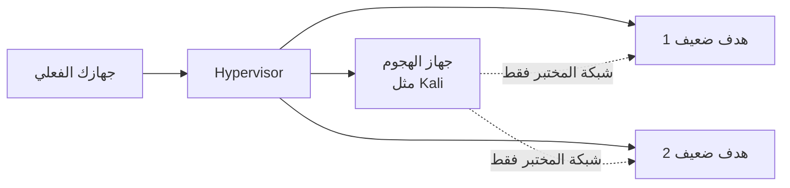

# المرحلة 1: إعداد المختبر والسلامة

## لماذا تأتي هذه المرحلة أولاً

في المرحلة 1 تعلمت *ما* هو الأمن السيبراني و*لماذا* يعمل المحترفون بالطريقة التي يعملون بها.  
في المرحلة 2 ستبدأ باستخدام أدوات حقيقية. قبل تثبيت أي أداة أو إرسال أي حزمة، يجب أن يكون لديك **مختبر معزول وآمن** وفهم واضح للحدود القانونية والأخلاقية.

العمل دون مختبر مناسب هو أسرع طريق لارتكاب أخطاء خطيرة — مسح الشبكة الخاطئة، التأثير على أنظمة الإنتاج، أو تجاوز الخطوط القانونية دون قصد.

هذه المرحلة تمنحك الأساس الذي تعتمد عليه كل التمارين العملية اللاحقة.

---

## أهداف التعلم

بنهاية هذه المرحلة ستكون قادرًا على:

- شرح لماذا المختبر المعزول إلزامي لتعلم الأمن العملي
- سرد المكونات الأساسية لمختبر منزلي آمن بحد أدنى
- اختيار وتثبيت برنامج الافتراضية (Hypervisor)
- إنشاء وتكوين أجهزة افتراضية لأدوار الهجوم والأهداف
- تطبيق عزل الشبكة الأساسي حتى تبقى حركة المختبر داخل المختبر
- ذكر القواعد القانونية والأخلاقية غير القابلة للتفاوض التي تحكم كل تمرين
- التعرف على تحذيرات "نقطة التحقق الأمني" ومعرفة كيفية التعامل معها

---

## 1. ما هو مختبر الأمن؟

**المختبر الأمني** (أو "المختبر المنزلي") هو مجموعة من الأجهزة الافتراضية والشبكات التي تتحكم بها بالكامل. يوجد حتى تتمكن من:

- ممارسة الاستطلاع والمسح والتحليل والتقنيات الدفاعية
- كسر الأشياء عمدًا ثم إصلاحها
- ارتكاب الأخطاء دون الإضرار بمستخدمين حقيقيين أو بيانات حقيقية أو مؤسسات حقيقية

فكر فيه كورشة مغلقة. كل ما يحدث بداخله يبقى بداخله.



الفكرة الأساسية: يمكن لجهاز الهجوم التحدث إلى أجهزة الأهداف، لكن لا ينبغي لأي منهما أن يصل إلى (أو يُوصل إليه من) الإنترنت العام بطرق قد تسبب ضررًا.

---

## 2. مكدس المختبر الأدنى الموصى به

لا تحتاج إلى أجهزة باهظة الثمن. حاسوب محمول حديث بذاكرة 16 جيجابايت (8 جيجابايت كحد أدنى) ومساحة قرص كافية كافية للبدء.

| المكون | الاختيار الموصى به | الغرض |
|--------|---------------------|-------|
| **برنامج الافتراضية** | VirtualBox (مجاني) أو VMware Workstation Player | تشغيل الأجهزة الافتراضية |
| **جهاز الهجوم** | Kali Linux (أو Parrot Security OS) | يحتوي على الأدوات التي ستتعلمها |
| **أجهزة الأهداف** | Metasploitable 2/3 أو DVWA أو OWASP Juice Shop أو أجهزة ضعيفة عمدًا مشابهة | أنظمة آمنة مصممة للفحص والاختبار |
| **اختياري للفريق الأزرق** | مكدس سجلات بسيط أو Security Onion (لاحقًا) | لتمارين الكشف وتحليل السجلات |

جميع الأهداف الموصى بها **ضعيفة عمدًا**. يتم نشرها خصيصًا للتدريب. استخدامها داخل مختبرك المعزول مناسب ومتوقع.

---

## 3. تثبيت برنامج الافتراضية

1. حمّل VirtualBox (أو VMware Workstation Player) من الموقع الرسمي.
2. ثبّته باستخدام المثبت العادي لنظام التشغيل لديك.
3. بعد التثبيت، افتح البرنامج وتأكد أنه يعمل دون أخطاء.

**نصيحة:** فعّل دعم الافتراضية في BIOS/UEFI إذا اشتكى البرنامج من عدم توفر تسريع الأجهزة. الخطوات الدقيقة تعتمد على الشركة المصنعة للوحة الأم.

---

## 4. إنشاء الأجهزة الافتراضية

### جهاز الهجوم (Kali)

- حمّل صورة الجهاز الافتراضي الرسمية لـ Kali Linux أو ملف ISO من موقع Kali.
- أنشئ جهازًا افتراضيًا جديدًا وخصص:
  - على الأقل 2 جيجابايت من الذاكرة (4 جيجابايت مفضلة)
  - 20+ جيجابايت من مساحة القرص
  - محولي شبكة (يُشرح أدناه)
- ثبّت أو استورد Kali وأكمل الإعداد الأولي.
- التقط **لقطة (Snapshot)** فورًا بعد أول تشغيل ناجح. هذا يسمح لك بالعودة إلى حالة نظيفة لاحقًا.

### أجهزة الأهداف

- حمّل صورة أو أكثر من الأنظمة الضعيفة عمدًا (Metasploitable أو DVWA أو Juice Shop وغيرها).
- استورد أو أنشئ كلًا منها كجهاز افتراضي منفصل.
- أعطِ كل هدف موارد متواضعة (1–2 جيجابايت من الذاكرة عادة كافية).
- التقط لقطة لكل هدف وهو لا يزال في حالته الضعيفة الأصلية.

**مهم:** لا تعرض هذه الأجهزة الضعيفة مباشرة على الإنترنت العام أبدًا.

---

## 5. عزل الشبكة (حاسم)

بشكل افتراضي تمنح العديد من برامج الافتراضية الأجهزة الافتراضية وصولًا إلى نفس شبكة جهازك الفعلي. في مختبر الأمن هذا عادة غير مرغوب فيه.

التكوين البسيط الموصى به:

| المحول | النوع | الغرض |
|--------|-------|-------|
| المحول 1 (الهجوم) | NAT أو NAT Network | يسمح لجهاز الهجوم بتنزيل التحديثات والأدوات |
| المحول 2 (الهجوم) | Host-Only أو Internal Network | شبكة خاصة مشتركة فقط مع أجهزة الأهداف |
| أجهزة الأهداف | Host-Only أو Internal Network (نفس المحول 2) | يمكن الوصول إليها من جهاز الهجوم، ولا يمكنها الوصول إلى الإنترنت |

بهذا التخطيط:

- يمكن لجهاز الهجوم تحديث نفسه والوصول إلى الأهداف.
- لا يمكن للأهداف بدء اتصالات بالعالم الخارجي.
- تبقى شبكتك المنزلية والإنترنت العام محميين من المسح العرضي أو التكوينات الخاطئة.

تحقق دائمًا من العزل قبل بدء أي تمرين نشط.

---

## 6. القواعد القانونية والأخلاقية (غير قابلة للتفاوض)

هذه القواعد تنطبق على كل تمرين في المرحلة 2 وما بعدها:

1. **فقط الأنظمة التي تملكها أو لديك إذن كتابي صريح باختبارها**  
   أجهزة المختبر الافتراضية مقبولة. شبكة الجار اللاسلكية أو موقع شركة عام أو خادم سحابي لا تتحكم به غير مقبولة.

2. **لا تمسح أو تهاجم أنظمة على الإنترنت العام أبدًا** كجزء من هذه الدروس  
   حتى "التحقق فقط" يمكن تفسيره على أنه وصول غير مصرح به بموجب العديد من القوانين.

3. **التفويض مطلوب**  
   في العمل المهني يكون هذا وثيقة قواعد الاشتباك الموقعة. في مختبرك التفويض هو حقيقة أنك تملك وتتحكم بالأجهزة الافتراضية.

4. **عند الشك، توقف**  
   إذا لم تكن متأكدًا مما إذا كان إجراء معين مسموحًا، لا تنفذه. اسأل مرشدًا أو مدربًا أو متخصصًا قانونيًا.

5. **وثّق ما تفعله**  
   احتفظ بملاحظات عن الأنظمة التي اختبرتها والتواريخ والنطاق. تصبح هذه العادة ضرورية في المهام المهنية.

الوصول غير المصرح به إلى أنظمة الحاسوب جريمة في جميع الولايات القضائية تقريبًا. المهارات التي تتعلمها قوية؛ والمسؤولية التي تأتي معها كبيرة بنفس القدر.

---

## 7. نقاط التحقق الأمني

طوال المراحل المتبقية من المرحلة 2 ستظهر أقسام تحمل علامة **نقطة التحقق الأمني**.

نقطة التحقق الأمني تعني:

- توقف.
- تأكد أنك تعمل فقط ضد أنظمة داخل مختبرك المعزول.
- تأكد أن تكوين الشبكة لم يتغير.
- تأكد أنك تفهم ما ستفعله الأوامر التالية.

لا تتخطى نقطة التحقق الأمني أبدًا. عاملها كإشارة توقف إلزامية.

---

## 8. عادة دفتر ملاحظات المختبر

ابدأ دفتر ملاحظات بسيط (رقمي أو ورقي) وسجّل:

- تاريخ ووقت كل جلسة
- الأجهزة الافتراضية التي كانت تعمل
- الأوامر التي شغّلتها والناتج الذي لاحظته
- أي شيء غير متوقع
- الأسئلة التي تظهر

يصبح هذا الدفتر قيمًا عندما تكتب تقارير لاحقًا أو تستعد للشهادات. كما يساعدك على ملاحظة الأنماط والتقدم.

---

## أخطاء شائعة يجب تجنبها

| الخطأ | لماذا هو خطير | النهج الأفضل |
|-------|---------------|--------------|
| توصيل الأهداف الضعيفة بالإنترنت | يمكن للمهاجمين الحقيقيين العثور عليها واختراقها | أبقِ الأهداف على شبكات Host-Only / Internal |
| مسح جهاز التوجيه المنزلي أو معدات مزود الخدمة | قد ينتهك شروط الخدمة أو القانون المحلي | قصِر كل الاختبارات النشطة على أجهزة المختبر |
| تخطي اللقطات | خطأ واحد قد يجبرك على إعادة التثبيت بالكامل | التقط لقطة قبل كل تغيير كبير |
| استخدام المختبر وأنت متعب أو مشتت | يزيد من فرصة استهداف النظام الخاطئ | اعمل فقط عندما تكون مركزًا؛ تحقق مرتين من عناوين IP |
| مشاركة لقطات شاشة تحتوي على عناوين IP خارجية حقيقية | قد تكشف عن معلومات شخصية أو مؤسسية بالخطأ | احذف أو استخدم فقط عناوين داخل المختبر |

---

## أفضل الممارسات

- التقط اللقطات بسخاء. مساحة القرص أرخص من إعادة بناء المختبر.
- أبقِ جهاز الهجوم محدثًا، لكن جمّد أجهزة الأهداف في حالتها الضعيفة.
- استخدم أسماء واضحة للأجهزة (مثل `Kali-Attacker` و`Metasploitable-Target` و`JuiceShop-Web`).
- أوقف الأجهزة بشكل نظيف عند انتهاء اليوم.
- تحقق دوريًا من أن شبكات Host-Only / Internal لا تزال معزولة.
- لا تخزن أبدًا بيانات اعتماد حقيقية أو بيانات شخصية أو مفاتيح إنتاج داخل أجهزة المختبر.

---

## تمرين عملي

## أكواد عملية (Codes/)

| السكربت | الغرض |
|--------|--------|
| `Codes/Bash/01_lab_setup/lab_snapshot_reminder.sh` | طباعة قائمة تحقق السلامة قبل التغيير |
| `Codes/Bash/01_lab_setup/check_lab_connectivity.sh` | فحص ping ومنافذ TCP سريعة لعنوان مختبر |
| `Codes/Python/01_lab_setup/check_lab_ports.py` | فحص المنافذ الشائعة على هدف مختبر |

```bash
chmod +x Codes/Bash/01_lab_setup/*.sh
./Codes/Bash/01_lab_setup/lab_snapshot_reminder.sh
./Codes/Bash/01_lab_setup/check_lab_connectivity.sh 192.168.56.10
python3 Codes/Python/01_lab_setup/check_lab_ports.py 192.168.56.10
```

استبدل `192.168.56.10` بعنوان IP ينتمي إلى شبكة **مختبرك** فقط.


1. ثبّت برنامج الافتراضية إذا لم تكن قد فعلت ذلك بالفعل.
2. أنشئ جهاز هجوم افتراضي واحد وجهاز هدف ضعيف عمدًا واحد.
3. كوّن الشبكة بحيث يتمكن جهاز الهجوم من الوصول إلى الهدف على شبكة خاصة بينما لا يملك الهدف وصولًا مباشرًا إلى الإنترنت.
4. التقط لقطة لكلا الجهازين.
5. من جهاز الهجوم، تأكد أنك تستطيع إرسال ping إلى عنوان IP الخاص بالهدف داخل المختبر.
6. اكتب إدخالًا قصيرًا في دفتر ملاحظات المختبر يصف الإعداد وعناوين IP التي استخدمتها.

**معايير النجاح:** تستطيع الوصول إلى الهدف من جهاز الهجوم، والهدف لا يستطيع الوصول إلى الإنترنت العام، ولديك لقطات تعمل.

---

## أسئلة للمراجعة

1. لماذا يجب تنفيذ تمارين الأمن العملية داخل مختبر معزول؟
2. ما الغرض من محول شبكة من نوع Host-Only أو Internal في مختبر الأمن؟
3. اذكر ثلاثة أنظمة ضعيفة عمدًا مناسبة لمختبر تدريبي.
4. ماذا يجب أن تفعل إذا لم تكن متأكدًا مما إذا كان نظام معين ضمن النطاق؟
5. لماذا يُوصى باللقطات قبل التغييرات الكبيرة أو التمارين الجديدة؟
6. ما هي نقطة التحقق الأمني وكيف يجب أن تتعامل معها؟

---

## الملخص

- المختبر الآمن المعزول هو أساس كل العمل العملي في المرحلة 2.
- المكدس الأدنى هو برنامج افتراضية + جهاز هجوم + هدف أو أكثر ضعيف عمدًا.
- عزل الشبكة يبقي حركة المختبر داخل المختبر.
- القواعد القانونية والأخلاقية غير قابلة للتفاوض: فقط الأنظمة التي تملكها أو لديك إذن صريح باختبارها.
- نقاط التحقق الأمني ودفتر ملاحظات المختبر عادات تحميك وتحسن التعلم.
- بمجرد أن يصبح المختبر جاهزًا، يمكنك الانتقال بثقة إلى المراحل التالية.

**المرحلة التالية:** مهارات Linux المتوسطة لممارسي الأمن — نظام التشغيل الذي تعمل عليه معظم أدوات الأمن.
