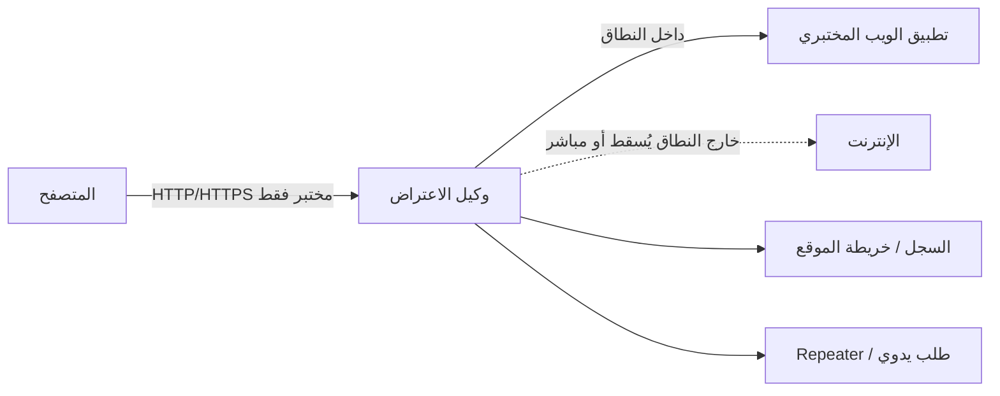

# المسار 1 · المرحلة 1.2 — رسم الخرائط وسير عمل الوكيل

## لماذا هذه المرحلة مهمة

لا يمكنك تقييم أو الدفاع عما لم ترسم خريطته. يحوّل الرسم المنهجي عبارة «هناك تطبيق ويب» إلى جرد ملموس للصفحات والمعاملات والأدوار ونقاط الدخول. بدون هذا الجرد تكون اختبارات الحقن وفحوصات التحكم في الوصول وتوصيات التقوية ناقصة وغالباً ما تفوت الأسطح الأكثر أهمية.

وكيل الاعتراض هو الأداة الأساسية التي تتيح لك رؤية حركة المرور بين متصفحك والتطبيق المختبري، وتعديلها عند الحاجة. عند استخدامه بشكل صحيح ومقيّد بأهداف المختبر فقط، يسرّع الفهم. عند استخدامه بإهمال، قد يسرّب حركة أو يخلق ثقة زائفة.

تعلّم هذه المرحلة عقلية رسم منهجي وسير عمل وكيل آمن بحيث تستند المراحل اللاحقة (الحقن، XSS، التحكم في الوصول، واجهات البرمجة) إلى خريطة موقع صلبة بدلاً من النقر العشوائي.

---

## أهداف التعلم

بنهاية هذه المرحلة ستكون قادراً على:

- بناء خريطة موقع مجهولة ومصادق عليها لتطبيق ويب مختبري
- تكوين وكيل اعتراض (OWASP ZAP أو Burp Suite Community) بحيث يُعترض فقط حركة المختبر
- تحديد وإدراج المعاملات المثيرة للاهتمام والنماذج ونقاط رفع الملفات والمناطق المقيّدة بالأدوار
- التمييز بين الملاحظة السلبية واكتشاف المحتوى النشط وتطبيق كل منهما بشكل مناسب داخل المختبر
- تصدير خريطة موقع بسيطة وجرد معاملات مناسب لملاحظات التقييم اللاحقة

---

## المتطلبات السابقة

- إكمال المرحلة 1.1 (يمكنك بالفعل مراقبة تدفقات تسجيل الدخول وملفات تعريف الارتباط)
- تطبيق مختبري يعمل ويمكن الوصول إليه من جهاز المهاجم/التحليل
- تثبيت OWASP ZAP أو Burp Suite Community (أو جاهزية للتثبيت)
- متصفح مُكوَّن للثقة في شهادة CA الخاصة بالوكيل *فقط لأعمال المختبر*

---

## نقطة تحقق السلامة

1. اربط مستمع الوكيل بـ `127.0.0.1` أو واجهة مختبرية فقط — لا تربطه أبداً بواجهة تواجه الإنترنت العام.
2. حدّد نطاقاً صارماً (اسم المضيف أو IP للتطبيق المختبري فقط). يجب إسقاط الطلبات خارج النطاق أو تمريرها دون اعتراض.
3. عطّل الاعتراض (أو أغلق الوكيل) عند تصفح أي موقع غير مختبري.
4. فضّل الرسم السلبي والزحف الخفيف على التطبيقات التدريبية الهشة؛ الاكتشاف العودي العدواني قد يُسقط أجهزة مختبرية منخفضة الموارد.
5. لا تستخدم الوكيل لمهاجمة أو رسم خريطة أي نظام خارج اتفاق المختبر المكتوب.

إذا كان النطاق غير واضح، توقف وأعد تأكيد عنوان IP/URL الهدف.

---

## المفاهيم الأساسية

### 1. عقلية اكتشاف المحتوى

الرسم ليس «هجمات القوة الغاشمة على الإنترنت». إنه جمع منضبط لـ:

- الروابط والنماذج المرئية
- المسارات المدفوعة بـ JavaScript (خاصة في تطبيقات الصفحة الواحدة)
- المعاملات التي تظهر في عناوين URL أو الأجسام أو الملفات
- الأسطح المصادق عليها مقابل المجهولة
- نقاط النهاية الإدارية أو عالية الامتياز
- وظائف رفع الملفات وغيرها من الإجراءات التي تغيّر الحالة

الهدف هو الاكتمال داخل الهدف المصرح به، وليس السرعة أو الضوضاء.

### 2. الرسم السلبي مقابل النشط

| النهج | ما يفعله | متى تستخدمه في المختبر |
|--------|-----------|-------------------------|
| **سلبي** | يسجّل الحركة الناتجة عن التصفح العادي | دائماً؛ خطر صفري على التطبيق |
| **زاحف / عنكبوت نشط** | يتبع الروابط تلقائياً | بعد خط الأساس السلبي؛ أبقِ العمق والخيوط منخفضة |
| **تصفح قسري / قوائم كلمات** | يطلب مسارات شائعة غير مرتبطة | فقط على تطبيقات تدريبية قوية؛ لا على الإنتاج |

### 3. سير عمل وكيل الاعتراض

حلقة آمنة نموذجية:

1. اضبط إعدادات وكيل المتصفح (أو وكيل النظام) على منفذ الوكيل المختبري.
2. ثبّت واثق بشهادة CA الخاصة بالوكيل حتى يمكن فك تشفير حركة HTTPS المختبرية.
3. اضبط النطاق على اسم المضيف/IP المختبري.
4. تصفح التطبيق بشكل طبيعي (رسم سلبي).
5. فعّل الاعتراض فقط عندما تريد عمداً إيقاف طلب وفحصه.
6. مرّر أو أسقط أو أرسل إلى أدوات Repeater / Intruder *فقط ضد الهدف المختبري*.
7. عطّل الاعتراض مرة أخرى قبل مواصلة التصفح العادي.

### 4. ما يجب تسجيله

لكل نقطة نهاية مثيرة للاهتمام سجّل:

- الطريقة والمسار
- المعاملات (الاسم، الموقع: استعلام / جسم / ترويسة / ملف)
- متطلب المصادقة (مجهول / أي مستخدم مصادق / دور محدد)
- رمز الحالة ونوع المحتوى
- أي ترويسات أمنية واضحة أو أعلام ناقصة (راجع المرحلة 1.1)

---

## خريطة توضيحية: تدفق حركة مقيّدة بالوكيل



يجب ألا يصبح الوكيل بوابة عامة لحركة غير مختبرية.

---

## شرح تفصيلي لجلسة رسم عملية

### الخطوة 1 — خط أساس سلبي

1. ابدأ الوكيل مع الاعتراض معطّلاً.
2. تصفح التطبيق المختبري كمستخدم مجهول: الصفحة الرئيسية، صفحة الدخول، صفحات المنتجات أو التحديات العامة، المساعدة، حول، إلخ.
3. في سجل الوكيل أو عرض خريطة الموقع، وسّع الشجرة. لديك الآن خط أساس مجهول.

### الخطوة 2 — خريطة مصادق عليها

1. سجّل الدخول بحساب مستخدم مختبري قياسي.
2. زر كل عنصر قائمة يمكن الوصول إليه، وصفحة الملف الشخصي، والميزات.
3. إذا كان للتطبيق أدوار متعددة (مستخدم / مسؤول)، كرر بالحساب أعلى امتيازاً وسجّل الفروقات.
4. صدّر أو التقط لقطة لخريطة الموقع. علّم أي العقد تظهر فقط بعد المصادقة.

### الخطوة 3 — جرد المعاملات

من السجل استخرج كل اسم معامل فريد. جمّعها:

- معرّفات (`id`، `userId`، `orderId`، `file`)
- مصطلحات بحث / تصفية
- أعلام إجراء (`action=delete`، `mode=edit`)
- رموز أو حقول CSRF

هذه تصبح المرشحين الأساسيين لاختبارات الحقن والتحكم في الوصول لاحقاً.

### الخطوة 4 — اكتشاف نشط خفيف (اختياري)

على هدف تدريبي قوي مثل Juice Shop يمكنك تفعيل زاحف منخفض الشدة. قيّد الطلبات المتزامنة وعمق العودية. راجع أي مسارات مكتشفة حديثاً وأضفها إلى الخريطة. على أهداف هشة (تثبيتات DVWA أقدم) فضّل الرسم السلبي الخالص.

### الخطوة 5 — التوثيق

أنتج إدخالاً قصيراً بـ markdown أو جدول:

```
الهدف: http://192.168.56.101:3000 (Juice Shop)
التاريخ: YYYY-MM-DD
الحسابات المستخدمة: demo@user، admin@juice.sh
العقد المجهولة: …
العقد المصادق عليها: …
المعاملات المثيرة: id، productId، …
المسارات الإدارية الملاحظة: …
```

---

## مثال عملي — Juice Shop أو DVWA

**Juice Shop (موصى به للرسم الحديث):**

- ابدأ التطبيق في مختبرك.
- اضبط ZAP أو Burp بنطاق `localhost:3000` أو IP المختبر.
- تصفح كل التحديات العامة وصفحات «About» / «Score Board».
- سجّل الدخول، زر السلة وسجل الطلبات وأي مسارات تبدو إدارية.
- لاحظ الاستخدام الكثيف لاستدعاءات API (`/rest/…`، `/api/…`) — ستُعاد زيارتها في المرحلة 1.6.

**DVWA:**

- ارسم بنية القائمة الكلاسيكية (Brute Force، Command Injection، SQL Injection، XSS، إلخ).
- لاحظ أن كثيراً من الصفحات قابلة للوصول فقط بعد الدخول وأن مستوى الأمان (منخفض/متوسط/عالي) يغيّر السلوك.
- سجّل `PHPSESSID` وأي ملف مستوى أمان.

في الحالتين التسليم هو نفسه: خريطة موقع + قائمة معاملات ستعيد استخدامها في المراحل اللاحقة.

---

## الأدوات المصاحبة

- OWASP ZAP — مجاني، قابل للبرمجة، ميزات جيدة لخريطة الموقع وHUD
- Burp Suite Community — ممتاز لـ Repeater والسجل؛ أدوات النطاق واضحة
- لوحة Network في أدوات مطور المتصفح — متاحة دائماً للفحوصات السلبية السريعة
- سكربتات مستقبلية في المسار 1 تحت `Codes/Python/Track-1-Web/` قد تساعد في تصدير خريطة الموقع أو جمع الترويسات

---

## الأخطاء الشائعة

- ترك الوكيل يعترض كل الحركة ثم زيارة مواقع بنكية أو بريد إلكتروني.
- تشغيل إعدادات زاحف عدوانية ضد جهاز مختبري منخفض الذاكرة وإسقاطه.
- معاملة سجل الوكيل كخريطة كاملة عندما لم تُمارَس المسارات المُصيَّرة بـ JavaScript.
- نسيان إعادة المصادقة بعد انتهاء صلاحية الجلسة في التطبيق المختبري أثناء الرسم.
- تصدير خريطة موقع ما زالت تحتوي على بيانات اعتماد أو رموز جلسة حقيقية (احذفها قبل المشاركة).

---

## أفضل الممارسات

- حدّد النطاق قبل أول طلب.
- فضّل الرسم السلبي؛ أضف الاكتشاف النشط فقط عند الحاجة ومع حدود معدل.
- احتفظ بمشاريع وكيل منفصلة أو تكوينات مسماة لكل هدف مختبري.
- احذف رموز الجلسة وكلمات المرور من أي خريطة مُصدَّرة قبل وضعها في محفظة.
- أعد زيارة الخريطة بعد كل مرحلة رئيسية؛ غالباً ما تكشف النتائج الجديدة معاملات فائتة سابقاً.

---

## تمرين عملي

1. اختر تطبيقاً مختبرياً واحداً (Juice Shop مفضّل).
2. اضبط ZAP أو Burp بنطاق صارم لذلك المضيف فقط.
3. أنتج خريطة موقع مجهولة بالتصفح العادي.
4. سجّل الدخول وأنتج خريطة مصادق عليها؛ أبرز الفروقات.
5. استخرج جرد معاملات (10 أسماء فريدة على الأقل إن كان التطبيق غنياً).
6. صدّر أو التقط لقطات لكلتا الخريطتين واحفظهما مع عنوان URL الهدف والتاريخ.
7. اكتب ثلاث جمل: (أ) ما فاجأك، (ب) أي منطقة تبدو الأكثر إثارة لاختبارات الحقن أو التحكم في الوصول لاحقاً، (ج) أي درس في تكوين الوكيل تعلمته.

---

## أسئلة المراجعة

1. ما الفرق بين الرسم السلبي واكتشاف المحتوى النشط، ولماذا يهم هذا التمييز لسلامة المختبر؟
2. لماذا يجب تقييد عنوان استماع الوكيل ونطاقه؟
3. اذكر ثلاث فئات من المعلومات يجب أن تظهر في خريطة موقع مختبرية جيدة.
4. كيف يختلف رسم تطبيق صفحة واحدةحدة (SPA) عن رسم تطبيق متعدد الصفحات الكلاسيكي؟
5. بعد الرسم، تلاحظ مساراً `/admin` يعيد 403 لمستخدم عادي. ما الخطوة المسؤولة التالية داخل المختبر؟

---

## الملخص

- يحوّل الرسم تطبيقاً غامضاً إلى جرد للأسطح والمعاملات.
- وكيل الاعتراض قوي فقط عندما يكون مقيّداً بصرامة بأهداف مختبرية.
- الملاحظة السلبية أولاً، الاكتشاف النشط الخفيف ثانياً، التوثيق دائماً.
- خريطة الموقع وقائمة المعاملات المنتَجة هنا تصبحان الأساس للمراحل 1.3–1.7 وتقرير المشروع النهائي.

---

## المصادر وقراءات إضافية

- OWASP Testing Guide — Information Gathering
- توثيق OWASP ZAP للبداية والنطاق
- توثيق Burp Suite — نطاق الهدف واعتراض الوكيل
- المرحلة 7 من الطور 2 (أساسيات الويب) والمرحلة 5 (مفاهيم الاستطلاع)

يبقى كل العمل العملي مقيّداً ببيئات مختبرية مصرح بها فقط.
