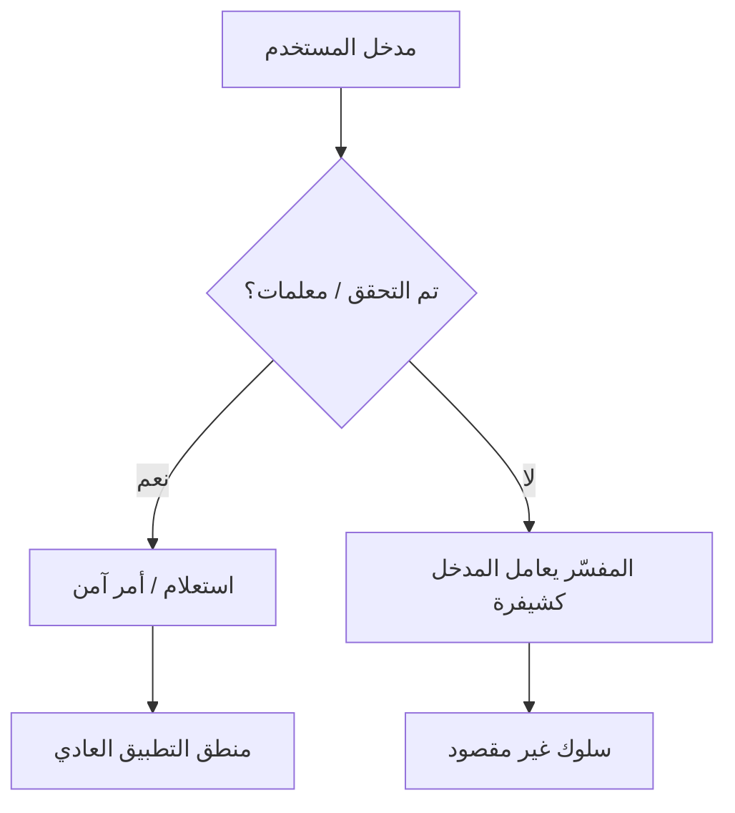

# المسار 1 · المرحلة 1.3 — الحقن في المختبر

## لماذا هذه المرحلة مهمة

تبقى عيوب الحقن من أكثر فئات الثغرات استغلالاً. تحدث عندما تُدمَج بيانات غير موثوقة في أمر أو استعلام أو سياق مفسّر فتُعامل كشيفرة بدلاً من بيانات خالصة. الأمثلة الكلاسيكية هي حقن SQL وحقن أوامر نظام التشغيل؛ تظهر أنماط مشابهة في LDAP وXPath ومحركات القوالب واستعلامات NoSQL.

تطبيقات التدريب مثل DVWA وOWASP Juice Shop موجودة حتى يتمكن المتعلمون من مراقبة نمط الفشل وقياس الأثر وممارسة التفكير في المعالجة **دون** توجيه حمولات إلى أنظمة حقيقية أبداً. تبقى هذه المرحلة داخل تلك المختبرات المقصودة فقط.

فهم الحقن يشحذ أيضاً المهارات الدفاعية: الاستعلامات ذات المعلمات، قوائم السماح، حسابات قاعدة البيانات بأقل امتياز، وترميز المخرجات الصحيح كلها تصبح أكثر ملموسية بعد مشاهدة تطبيق مختبري ينكسر.

---

## أهداف التعلم

بنهاية هذه المرحلة ستكون قادراً على:

- شرح السبب الجذري للحقن (فشل في إبقاء البيانات والشيفرة منفصلتين)
- إظهار تحدي حقن SQL و(حيث يتوفر) حقن أوامر مخصص على تطبيق مختبري مقصود
- تصنيف فئات الأثر (كشف بيانات، تجاوز مصادقة، تعديل بيانات، تنفيذ أوامر)
- وصف التخفيفات الأساسية: الاستعلامات ذات المعلمات / العبارات المُعدّة، قوائم السماح، أقل امتياز، والهروب عندما تكون المعلمات مستحيلة
- توثيق نتيجة مختبرية مع الطلب وفئة الحمولة والنتيجة ونصيحة معالجة بلغة بسيطة

---

## المتطلبات السابقة

- إكمال المرحلتين 1.1 و1.2 (يمكنك بالفعل مراقبة الحركة ولديك خريطة موقع أساسية)
- تطبيق مختبري بتحديات حقن مقصودة (DVWA منخفض/متوسط، Juice Shop، WebGoat، إلخ)
- وكيل اعتراض اختياري لكنه مفيد لتعديل الطلب بدقة
- القدرة على التقاط لقطة للهدف قبل وبعد التجارب

---

## نقطة تحقق السلامة

1. فقط صفحات ضعيفة مقصودة داخل تطبيقات تتحكم بها أو مصممة صراحة للتدريب.
2. فضّل مستويات الصعوبة المنخفضة أو المتوسطة المدمجة؛ فهي مصممة لإظهار المشكلة بوضوح.
3. لا تفحص أو تشوّش أو تحقن في نماذج على الإنترنت العام أو أنظمة صاحب العمل أو أي موقع طرف ثالث.
4. تجنّب الحمولات التدميرية (DROP TABLE، حذف جماعي، أوامر نظام ملفات تكرارية) حتى داخل المختبر ما لم يتطلب التحدي ذلك صراحة ولديك لقطة جديدة.
5. سجّل عنوان URL الدقيق واسم التحدي وحساب المختبر حتى تبقى النتائج قابلة للتكرار.

إذا لم تكن الصفحة معلّمة بوضوح كتحدي تدريبي، لا تختبرها.

---

## المفاهيم الأساسية

### 1. حدود الثقة

كل ثغرة حقن هي فشل عند حدود ثقة: بيانات يجب أن تُعامل كمعتمة تُفسَّر بدلاً من ذلك بواسطة محرك لغة (مفسّر SQL، صدفة، خادم LDAP، إلخ). المبدأ التصحيحي بسيط:

> يجب ألا يُسمح أبداً لبيانات يتحكم فيها المستخدم بتغيير *بنية* الاستعلام أو الأمر.

### 2. حقن SQL (مفاهيمي)

نمط ضعيف نموذجي (لا تكتب هذا أبداً في شيفرة حقيقية):

```sql
SELECT * FROM users WHERE name = '" + userInput + "' AND active = 1;
```

إذا احتوى `userInput` على علامة اقتباس مفردة وSQL إضافي، يتغير معنى العبارة. العروض الكلاسيكية تشمل:

- تجاوز المصادقة (`' OR '1'='1`)
- استخراج بيانات قائم على Union
- استدلال قائم على الأخطاء أو المنطقي
- (في الحالات القصوى) استعلامات مكدسة أو تفاعل مع نظام الملفات — فقط على أنظمة مُكوَّنة عمداً للسماح بذلك

**الدفاع الأساسي:** الاستعلامات ذات المعلمات / العبارات المُعدّة. بنية SQL ثابتة؛ تُورَّد بيانات المستخدم بشكل منفصل ولا تُفسَّر أبداً كـ SQL.

دفاعات ثانوية: حسابات قاعدة بيانات بأقل امتياز، قوائم سماح للمدخلات ذات الصيغ المعروفة الآمنة، وتخزين الحد الأدنى فقط من البيانات المطلوبة.

### 3. حقن أوامر نظام التشغيل (مفاهيمي)

نمط ضعيف:

```bash
ping -c 1 " + userInput
```

إذا احتوى `userInput` على أحرف خاصة للصدفة (`;`، `|`، `&&`، backticks، إلخ)، يمكن تنفيذ أوامر إضافية بامتيازات عملية خادم الويب.

**الدفاعات الأساسية:** تجنّب استدعاء الصدفة قدر الإمكان؛ إذا وجب استدعاء برامج خارجية، استخدم مكتبات على مستوى اللغة تقبل مصفوفات وسائط (بدون صدفة)، وطبّق قوائم سماح صارمة لأي جزء يتأثر بالمستخدم.

### 4. فئات الأثر التي ستلاحظها في المختبر

| الفئة | ملاحظة مختبرية نموذجية |
|-------|-------------------------|
| تجاوز المصادقة | ينجح الدخول دون بيانات اعتماد صالحة |
| كشف بيانات | تظهر صفوف أو أعمدة إضافية في النتائج |
| تعديل بيانات | يمكن تحديث أو حذف سجلات خارج التدفق المقصود |
| تنفيذ أوامر | يظهر مخرج `id` أو `whoami` أو `cat` في الاستجابة |
| رفض الخدمة | حمولات طويلة الأمد أو مستهلكة للموارد (تجنّبها في مختبرات مشتركة) |

### 5. لماذا التحقق من المدخلات وحده غير كافٍ

مرشحات القائمة السوداء هشة؛ تظهر ترميزات وحالات حدّية جديدة باستمرار. قوائم السماح للصيغ المتوقعة (مثل معرّفات رقمية) مفيدة، لكن الدفاع الهيكلي (المعلمات) يبقى أساسياً. الدفاع المتعمق يجمع الاثنين.

---

## خريطة توضيحية: حدود ثقة الحقن



الهدف الكامل للترميز الآمن هو الإبقاء على المسار الأيسر.

---

## جولة مختبرية تفصيلية

### حقن SQL على DVWA (أمان منخفض)

1. اضبط أمان DVWA على منخفض.
2. انتقل إلى صفحة تحدي حقن SQL.
3. لاحظ الطلب العادي (عادة GET أو POST بمعامل معرّف مستخدم).
4. باستخدام المتصفح أو الوكيل، استبدل قيمة المعرّف بحمولة مختبرية كلاسيكية مثل `1' OR '1'='1` (الصيغة الدقيقة تعتمد على التحدي؛ اتبع تلميحات التطبيق إن وُجدت).
5. لاحظ الاستجابة: عادة تظهر سجلات مستخدمين إضافية.
6. وثّق:
   - الطلب الدقيق (الطريقة، URL، المعامل)
   - فئة الحمولة (منطقي / union / إلخ)
   - الأثر الملحوظ
   - اقتراح الإصلاح بلغة بسيطة: «استخدم عبارة مُعدّة بحيث يُربط معرّف المستخدم كبيانات، لا يُدمَج أبداً في سلسلة SQL. أيضاً قيّد حساب قاعدة بيانات التطبيق على SELECT فقط على الجداول الضرورية.»

### حقن أوامر (DVWA أو مشابه)

1. حدد تحدي حقن الأوامر.
2. قدّم اسم مضيف صالحاً، ثم أضف تسلسل أحرف خاصة مختبرياً سينفّذه الإصدار منخفض الأمان (مثل `whoami` أو `id` غير الضار — تأكد من الصيغة الدقيقة على نسختك).
3. لاحظ مخرج الأمر الإضافي في الاستجابة.
4. وثّق نفس البنود الأربعة أعلاه، مع التأكيد على أقل امتياز لعملية خادم الويب وتجنّب استدعاء الصدفة.

### تحديات حقن Juice Shop

يقدّم Juice Shop قضايا حقن بشكل أحدث، غالباً مدفوع بواجهة برمجة. استخدم لوحة النتائج أو قائمة التحديات لتحديد المهام ذات الصلة. ينطبق نفس انضباط التوثيق: الطلب، فئة الحمولة، النتيجة، نصيحة المعالجة.

---

## مثال عملي — قالب التوثيق

```markdown
### النتيجة: حقن SQL في البحث عن المستخدم (مختبر فقط)

- **الهدف:** http://192.168.56.101/dvwa/vulnerabilities/sqli/
- **التاريخ:** YYYY-MM-DD
- **الحساب:** admin (مختبر)
- **الطلب:** GET ...?id=1' OR '1'='1
- **النتيجة الملحوظة:** أُعيدت كل سجلات المستخدمين
- **فئة الأثر:** كشف بيانات / مجاور للمصادقة
- **المعالجة:** استبدل دمج السلاسل باستعلام ذي معلمات.
  امنح مستخدم قاعدة بيانات التطبيق الحد الأدنى فقط من الامتيازات المطلوبة.
- **الدليل:** لقطة شاشة أو مقتطف من سجل الوكيل (محذوف الأسرار)
```

---

## الكود والأدوات المصاحبة

- Proxy Repeater (ZAP / Burp) لطلبات مختبرية دقيقة وقابلة للتكرار
- أدوات مطور المتصفح لتغييرات معاملات سريعة
- سكربتات مساعدة مستقبلية في المسار 1 قد تساعد في ترميز حمولات مختبرية آمنة؛ لا توجّهها أبداً خارج المختبر

---

## الأخطاء الشائعة

- معاملة حمولة مختبرية ناجحة كـ «سلاح» يُعاد استخدامه ضد أنظمة حقيقية.
- استخدام SQL تدميري (DROP، DELETE بدون WHERE) على نسخة مختبرية مشتركة دون لقطة.
- التوقف عند «نجح» دون كتابة نصيحة المعالجة.
- افتراض أن التحقق من جانب العميل يمنع الحقن (لا يفعل؛ يجب أن يفرض الخادم).
- اختبار الحقن على صفحات ليست جزءاً من مجموعة التحديات المقصودة.

---

## أفضل الممارسات (دفاعية)

- فضّل الاستعلامات ذات المعلمات / العبارات المُعدّة لكل تفاعل مع قاعدة بيانات يتضمن بيانات خارجية.
- استخدم قوائم سماح عندما تكون صيغة المدخلات المتوقعة معروفة (معرّفات رقمية، تعدادات ثابتة).
- شغّل حساب قاعدة بيانات التطبيق بأقل امتياز ضروري.
- تجنّب استدعاء صدفة؛ إذا لزم برامج خارجية، مرّر الوسائط كمصفوفة.
- سجّل أنماط الاستعلام غير العادية أو أخطاء الصيغة المتكررة لأعمال الكشف لاحقاً (المسار 2).
- عامل كل قيمة يتحكم فيها المستخدم كعدائية حتى يثبت التطبيق نفسه خلاف ذلك بالتحقق والمعلمات.

---

## تمرين عملي

1. اختر تحدي حقن SQL واحداً، وإن توفر، تحدي حقن أوامر واحداً على تطبيقك المختبري.
2. أكمل كل تحدٍ باستخدام أدنى إعداد أمان أولاً.
3. لكل منهما، أنتج إدخالاً في الدفتر وفق القالب أعلاه (الطلب، فئة الحمولة، النتيجة، المعالجة).
4. ارفع مستوى الأمان درجة واحدة (إن دعم التطبيق ذلك) ولاحظ كيف يتغير السلوك.
5. اكتب جملتين إضافيتين: (أ) كيف كانت المعلمات ستمنع المشكلة، (ب) ما قيد أقل امتياز كان سيحد من الأثر حتى لو حدث الحقن.

احفظ الإدخالات بالتاريخ ومعرّفات الهدف.

---

## أسئلة المراجعة

1. لماذا يفشل التحقق من المدخلات وحده غالباً كضابط وحيد ضد الحقن؟
2. ما الدور الدفاعي لأقل امتياز على حساب قاعدة البيانات الذي يستخدمه تطبيق الويب؟
3. اشرح الفرق بين استعلام ذي معلمات ومجرد هروب الأحرف الخاصة.
4. في عرض مختبري لحقن أوامر، لماذا يُفضّل تشغيل أمر غير تدميري مثل `id` على أمر حذف ملفات؟
5. كيف يمكن لوجود ثغرات حقن في تطبيق مختبري أن يُعلم قواعد كشف قد تكتبها لاحقاً في المسار 2؟

---

## الملخص

- الحقن نتيجة السماح لبيانات غير موثوقة بتغيير بنية استعلام أو أمر.
- التطبيقات المختبرية المقصودة تتيح لك مراقبة الأثر بأمان وممارسة التفكير في المعالجة.
- المعلمات وقوائم السماح وأقل امتياز تشكل مجموعة الأدوات الدفاعية الأساسية.
- التوثيق الواضح للنتائج المختبرية يُعدّك لتقارير التقييم المهنية (المرحلة 1.8).

---

## المصادر وقراءات إضافية

- OWASP Injection Prevention Cheat Sheet
- OWASP SQL Injection Prevention Cheat Sheet
- OWASP Testing Guide — Injection
- PortSwigger Web Security Academy — SQL Injection (أقسام مفاهيمية)
- المرحلة 7 من الطور 2 ومناقشة OWASP Top 10 الأوسع

يبقى كل العمل العملي مقيّداً ببيئات مختبرية مصرح بها فقط. لا تُخوّل التقنيات المعروضة هنا اختبار أنظمة خارج اتفاق مختبرك.
