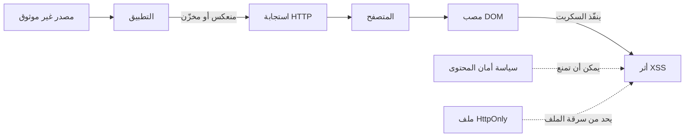

# المسار 1 · المرحلة 1.4 — XSS وجانب العميل

## لماذا هذه المرحلة مهمة

تسمح البرمجة عبر المواقع (XSS) لمهاجم بتنفيذ سكربت في سياق متصفح الضحية. لأن المتصفح يثق في الأصل الذي سلّم الصفحة، يمكن للسكربت المحقون قراءة ملفات تعريف الارتباط (ما لم يكن HttpOnly)، وتعديل DOM، وأداء إجراءات باسم المستخدم، أو تسريب البيانات. يبقى XSS من أكثر ثغرات الويب اكتشافاً وهو مكوّن متكرر في سلاسل هجوم أكبر.

توفر تطبيقات التدريب تحديات XSS مقصودة وآمنة حتى تتمكن من مراقبة الفئات الثلاث الكلاسيكية — المنعكس، والمخزّن، والقائم على DOM — دون زرع سكربتات على مستخدمين حقيقيين أو مواقع إنتاج أبداً. فهم XSS يوضح أيضاً لماذا يهم ترميز المخرجات وسياسة أمان المحتوى (CSP) وسمة ملف تعريف الارتباط `HttpOnly`.

---

## أهداف التعلم

بنهاية هذه المرحلة ستكون قادراً على:

- التمييز بين XSS المنعكس والمخزّن والقائم على DOM على المستوى المفاهيمي
- تشغيل تحديات XSS المختبرية المقصودة بأمان وتوثيق المصدر والمصب
- شرح ترميز المخرجات / الهروب وسياسة أمان المحتوى كدفاعات أساسية
- وصف كيف تحد سمة `HttpOnly` من أثر XSS حتى عند تنفيذ سكربت
- كتابة نصيحة معالجة بلغة بسيطة لنتيجة مختبرية

---

## المتطلبات السابقة

- إكمال المراحل 1.1–1.3
- تطبيق مختبري بتحديات XSS (DVWA، Juice Shop، WebGoat، إلخ)
- أدوات مطور المتصفح؛ الوكيل اختياري
- القدرة على مسح ملفات تعريف الارتباط والتخزين بين الاختبارات

---

## نقطة تحقق السلامة

1. شغّل XSS فقط على صفحات تدريبية مقصودة داخل تطبيقات تتحكم بها.
2. لا تزرع سكربتات دائمة على نسخ مختبرية مشتركة يستخدمها متعلمون آخرون دون تنسيق، ولا على أي موقع إنتاج أو طرف ثالث أبداً.
3. فضّل مستويات التحدي المنخفضة/المتوسطة المدمجة؛ فهي مصممة لإظهار المشكلة بوضوح.
4. تجنّب الحمولات التي تحاول مغادرة بيئة المختبر أو الاتصال بخوادم خارجية ما لم يتطلب التحدي استدعاءً مسيطراً تستضيفه داخل المختبر.
5. التقط لقطة قبل اختبار XSS المخزّن حتى تتمكن من استعادة حالة نظيفة.

---

## المفاهيم الأساسية

### 1. الفئات الثلاث الكلاسيكية

| النوع | كيف تصل الحمولة إلى المصب | ملاحظة مختبرية نموذجية |
|--------|----------------------------|--------------------------|
| **منعكس** | تُعاد الحمولة في الاستجابة الفورية للطلب الذي احتواها | صندوق بحث أو صفحة خطأ يعكس المدخل كـ HTML |
| **مخزّن** (دائم) | يحفظ التطبيق الحمولة ثم يخدمها لاحقاً لمستخدمين آخرين | تعليق أو حقل ملف شخصي أو رسالة تُعرض دون ترميز |
| **قائم على DOM** | لا تحتاج الحمولة إلى الوصول إلى الخادم؛ يقرأ JavaScript من جانب العميل مصدراً غير موثوق (جزء من URL، إلخ) ويكتبه في DOM بشكل غير آمن | تستخدم الصفحة `innerHTML` أو مشابهاً ببيانات من `location.hash` |

تشترك الثلاثة في نفس السبب الجذري: بيانات غير موثوقة تُفسَّر كـ HTML أو JavaScript بدلاً من نص خالص.

### 2. المصادر والمصاب

- **المصدر** — المكان الذي تدخل منه البيانات غير الموثوقة (معامل URL، حقل نموذج، ملف تعريف ارتباط، `postMessage`، إلخ).
- **المصب** — عملية DOM خطرة أو سياق HTML ينفّذ أو يعرض البيانات (`innerHTML`، `document.write`، معالجات الأحداث، سمات غير مقتبسة، إلخ).

تمارين المختبر تدربك على تحديد كليهما.

### 3. الدفاعات الأساسية

- **ترميز المخرجات / الهروب** — تحويل الأحرف ذات المعنى الخاص في HTML (`<`، `>`، `&`، علامات الاقتباس) إلى كيانات آمنة قبل الإدراج في سياق HTML. يلزم ترميز واعٍ بالسياق (جسم HTML مقابل سمة مقابل JavaScript مقابل URL).
- **سياسة أمان المحتوى (CSP)** — ترويسة HTTP تخبر المتصفح أي مصادر للسكربت والنمط والموارد الأخرى مسموحة. يمكن لـ CSP قوية منع تنفيذ السكربت المضمّن حتى لو انعكست حمولة XSS.
- **ملفات HttpOnly** — تمنع JavaScript من قراءة ملف الجلسة، مما يحد من ضرر كثير من حمولات XSS.
- **التحقق من المدخلات** — مفيد كدفاع متعمق لكنه لا يكفي وحده أبداً؛ الترميز عند حدود المخرجات أساسي.
- **الهروب التلقائي للأطر** — قوالب حديثة (React JSX، Angular، Vue مع ربطات صحيحة، إلخ) تهرب افتراضياً عند استخدامها بشكل صحيح؛ فهم الاستثناءات مهم.

### 4. الأثر في المختبر

حتى `alert(1)` أو `alert(document.domain)` بسيط يثبت أن السكربت نُفّذ في سياق الأصل. قد تُظهر حمولات مختبرية أكثر تقدماً الوصول إلى الملفات (عندما يغيب HttpOnly) أو تعديل DOM. الهدف التعليمي هو التعرف والتفكير في المعالجة، وليس بناء حمولات مُسلَّحة.

---

## خريطة توضيحية: تدفق بيانات XSS



---

## جولة مختبرية تفصيلية

### XSS المنعكس (DVWA منخفض)

1. اضبط مستوى الأمان على منخفض.
2. افتح تحدي XSS المنعكس.
3. أرسل حمولة مختبرية بسيطة مثل `<script>alert(1)</script>` (قد تختلف الصيغة الدقيقة؛ اتبع التحدي).
4. لاحظ التنبيه وافحص HTML الاستجابة لتحديد المصب.
5. وثّق المصدر (معامل المدخل)، والمصب (نقطة الإدراج غير المُرمَّزة)، وجملة معالجة: «رمّز مدخل المستخدم لسياق HTML قبل عكسه، أو استخدم محرك قوالب يهرب افتراضياً.»

### XSS المخزّن

1. حدد تحدي XSS المخزّن (دفتر زوار، تعليق، نبذة ملف شخصي، إلخ).
2. أرسل حمولة سيحفظها التطبيق ويعرضها لاحقاً.
3. اعرض الصفحة كمستخدم مختبري ثانٍ (أو نفس المستخدم بعد إعادة التحميل) وتأكد من تنفيذ السكربت.
4. امسح البيانات المخزّنة أو استعد لقطة بعد ذلك.
5. وثّق كما سبق، مع ملاحظة الطبيعة الدائمة.

### القائم على DOM (إن توفر)

1. حدد صفحة تقرأ من جزء URL أو مصدر آخر من جانب العميل وتكتب إلى DOM.
2. اصنع عنوان URL مختبرياً يمارس المصب غير الآمن.
3. أكد التنفيذ دون أن تظهر الحمولة بالضرورة في سجلات الخادم.
4. وثّق الطبيعة الخالصة من جانب العميل للمشكلة.

يحتوي Juice Shop على تحديات XSS متعددة بدرجات متفاوتة من التعقيد؛ استخدم لوحة النتائج لتحديدها وطبق نفس انضباط التوثيق.

---

## مثال عملي — إدخال دفتر

```markdown
### النتيجة: XSS منعكس في البحث (مختبر فقط)

- الهدف: http://192.168.56.101/dvwa/vulnerabilities/xss_r/
- التاريخ: YYYY-MM-DD
- فئة الحمولة: وسم سكربت أساسي
- المصدر: معامل name
- المصب: صدى غير مُرمَّز داخل جسم HTML
- النتيجة الملحوظة: مربع تنبيه في المتصفح
- المعالجة: طبّق ترميز سياق HTML على القيمة المنعكسة.
  فضّل إطاراً يهرب افتراضياً. أضف CSP تمنع السكربت المضمّن.
- الدليل: لقطة شاشة للتنبيه + مقتطف الاستجابة
```

---

## الأخطاء الشائعة

- اختبار XSS على مواقع حقيقية أو أنظمة شبيهة بالإنتاج مشتركة.
- ترك حمولات مخزّنة في نسخة مختبرية متعددة المستخدمين دون تنظيف.
- الاعتقاد بأن «المتصفح منعها» يعني أن التطبيق آمن (قد تكون CSP أو المرشحات المدمجة ناقصة).
- التركيز فقط على `alert(1)` دون تحديد المصدر والمصب الفعليين.
- نسيان أن HttpOnly لا يمنع كل أثر XSS — يبقى تعديل DOM وإجراءات أخرى ممكنة.

---

## أفضل الممارسات (دفاعية)

- رمّز عند المخرجات وفقاً للسياق المحيط.
- تبنَّ سياسة أمان محتوى قوية؛ ابدأ بـ `default-src 'self'` وشدّد.
- اضبط سمة `HttpOnly` على ملفات الجلسة.
- فضّل الهروب التلقائي للأطر الحديثة وتجنّب واجهات برمجة غير آمنة (`innerHTML`، `dangerouslySetInnerHTML` دون تنقية، إلخ).
- عامل كل انعكاس لبيانات المستخدم كمصب محتمل حتى يُثبت أنه آمن.
- سجّل وراقب أنماط فحص XSS الشائعة كجزء من هندسة الكشف (المسار 2).

---

## تمرين عملي

1. أكمل تحدي XSS منعكس واحداً على الأقل ومخزّناً واحداً على تطبيقك المختبري.
2. لكل منهما، سجّل المصدر والمصب وفئة الحمولة والنتيجة وجملة أو جملتين للمعالجة.
3. افحص سمات ملف الجلسة (المرحلة 1.1) ولاحظ ما إذا كان HttpOnly موجوداً.
4. إذا دعم التطبيق CSP، افحص الترويسة وعلّق على قوتها.
5. أعد أي حمولات مخزّنة إلى حالة نظيفة.

---

## أسئلة المراجعة

1. كيف تتفاعل سمة `HttpOnly` مع أثر XSS؟
2. ما المشكلة التي تهدف سياسة أمان المحتوى بشكل أساسي إلى تقليلها؟
3. لماذا يُعتبر XSS المخزّن عموماً أعلى خطراً من المنعكس في تطبيق متعدد المستخدمين؟
4. اشرح الفرق بين المصدر والمصب في سياق XSS القائم على DOM.
5. لماذا التحقق من المدخلات من جانب العميل غير كافٍ كدفاع وحيد ضد XSS؟

---

## الملخص

- يحدث XSS عندما تُفسَّر بيانات غير موثوقة كسكربت أو HTML في متصفح الضحية.
- تختلف فئات المنعكس والمخزّن والقائم على DOM في كيفية وصول الحمولة إلى المصب.
- ترميز المخرجات وCSP وملفات HttpOnly تشكل الطبقات الدفاعية الأساسية.
- تحديات المختبر تتيح لك ممارسة التعرف والتفكير في المعالجة بأمان.

---

## المصادر وقراءات إضافية

- OWASP XSS Prevention Cheat Sheet
- OWASP DOM-based XSS Prevention Cheat Sheet
- Content Security Policy Level 3 (W3C)
- توثيق MDN حول CSP وسمات الملفات
- المرحلة 7 من الطور 2

يبقى كل العمل العملي مقيّداً ببيئات مختبرية مصرح بها فقط.
