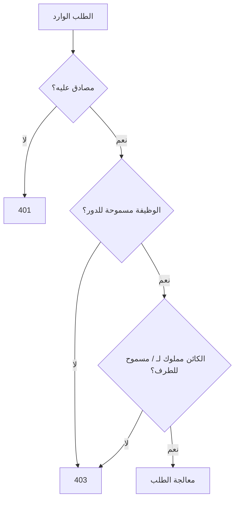

# المسار 1 · المرحلة 1.5 — التحكم في الوصول وIDOR

## لماذا هذه المرحلة مهمة

يُصنَّف التحكم في الوصول المكسور باستمرار بين أخطر مخاطر تطبيقات الويب. يحدث عندما يفشل التطبيق في فرض من يُسمح له بفعل ماذا. المظاهر الكلاسيكية تشمل:

- عرض أو تعديل بيانات مستخدم آخر بتغيير معرّف (مرجع كائن مباشر غير آمن — IDOR)
- الوصول إلى وظائف إدارية أثناء المصادقة كمستخدم عادي فقط (تصعيد امتياز عمودي)
- الوصول إلى صفحات أو نقاط نهاية API يجب أن تكون قابلة للوصول فقط بعد المصادقة (تصفح قسري)

بخلاف الحقن أو XSS، غالباً ما لا تتطلب عيوب التحكم في الوصول حمولة خاصة — فقط تغيير معرّف أو طلب مباشر إلى عنوان URL مقيّد. لذلك يسهل تفويتها أثناء الاختبار العابر ويسهل إدخالها أثناء التطوير عندما تكون فحوصات التفويض ناقصة أو تُنفَّذ فقط على العميل.

تكشف التطبيقات المختبرية هذه القضايا عمداً حتى تتمكن من ممارسة الاختبار المنهجي والتوثيق الواضح.

---

## أهداف التعلم

بنهاية هذه المرحلة ستكون قادراً على:

- شرح الفرق بين قضايا الامتياز العمودي والأفقي
- اختبار تفويض مستوى الكائن ومستوى الوظيفة **داخل تطبيق مختبري فقط**
- تحديد مراجع الكائنات المباشرة غير الآمنة (IDOR) بتغيير المعرّفات أثناء المصادقة كمستخدم مختبري منخفض الامتياز
- توثيق فجوات التفويض بأدلة الطلب/الاستجابة وتوصية معالجة واضحة
- توضيح لماذا يجب فرض التفويض من جانب الخادم في كل طلب

---

## المتطلبات السابقة

- إكمال المراحل 1.1–1.4
- تطبيق مختبري يدعم حسابي مستخدمين مميزين على الأقل (أو مستخدم وحساب مسؤول)
- القدرة على التقاط الطلبات وتعديلها (أدوات مطور المتصفح أو وكيل اعتراض)

---

## نقطة تحقق السلامة

1. استخدم فقط حسابات مختبرية أُنشئت على التطبيق التدريبي المقصود.
2. لا تحاول اختبارات التحكم في الوصول ضد SaaS طرف ثالث أو أنظمة صاحب العمل أو أي بيئة إنتاج.
3. فضّل البراهين غير التدميرية (عرض بيانات مستخدم آخر) على الحذف أو إجراءات منح الامتياز ما لم يتطلب التحدي ذلك صراحة ولديك لقطة.
4. سجّل الحسابات الدقيقة ومعرّفات الكائنات المستخدمة حتى تبقى النتائج قابلة للتكرار.
5. أعد أي بيانات مختبرية معدّلة بعد التمرين.

---

## المفاهيم الأساسية

### 1. التحكم في الوصول العمودي مقابل الأفقي

| النوع | الوصف | مثال مختبري |
|-------|--------|-------------|
| **عمودي** | يصل مستخدم منخفض الامتياز إلى وظيفة أعلى امتيازاً | يمكن لمستخدم عادي فتح `/admin` أو استدعاء API للمسؤول فقط |
| **أفقي** | يصل مستخدم إلى موارد مستخدم آخر بنفس مستوى الامتياز | يعرض المستخدم A طلب المستخدم B بتغيير `orderId` |

كلاهما فشل في التفويض. غالباً ما تشير القضايا العمودية إلى غياب فحوصات الدور؛ غالباً ما تشير الأفقية إلى غياب فحوصات الملكية.

### 2. مرجع الكائن المباشر غير الآمن (IDOR)

يوجد IDOR عندما يستخدم التطبيق معرّفاً يورده المستخدم (معرّف رقمي، UUID، اسم ملف، إلخ) لتحديد موقع كائن لكنه يفشل في التحقق من أن الطرف الحالي مسموح له بالوصول إلى ذلك الكائن. تغيير المعرّف في الطلب غالباً ما يكفي لإظهار العيب داخل تطبيق تدريبي.

### 3. التفويض على مستوى الوظيفة مقابل مستوى الكائن

- **مستوى الوظيفة** — «هل يُسمح لهذا المستخدم باستدعاء نقطة النهاية هذه أصلاً؟»
- **مستوى الكائن** — «هل يُسمح لهذا المستخدم بالتصرف على *هذا الكائن بالذات*؟»

غالباً ما تنفّذ التطبيقات الحديثة الغنية بواجهات البرمجة الأول وتنسى الثاني، فتنتج قضايا بأسلوب IDOR.

### 4. لماذا فحوصات جانب العميل غير كافية

إخفاء زر «تعديل» في JavaScript أو الاعتماد على حارس موجه الواجهة الأمامية لا يشكل تحكماً في الوصول. يمكن إعادة تشغيل أي طلب أو تعديله خارج المتصفح. يجب اتخاذ قرارات التفويض على الخادم لكل طلب، باستخدام الهوية المصادق عليها التي أسستها الجلسة أو الرمز.

---

## خريطة توضيحية: نقاط قرار التفويض



يجيب تصميم التحكم في الوصول الكامل عن سؤالي الوظيفة والكائن في كل طلب.

---

## جولة مختبرية تفصيلية

### IDOR أفقي (نمط نموذجي)

1. أنشئ أو استخدم حسابي مستخدمين مختبريين (المستخدم A والمستخدم B).
2. سجّل الدخول كالمستخدم A وحدد مورداً يخص A (ملف شخصي، طلب، رسالة، مستند).
3. لاحظ معرّف الكائن في عنوان URL أو النموذج أو جسم JSON.
4. سجّل الخروج (أو استخدم متصفحاً ثانياً / نافذة خاصة) وسجّل الدخول كالمستخدم B.
5. أعد تشغيل أو اصنع طلباً يستبدل معرّف كائن المستخدم A أثناء المصادقة كالمستخدم B.
6. لاحظ ما إذا كان التطبيق يعيد بيانات المستخدم A أو يرفض الوصول بشكل صحيح.
7. وثّق الطلب، والاستجابة المتوقعة مقابل الفعلية، والمعالجة: «قبل إعادة أو تعديل الكائن، تحقق من أن المستخدم المصادق عليه هو المالك أو لديه منحة صريحة.»

### فحص الامتياز العمودي

1. سجّل الدخول كمستخدم مختبري عادي.
2. من خريطة الموقع (المرحلة 1.2) حاول طلبات مباشرة إلى مسارات إدارية أو نقاط نهاية API يجب أن تكون مقيّدة.
3. لاحظ رموز الحالة (200 مقابل 403 مقابل 404) وأي بيانات مُعادة.
4. إذا كشف التطبيق دوراً أو معامل `isAdmin`، اختبر ما إذا كان تغييره من جانب العميل يؤثر على سلوك الخادم (يجب ألا يؤثر).

### Juice Shop وما شابه

تتضمن كثير من تطبيقات التدريب الحديثة تحديات IDOR وتصعيد امتياز صريحة. استخدم لوحة النتائج أو أوصاف التحديات لتحديدها، ثم طبّق نفس انضباط توثيق الطلب/الاستجابة.

---

## مثال عملي — إدخال دفتر

```markdown
### النتيجة: IDOR أفقي على تفاصيل الطلب (مختبر فقط)

- الهدف: http://192.168.56.101:3000/rest/order-history/...
- التاريخ: YYYY-MM-DD
- الحسابات: userA@lab، userB@lab
- الإجراء: مصادق كـ userB، طلب معرّف طلب يخص userA
- النتيجة: 200 OK مع بيانات طلب userA
- المعالجة: يجب أن يتحقق الخادم من أن مالك الطلب يطابق الطرف المصادق عليه (أو أن علاقة مشاركة صريحة موجودة) قبل إعادة المورد.
- الدليل: زوج الطلب/الاستجابة (الرموز محذوفة)
```

---

## الأخطاء الشائعة

- اختبار التحكم في الوصول على منصات SaaS متعددة المستأجرين حقيقية دون تفويض.
- افتراض أن استجابة 404 تعني أن المورد محمي (أحياناً يعيد التطبيق 404 للكائنات غير المصرح بها؛ أحياناً 403؛ الاتساق مهم).
- تغيير معرّف في شريط عنوان المتصفح لكن نسيان إعادة تشغيل استدعاء API الذي يجلب البيانات فعلياً.
- توثيق فقط «نجح» دون ذكر فحص جانب الخادم الناقص.
- استخدام نفس حساب المختبر لجانبي اختبار أفقي، مما لا يمكنه إظهار IDOR.

---

## أفضل الممارسات (دفاعية)

- افرض التفويض على الخادم لكل طلب يصل إلى كائن محمي أو يعدّله.
- فضّل معرّفات معتمة غير قابلة للتنبؤ (UUIDs) *بالإضافة إلى* فحوصات الملكية — لا كبديل لها.
- ركّز منطق التفويض (محرك سياسة، وسيط، أو خدمة مخصصة) بدلاً من نثر فحوصات مرتجلة.
- ارفض افتراضياً؛ امنح صراحة.
- سجّل فشل التفويض للكشف (المسار 2) والتحليل الجنائي.
- ضمّن اختبارات تفويض إيجابية وسلبية في أي تقييم مختبري أو مهني.

---

## تمرين عملي

1. احصل على أو أنشئ حسابي مستخدمين مختبريين مميزين.
2. أظهر IDOR أفقياً واحداً على الأقل (أو أكد أن التطبيق يحظره بشكل صحيح) وسجّل الدليل.
3. حاول الوصول إلى وظيفة إدارية أو أعلى امتيازاً واحدةً على الأقل أثناء المصادقة كمستخدم عادي؛ سجّل النتيجة.
4. لكل نتيجة أو عدم نتيجة، اكتب بيان معالجة أو تأكيد قصيراً.
5. حدّث خريطة موقعك من المرحلة 1.2 بأي مسارات مقيّدة مكتشفة حديثاً.

---

## أسئلة المراجعة

1. لماذا يجب فرض التفويض من جانب الخادم حتى عندما تخفي واجهة المستخدم الميزات المقيّدة؟
2. ما الفرق بين التحكم في الوصول على مستوى الوظيفة ومستوى الكائن؟
3. كيف يمكن لواجهة برمجة أن تكشف IDOR بشكل مختلف عن نموذج HTML كلاسيكي مُصيَّر من الخادم؟
4. لماذا تُعد المعرّفات الرقمية المتسلسلة مساهماً شائعاً في قضايا IDOR (رغم أن السبب الجذري هو غياب التفويض)؟
5. كيف تحوّل نتيجة IDOR مختبرية إلى فكرة كشف للمسار 2؟

---

## الملخص

- يتيح التحكم في الوصول المكسور للمستخدمين التصرف خارج امتيازاتهم المقصودة.
- IDOR هو الشكل الأفقي الذي يظهر عندما لا تُفحص ملكية الكائن.
- تظهر القضايا العمودية عندما تغيب فحوصات الدور أو الوظيفة.
- يجب أن يجيب كل طلب محمي عن «هل هذه الوظيفة مسموحة؟» و«هل هذا الكائن مسموح لهذا الطرف؟»
- الممارسة المختبرية بحسابين وتعديل طلب دقيق تبني عادة اختبار التفويض المنهجي.

---

## المصادر وقراءات إضافية

- OWASP Broken Access Control
- OWASP Insecure Direct Object Reference Prevention
- OWASP API Security Top 10 (API1 Broken Object Level Authorization)
- المرحلة 7 من الطور 2

يبقى كل العمل العملي مقيّداً ببيئات مختبرية مصرح بها فقط.
