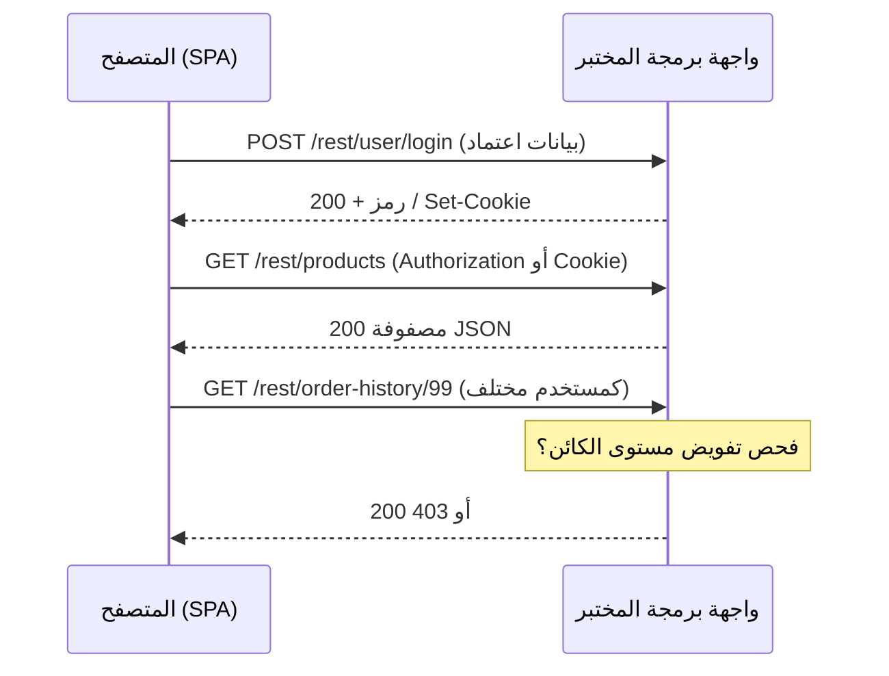

# المسار 1 · المرحلة 1.6 — واجهات API والتطبيقات الحديثة

## لماذا هذه المرحلة مهمة

تُبنى تطبيقات الويب المعاصرة غالباً كواجهة أمامية بـ JavaScript تستهلك واجهات برمجة JSON. نفس مبادئ الأمان التي تنطبق على التطبيقات الكلاسيكية المدفوعة بالنماذج — المصادقة، التفويض، التعامل مع المدخلات، وإدارة الجلسات — ما زالت تنطبق، لكن السطح يبدو مختلفاً. تنتقل المعرّفات في أجسام JSON أو أجزاء المسار، وغالباً ما تستخدم المصادقة رموز Bearer أو JWT، وتتفاعل سياسة نفس الأصل في المتصفح مع تكوين CORS.

تكشف التطبيقات المختبرية مثل OWASP Juice Shop واجهات REST غنية تتيح لك مراقبة هذه الأنماط بأمان. إتقان مراقبة واجهات البرمجة والاختبار الأساسي في المختبر يُعدّك لكل من أعمال أمان التطبيقات وكشف إساءة استخدام واجهات البرمجة في سياق SOC (المسار 2).

---

## أهداف التعلم

بنهاية هذه المرحلة ستكون قادراً على:

- وصف أفعال REST الشائعة وأجسام طلب/استجابة JSON ورموز الحالة ذات الصلة بالأمان
- التقاط وتفسير حركة واجهة برمجة من تطبيق صفحة واحدةحدة مختبري باستخدام أدوات مطور المتصفح أو وكيل اعتراض
- شرح مفاهيم الرمز / JWT على مستوى عالٍ ومخاطر التفويض المكسور على مستوى الكائن في واجهات البرمجة
- تحديد أنماط التعيين الجماعي وكشف البيانات المفرط عندما تظهر في استجابات مختبرية
- كتابة سكربت Python صغير بـ `requests` يتفاعل فقط مع نقطة نهاية واجهة برمجة مختبرية

---

## المتطلبات السابقة

- إكمال المراحل 1.1–1.5
- تطبيق مختبري يكشف واجهة REST أو JSON (Juice Shop مثالي)
- أدوات مطور المتصفح؛ الوكيل موصى به
- بيئة Python 3 مع مكتبة `requests` للسكربت الاختياري

---

## نقطة تحقق السلامة

1. يجب أن يستهدف كل تفاعل مع واجهة البرمجة مضيفات مختبرية فقط.
2. لا توجّه سكربتات أو أدوات إلى واجهات برمجة عامة أو أنظمة صاحب العمل أو أي خدمة طرف ثالث.
3. استخدم رموز وحسابات مختبرية حصرياً.
4. حدّ معدل أي طلبات مكتوبة حتى لا تُرهق نسخة مختبرية مشتركة.
5. احذف الرموز والبيانات الشخصية من أي حركة مُصدَّرة قبل وضعها في محفظة.

---

## المفاهيم الأساسية

### 1. واجهات REST في السياق الأمني

| الفعل | الاستخدام النموذجي | ملاحظات أمنية |
|--------|----------------------|-----------------|
| GET | استرجاع مورد(ات) | يجب أن يكون خالياً من الآثار الجانبية؛ راقب IDOR في المسار أو الاستعلام |
| POST | إنشاء مورد | التحقق من الجسم، التعيين الجماعي، المصادقة مطلوبة |
| PUT / PATCH | استبدال أو تحديث | التفويض على مستوى الكائن حرج |
| DELETE | إزالة مورد | التفويض على مستوى الكائن + أنماط تأكيد |

رموز الحالة المهمة لاختبار الأمان:

- 401 Unauthorized — المصادقة ناقصة أو غير صالحة
- 403 Forbidden — مصادق عليه لكن غير مفوّض
- 404 Not Found — يُستخدم أحياناً لإخفاء وجود كائنات غير مصرح بها
- 200 / 201 مع بيانات مفرطة — قضية كشف بيانات محتملة

### 2. أنماط المصادقة في واجهات البرمجة

- **ملف جلسة** — كلاسيكي؛ يرسله المتصفح تلقائياً
- **رمز Bearer** — ترويسة `Authorization: Bearer <token>`؛ شائع مع SPA
- **JWT (JSON Web Token)** — رمز موقّع ذاتي الاحتواء؛ مفاهيم فقط في هذه المرحلة (ترويسة، حمولة، توقيع). المخاطر تشمل مفاتيح توقيع ضعيفة، غياب انتهاء الصلاحية، وقبول خوارزمية `none`
- **مفاتيح API** — غالباً طويلة العمر؛ يجب حمايتها وتدويرها

### 3. التفويض المكسور على مستوى الكائن (BOLA / IDOR في واجهات البرمجة)

المعادل في واجهة البرمجة لقضايا IDOR المدروسة في المرحلة 1.5. قد تتطلب نقطة النهاية المصادقة بشكل صحيح لكنها تفشل في التحقق من أن الطرف المصادق عليه مسموح له بالوصول إلى الكائن المحدد في المسار أو الجسم. تغيير معرّف في طلب `/api/orders/123` أثناء المصادقة كمستخدم آخر هو العرض المختبري الكلاسيكي.

### 4. التعيين الجماعي وكشف البيانات المفرط

- **التعيين الجماعي** — تربط واجهة البرمجة حقول الطلب مباشرة بكائنات داخلية، مما يسمح لمهاجم بضبط خصائص امتيازية (`isAdmin`، `role`، `balance`) لا تعرضها الواجهة أبداً.
- **كشف البيانات المفرط** — تعيد واجهة البرمجة حقولاً أكثر مما يحتاجه العميل (تجزئات كلمات المرور، معرّفات داخلية، بيانات مستخدمين آخرين). قد تتجاهلها الواجهة الأمامية، لكن البيانات غادرت الخادم بالفعل.

### 5. CORS (مفاهيمي)

تتحكم مشاركة الموارد عبر الأصول في أي الأصول قد تقرأ استجابات من واجهة البرمجة. CORS غير المُكوَّن جيداً (`Access-Control-Allow-Origin: *` مع بيانات اعتماد) يمكن أن يسمح لمواقع خبيثة بقراءة استجابات واجهة برمجة مصادق عليها. مراقبة ترويسات CORS في المختبر مفيدة؛ الاستغلال خارج نطاق هذه المرحلة.

---

## خريطة توضيحية: حركة SPA ↔ واجهة البرمجة



---

## جولة مختبرية تفصيلية

### مراقبة حركة واجهة برمجة Juice Shop

1. افتح أدوات المطور → Network، صفِّ حسب Fetch/XHR.
2. تصفح التطبيق؛ لاحظ استدعاءات `/rest/` و`/api/`.
3. سجّل الدخول ولاحظ استجابة المصادقة (رمز أو ملف).
4. حدد نقطة نهاية تعيد كائناً يخص المستخدم الحالي (سلة، طلبات، ملف شخصي).
5. باستخدام الوكيل أو بتحرير الطلب، غيّر معرّفاً وأعد الإرسال أثناء المصادقة كالمستخدم الأصلي أو مستخدم مختبري ثانٍ.
6. سجّل ما إذا كان التفويض على مستوى الكائن مُفرَضاً.

### عميل Python مختبري اختياري

نمط أدنى (استبدل بعنوان URL المختبري الفعلي والرمز):

```python
import requests

LAB_BASE = "http://192.168.56.101:3000"  # مختبر فقط
session = requests.Session()

# مثال: تسجيل الدخول (عدّل لنقطة النهاية المختبرية الحقيقية)
r = session.post(f"{LAB_BASE}/rest/user/login",
                 json={"email": "labuser@example.com", "password": "labpass"})
print(r.status_code, r.json())

# مثال: طلب مصادق عليه
r2 = session.get(f"{LAB_BASE}/rest/products")
print(r2.status_code, len(r2.json()))
```

لا تُضمّن بيانات اعتماد حقيقية ولا توجّه السكربت خارج المختبر.

---

## مثال عملي — إدخال دفتر

```markdown
### ملاحظة: نقطة نهاية طلب واجهة البرمجة (مختبر فقط)

- الهدف: http://192.168.56.101:3000/rest/order-history/{id}
- التاريخ: YYYY-MM-DD
- المصادقة: رمز Bearer مختبري / جلسة
- الاختبار: طلب معرّف طلب مستخدم آخر
- النتيجة: 200 مع بيانات طلب أجنبي → BOLA / IDOR
- المعالجة: يجب أن يقارن الخادم order.owner مع الطرف المصادق عليه قبل إعادة المورد.
- ملاحظات: احتوت الاستجابة أيضاً على حقول غير معروضة في الواجهة (مرشح لكشف بيانات مفرط)
```

---

## الأخطاء الشائعة

- معاملة واجهة برمجة كـ «داخلية» وبالتالي معفاة من نفس قواعد التفويض كالواجهة.
- تخزين رموز طويلة العمر في localStorage (يمكن لـ XSS سرقتها) دون فهم المقايضة.
- تشغيل سكربتات غير محدودة المعدل ضد نسخة مختبرية مشتركة.
- تصدير حركة ما زالت تحتوي على رموز مختبرية حية إلى ملاحظات مشتركة.

---

## أفضل الممارسات (دفاعية)

- افرض التفويض على مستوى الكائن في كل نقطة نهاية واجهة برمجة تقبل معرّفاً.
- أعد فقط الحقول التي يحتاجها العميل فعلياً.
- فضّل رموز وصول قصيرة العمر مع رموز تحديث؛ خزّن الرموز بعناية.
- تحقق واسمح فقط بحقول الطلب لمنع التعيين الجماعي.
- اضبط CORS بإحكام؛ تجنّب `*` مع بيانات الاعتماد.
- سجّل فشل المصادقة والتفويض لأعمال الكشف لاحقاً.

---

## تمرين عملي

1. التقط حركة واجهة برمجة من SPA المختبري أثناء التصفح العادي وبعد الدخول.
2. حدد ثلاث نقاط نهاية واجهة برمجة مميزة على الأقل وسجّل أفعالها ومعاملاتها ومتطلبات المصادقة.
3. نفّذ اختبار تغيير معرّف كائن واحداً (أسلوب IDOR/BOLA) ووثّق النتيجة.
4. اختيارياً اكتب وشغّل سكربت `requests` صغيراً ضد نقطة نهاية مختبرية واحدة؛ ضمّن السكربت ومخرجه في دفترك (احذف الأسرار).
5. حدّث خريطة موقعك / جرد المعاملات بأسطح واجهة البرمجة المكتشفة.

---

## أسئلة المراجعة

1. كيف يمكن لواجهة برمجة أن تكشف IDOR (BOLA) بشكل مختلف عن نموذج HTML كلاسيكي؟
2. ما الدلالة الأمنية لإعادة واجهة برمجة حقولاً لا تعرضها الواجهة الأمامية أبداً؟
3. لماذا تخزين JWT في localStorage أخطر من تخزينه في ملف HttpOnly (عندما يسمح تصميم التطبيق بالملفات)؟
4. ما رمز الحالة الذي يجب أن تعيده واجهة برمجة عندما يكون المتصل مصادقاً عليه لكن غير مفوّض للكائن المطلوب؟
5. كيف يتغير عمل الرسم من المرحلة 1.2 عندما يكون التطبيق تطبيقاً بصفحة واحدة يحمّل البيانات عبر واجهة برمجة؟

---

## الملخص

- تنقل التطبيقات الحديثة كثيراً من قرارات الأمان إلى واجهات برمجة JSON.
- نفس مبادئ التفويض والمصادقة والتعامل مع المدخلات ما زالت تنطبق.
- مراقبة حركة واجهة البرمجة المختبرية واختبارات المعرّف المسيطر عليها تبني مهارة أمان تطبيقات عملية.
- التوثيق الواضح لنتائج واجهة البرمجة يغذي تقرير المشروع النهائي وهندسة الكشف المستقبلية.

---

## المصادر وقراءات إضافية

- OWASP API Security Top 10
- OWASP Testing Guide — API Testing
- مقدمة JWT.io (مفاهيمية)
- المرحلة 7 من الطور 2 ومراحل المسار 1 1.1–1.5

يبقى كل العمل العملي مقيّداً ببيئات مختبرية مصرح بها فقط.
