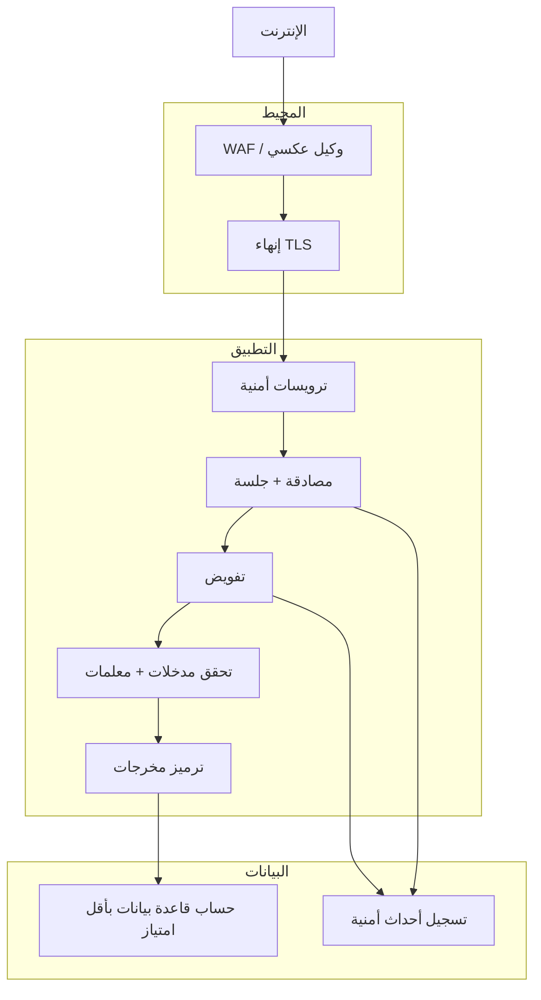

# المسار 1 · المرحلة 1.7 — التقوية والدفاع

## لماذا هذه المرحلة مهمة

اكتشاف القضايا نصف أمان التطبيقات فقط. النصف الآخر هو معرفة أي الضوابط العملية تقلل الخطر وكيفية التحقق من وجود تلك الضوابط. تحوّل التقوية دروس المراحل 1.1–1.6 إلى تحسينات ملموسة وقابلة للقياس: ترويسات أمنية، أعلام ملفات صحيحة، توقعات TLS، عمر الجلسة، حسابات قاعدة بيانات بأقل امتياز، وتسجيل الأحداث ذات الصلة بالأمان.

يمكن لجدار حماية تطبيقات الويب (WAF) إضافة طبقة مفيدة، لكنه ليس بديلاً أبداً عن إصلاح الشيفرة أو التكوين الأساسي. تعلّم هذه المرحلة تقييم تطبيق مختبري مقابل قائمة تحقق تقوية موجزة والتوصية بتحسينات أو تنفيذها تبقى بعد الفحص التالي.

---

## أهداف التعلم

بنهاية هذه المرحلة ستكون قادراً على:

- تطبيق قائمة تحقق ترويسات أمنية عملية (CSP، HSTS، X-Content-Type-Options، X-Frame-Options / frame-ancestors، Referrer-Policy، Permissions-Policy، إلخ)
- مراجعة سمات ملف الجلسة وتوقعات تكوين TLS لتطبيق مختبري
- شرح دور وقيود WAF كطبقة واحدة في استراتيجية دفاع متعمق
- إنتاج تقرير تقوية قصير لتطبيق مختبري واحد يتضمن نتائج إيجابية وتوصيات ذات أولوية
- ربط ضوابط التقوية بالقضايا المدروسة في المراحل السابقة (الحقن، XSS، سرقة الجلسة، النقر الاحتيالي، إلخ)

---

## المتطلبات السابقة

- إكمال المراحل 1.1–1.6
- التطبيق المختبري ما زال يعمل
- القدرة على فحص ترويسات الاستجابة (أدوات مطور المتصفح، وكيل، أو سكربت Python بسيط)
- اختياري: الوصول إلى تكوين التطبيق المختبري أو إعدادات الوكيل العكسي حتى تتمكن فعلياً من تفعيل ترويسة

---

## نقطة تحقق السلامة

1. أجرِ تغييرات التكوين فقط على نسخ مختبرية تتحكم بها.
2. التقط لقطة قبل تغيير إعدادات TLS أو الترويسة أو الجلسة.
3. لا تطبق تقوية تجريبية على أنظمة إنتاج أو أنظمة غير مختبرية مشتركة.
4. عند اختبار قاعدة WAF، استخدم فقط حركة وحمولات مختبرية.

---

## المفاهيم الأساسية

### 1. الترويسات الأمنية المهمة

| الترويسة | الغرض | قيمة قوية نموذجية (توضيحية) |
|----------|--------|------------------------------|
| `Content-Security-Policy` | تقييد مصادر السكربت والنمط والإطارات إلخ | `default-src 'self'; script-src 'self'; object-src 'none'; base-uri 'self'` (اضبط حسب التطبيق) |
| `Strict-Transport-Security` | فرض HTTPS، تمكين أهلية التحميل المسبق | `max-age=31536000; includeSubDomains` |
| `X-Content-Type-Options` | منع تخمين MIME | `nosniff` |
| `X-Frame-Options` أو CSP `frame-ancestors` | تخفيف النقر الاحتيالي | `DENY` أو `frame-ancestors 'none'` |
| `Referrer-Policy` | التحكم في تسريب معلومات المُحيل | `strict-origin-when-cross-origin` أو أشد |
| `Permissions-Policy` | تعطيل ميزات متصفح غير مطلوبة | `geolocation=(), camera=(), microphone=()` |
| `Cache-Control` (للصفحات الحساسة) | منع تخزين المحتوى المصادق عليه | `no-store` |

غياب هذه الترويسات لا يعني تلقائياً أن التطبيق قابل للاستغلال، لكن وجودها يرفع الشريط بشكل قابل للقياس لعدة فئات هجوم.

### 2. تقوية الجلسة والملف (مراجعة + عمق)

من المرحلة 1.1، أكد:

- `Secure`
- `HttpOnly`
- `SameSite=Lax` أو `Strict`
- عمر / مهلة خمول معقولة
- إعادة توليد معرّف الجلسة بعد الدخول
- إبطال من جانب الخادم عند الخروج

### 3. توقعات TLS

- TLS 1.2+ فقط؛ عطّل البروتوكولات القديمة والتشفيرات الضعيفة
- سلسلة شهادات صالحة
- فضّل مجموعات تشفير حديثة والسرية الأمامية
- HSTS كتعزيز على مستوى الترويسة

تكوين التشفير الدقيق خاص بالبيئة؛ هدف المختبر هو التحقق من أن HTTP بالنص الواضح غير مقبول للحركة المصادق عليها وأن HSTS موجود عند استخدام HTTPS.

### 4. أقل امتياز والتسجيل

- يجب أن يحمل حساب قاعدة بيانات التطبيق فقط الامتيازات المطلوبة (SELECT/INSERT/UPDATE على جداول محددة، لا حقوق DBA).
- يجب تسجيل فشل المصادقة وفشل التفويض وفشل التحقق من المدخلات بسياق كافٍ للكشف لاحقاً (المسار 2).

### 5. WAF كطبقة، لا رصاصة فضية

يمكن لجدار حماية تطبيقات الويب حظر أنماط استغلال شائعة وترقيع افتراضي لقضايا معروفة. لا يصلح الشيفرة غير الآمنة، ولا يستبدل منطق التفويض، ويمكن تجاوزه بحمولات جديدة. عامله كضابط واحد بين كثيرين؛ قس تغطيته ومعدل الإيجابيات الكاذبة في المختبر إن كان لديك وصول إلى واحد.

---

## خريطة توضيحية: طبقات الدفاع المتعمق لتطبيق ويب



---

## جولة مختبرية تفصيلية

1. اختر تطبيقاً مختبرياً واحداً رسمت خريطته بالفعل.
2. اجمع ترويسات الاستجابة للصفحة الرئيسية وصفحة الدخول وصفحة مصادق عليها واحدة على الأقل. لاحظ أي الترويسات الأمنية موجودة وأيها ناقصة.
3. أعد فحص سمات ملف الجلسة (المرحلة 1.1) وأي سلوك تسجيل خروج.
4. إذا كان التطبيق قابلاً للوصول عبر HTTP وHTTPS، اختبر ما إذا كان يمكن إجبار ملفات مصادق عليها عبر نص واضح.
5. اصنع نتيجة قائمة تحقق قصيرة:

   | الضابط | موجود؟ | ملاحظات / توصية |
   |---------|--------|------------------|
   | CSP | جزئي / ناقص | … |
   | HSTS | … | … |
   | أعلام الملف | … | … |
   | … | … | … |

6. نفّذ أو أوصِ بتحسينين ملموسين (مثلاً إضافة `X-Content-Type-Options: nosniff` على مستوى الوكيل العكسي، أو تشديد مهلة الجلسة). إذا تمكنت من تطبيق التغيير في المختبر، أعد الاختبار وسجّل الترويسة الجديدة.

---

## الكود المصاحب

فاحص ترويسات مختبري بسيط (مفهوم):

```python
# Codes/Python/Track-1-Web/check_security_headers.py (عنوان URL مختبري فقط)
import requests
import sys

url = sys.argv[1]  # يجب أن يكون مختبرياً
r = requests.get(url, timeout=10, allow_redirects=True)
interesting = [
    "content-security-policy", "strict-transport-security",
    "x-content-type-options", "x-frame-options",
    "referrer-policy", "permissions-policy",
    "set-cookie"
]
for k, v in r.headers.items():
    if k.lower() in interesting or k.lower().startswith("x-"):
        print(f"{k}: {v}")
```

وجّهه فقط إلى عناوين URL مختبرية.

---

## الأخطاء الشائعة

- معاملة درجة «A» خضراء من فاحص ترويسات عبر الإنترنت كدليل على أن التطبيق آمن.
- تفعيل CSP مقيّدة دون اختبار سكربتات وأنماط التطبيق نفسه، مما يكسر التطبيق المختبري.
- الاعتماد على WAF مع ترك حقن SQL أو IDOR دون إصلاح في الشيفرة.
- تغيير إعدادات TLS إنتاج دون خطة تراجع (لا تفعل هذا في المنهج؛ مختبر فقط).

---

## أفضل الممارسات

- تبنَّ الترويسات الأمنية مبكراً؛ اضبط CSP بشكل تكراري.
- اجعل سمات الملف جزءاً من تكوين الجلسة الافتراضي، لا فكرة لاحقة.
- افرض HTTPS وHSTS لأي تطبيق يتعامل مع المصادقة.
- أبقِ حساب قاعدة البيانات بأقل امتياز وراجع منححه دورياً.
- سجّل الأحداث الأمنية بصيغة يمكن لـ SIEM استهلاكها (المسار 2).
- راجع حالة التقوية بعد كل تغيير كبير في الشيفرة أو البنية التحتية.

---

## تمرين عملي

1. شغّل مراجعة ترويسات وملفات ضد تطبيقك المختبري الأساسي.
2. أكمل قائمة تحقق تقوية من صفحة واحدةحدة (نتائج إيجابية + فجوات ذات أولوية).
3. نفّذ أو وثّق تحسينين ملموسين وأعد التحقق منهما.
4. اكتب فقرة قصيرة تربط ضابطاً تقوية واحداً على الأقل بفئة قضية من مراحل سابقة (مثلاً: «تقلل CSP أثر نتائج XSS من المرحلة 1.4»).
5. احفظ قائمة التحقق؛ ستغذي تقرير المشروع النهائي.

---

## أسئلة المراجعة

1. أي ترويسة أمنية تخفف النقر الاحتيالي بشكل أساسي، وما البديل الحديث داخل CSP؟
2. لماذا WAF غير كافٍ كدفاع وحيد ضد الحقن أو التحكم في الوصول المكسور؟
3. ما مجموعة سمات الملف التي تقلل بشكل أكثر فعالية خطر سرقة الجلسة عبر XSS والتنصت الشبكي؟
4. كيف يحد أقل امتياز على حساب قاعدة البيانات من أثر نتيجة حقن SQL ناجحة؟
5. لماذا يجب تسجيل الأحداث ذات الصلة بالأمان (فشل الدخول، فشل التفويض) بطريقة متسقة وقابلة للقراءة آلياً؟

---

## الملخص

- تحوّل التقوية الضوابط النظرية إلى تكوين قابل للملاحظة.
- الترويسات الأمنية وأعلام الملفات وTLS وأقل امتياز والتسجيل تشكل خط أساس عملي.
- WAF طبقة إضافية مفيدة، لا بديل أبداً عن التصميم والترميز الآمنين.
- قائمة التحقق المختبرية المنتَجة هنا تصبح دليلاً على التفكير الدفاعي في المشروع النهائي.

---

## المصادر وقراءات إضافية

- OWASP Secure Headers Project
- Mozilla Observatory / securityheaders.com (استخدم فقط ضد مضيفات مختبرية)
- OWASP Session Management Cheat Sheet
- CIS Benchmarks (أقسام خادم ويب مختارة، مفاهيمية)
- المرحلة 7 من الطور 2 ومراحل المسار 1 1.1–1.6

يبقى كل العمل العملي مقيّداً ببيئات مختبرية مصرح بها فقط.
