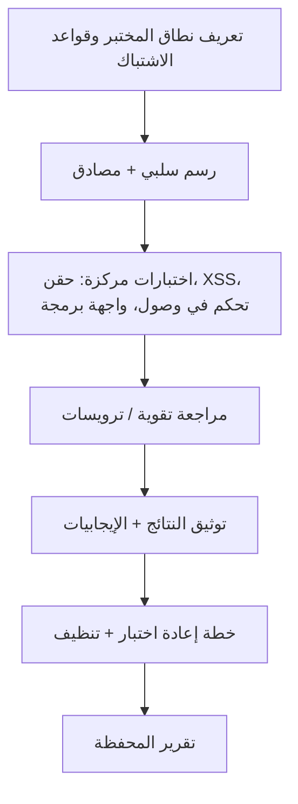

# المسار 1 · المرحلة 1.8 — تقرير التقييم الختامي

## لماذا هذه المرحلة مهمة

يُحكم على أعمال أمان التطبيقات المهنية بجودة التقرير بقدر جودة النتائج التقنية. يتيح تقرير واضح وقابل للتكرار وقائم على الأدلة لمطور أو مالك نظام فهم الخطر وتحديد أولويات الإصلاحات والتحقق من المعالجة. يجمع هذا المشروع النهائي كل مهارة مُورست في المراحل 1.1–1.7 في قطعة أثرية واحدة جاهزة للمحفظة منتَجة ضد **تطبيق مختبري مقصود واحد**.

التقرير ليس قائمة استغلالات. إنه سرد منظم للنطاق والمنهجية والنتائج ومبررات الخطر ونصيحة المعالجة، مكتوب بحيث يتمكن ممارس آخر من تكرار خطواتك على نفس الهدف المختبري والوصول إلى استنتاجات قابلة للمقارنة.

---

## أهداف التعلم

بنهاية هذه المرحلة ستكون قادراً على:

- تعريف نطاق مختبري دقيق وقواعد اشتباك
- إجراء تقييم منهجي يعيد استخدام خريطة الموقع وجرد المعاملات والتقنيات من المراحل السابقة
- إنتاج جدول نتائج يتضمن العنوان ومبرر الشدة والدليل والمعالجة
- تسجيل ملاحظات أمنية إيجابية (ما يفعله التطبيق جيداً)
- كتابة خطة إعادة اختبار وتوثيق تنظيف المختبر (استعادة اللقطات)
- تسليم تقرير يلبي شريط جودة مهنياً للاستخدام في المحفظة

---

## المتطلبات السابقة

- إكمال المراحل 1.1–1.7
- تطبيق مختبري واحد تحت سيطرتك الكاملة (Juice Shop موصى به للثراء؛ DVWA مقبول)
- إدخالات دفتر وخريطة موقع وأدلة من المراحل السابقة
- القدرة على استعادة الهدف إلى لقطة نظيفة بعد التقييم

---

## نقطة تحقق السلامة

1. يبقى التقييم بأكمله داخل حدود المختبر المحددة في بداية المسار.
2. لا تغادر حركة أو حمولات أو سكربتات المختبر أو تستهدف أنظمة خارج اتفاقك المكتوب.
3. يُنفَّذ الاختبار التدميري (إن وُجد) فقط بعد لقطة جديدة ويُوثَّق بالكامل.
4. تُحذف كل بيانات الاعتماد والرموز ومعرّفات الجلسة من التقرير النهائي ومن أي نسخة محفظة مشتركة.
5. بعد التقييم، أعد التطبيق المختبري إلى حالة معروفة جيدة.

---

## هيكل التقرير المطلوب

استخدم المخطط التالي. وسّع كل قسم بالتفاصيل الملموسة التي جمعتها.

### 1. صفحة العنوان / الرأس

- عنوان التقييم (مثلاً «تقييم مختبري لـ OWASP Juice Shop»)
- نطاق تاريخ الاختبار
- اسم / مقبض المقيّم
- معرّف الهدف المختبري (اسم المضيف/IP، الإصدار إن عُرف)
- التصنيف: «تمرين مختبري مصرح به فقط — ليس تقييماً إنتاجياً»

### 2. النطاق وقواعد الاشتباك

- عناوين URL وIP الدقيقة للهدف
- الحسابات المستخدمة (أدوار مختبرية فقط)
- التقنيات داخل النطاق (رسم، اختبار مصادق، تحديات حقن، تحديات XSS، اختبارات تحكم في الوصول، مراجعة ترويسات، إلخ)
- بنود خارج النطاق صراحة (مضيفات مختبر أخرى، الإنترنت العام، رفض الخدمة، الهندسة الاجتماعية، إلخ)
- بيان بأن كل الاختبار نُفّذ تحت قواعد سلامة المنهج

### 3. المنهجية

- الأدوات المستخدمة (أدوات مطور المتصفح، ZAP/Burp، أي سكربتات المسار 1)
- العملية عالية المستوى: رسم سلبي → رسم مصادق → اختبارات مركزة حسب فئة القضية → مراجعة تقوية
- إشارة إلى خريطة الموقع وجرد المعاملات المنتَجين في المرحلة 1.2
- أي قيود (وقت، تطبيق هش، حسابات دور ناقصة)

### 4. النتائج

قدّم النتائج في جدول أو أقسام فرعية منسقة بشكل متسق. لكل نتيجة ضمّن:

| الحقل | المحتوى |
|--------|----------|
| العنوان | اسم وصفي قصير |
| مبرر الشدة | لماذا صنّفتها حرجة / عالية / متوسطة / منخفضة / معلوماتية (الأثر + الاحتمالية في سياق *المختبر*) |
| الوصف | ما لوحظ، أي تقنية مرحلة استُخدمت |
| الدليل | مقتطفات طلب/استجابة، لقطات شاشة، أو سجل وكيل (محذوف) |
| نقطة النهاية / المعامل المتأثر | الموقع الدقيق |
| المعالجة | نصيحة ملموسة وقابلة للتنفيذ (معلمات، فحص تفويض، إضافة ترويسة، إلخ) |
| المراجع | فئة OWASP أو رابط ورقة غش إن ساعد |

اهدف إلى ثلاث نتائج جوهرية على الأقل مستمدة من مراحل مختلفة (مثلاً حقن واحد، تحكم في وصول واحد، فجوة تقوية واحدة). الملاحظات المعلوماتية حول ترويسات ناقصة أو أعلام ملفات ضعيفة قيمة أيضاً.

### 5. ملاحظات إيجابية

سجّل ما يفعله التطبيق جيداً. أمثلة:

- ملفات جلسة مضبوطة بشكل صحيح بـ HttpOnly وSecure
- تفويض مُفرَض بشكل صحيح على كائن معين
- وجود سياسة أمان محتوى مفيدة
- تسجيل خروج واضح يبطل الجلسة من جانب الخادم

تُظهر الملاحظات الإيجابية حكماً متوازناً وتساعد القارئ على الثقة ببقية التقرير.

### 6. ملخص التقوية

أعد استخدام أو أرفق قائمة التحقق من المرحلة 1.7. أبرز التحسينين اللذين أوصيت بهما أو نفذتهما.

### 7. خطة إعادة الاختبار

لكل نتيجة (أو لأعلى الشدة) اذكر:

- ما التغيير الذي يشكل معالجة ناجحة
- كيف ستعيد الاختبار (الطلب أو الفحص الدقيق)
- نافذة التحقق المقترحة

### 8. التنظيف ونظافة المختبر

- استعادة اللقطة(ات)
- إزالة XSS المخزّن أو بيانات مختبرية دائمة أخرى
- إلغاء حسابات أو رموز مؤقتة إن انطبق
- تنظيف مشاريع الوكيل والحركة المُصدَّرة

### 9. الملحق (اختياري)

- خريطة الموقع الكاملة
- جرد المعاملات
- تفريغات ترويسات خام
- قوائم سكربتات (مختبر فقط)

---

## شريط الجودة

يجب أن يتمكن قارئ لديه وصول إلى نفس التطبيق المختبري من:

- إعادة إنتاج كل نتيجة من الدليل والوصف
- فهم الخطر دون لغة تسويقية أو مبالغة
- التصرف بناءً على نصيحة المعالجة دون الحاجة إلى هندسة عكسية لخطواتك
- رؤية أنك احترمت حدود المختبر طوال الوقت

تجنّب:

- أسراراً غير محذوفة
- ادعاءات حول أنظمة لم تختبرها
- تضخيم الشدة
- قوائم حمولات دون سياق أو معالجة

---

## خريطة توضيحية: سير عمل التقييم

---

## إرشاد عملي للكتابة

- اكتب بلغة تقنية واضحة ومحايدة.
- فضّل «أعاد التطبيق بيانات طلب مستخدم آخر عند تغيير معامل orderId» على «IDOR حرج يتيح الاستيلاء الكامل على الحساب».
- يجب أن يكون مبرر الشدة صريحاً: الأثر على السرية / النزاهة / التوفر في سياق المختبر، بالإضافة إلى مدى سهولة إظهار القضية.
- أبقِ الدليل قريباً من الوصف؛ لا تجبر القارئ على البحث في ملحق عن لقطة الشاشة الوحيدة التي تثبت النتيجة.
- إذا أُكمل تحدٍ داخل DVWA أو Juice Shop، قل ذلك؛ السياق التعليمي جزء من صدق التقرير.

---

## المخرج العملي

1. اختر تطبيقاً مختبرياً واحداً كهدف وحيد للمشروع النهائي.
2. أعد تأكيد النطاق والتقط لقطة جديدة.
3. أعد استخدام إدخالات الدفتر السابقة وخريطة الموقع والأدلة؛ املأ أي فجوات باختبارات مختبرية إضافية.
4. اكتب التقرير الكامل وفق الهيكل أعلاه.
5. احذف كل الأسرار.
6. أعد التطبيق المختبري.
7. احفظ التقرير في مجلد محفظتك باسم ملف واضح (مثلاً `Track1_Capstone_JuiceShop_YYYYMMDD.md` أو PDF).

---

## فحص ذاتي قبل التسليم

- [ ] بيان النطاق يحد الاختبار بالهدف المختبري
- [ ] ثلاث نتائج على الأقل مع دليل ومعالجة
- [ ] ملاحظة إيجابية واحدة على الأقل
- [ ] قائمة تحقق التقوية مضمّنة أو ملخصة
- [ ] خطة إعادة اختبار موجودة
- [ ] التنظيف موثّق
- [ ] لا بيانات اعتماد حية أو رموز جلسة في الوثيقة النهائية
- [ ] اللغة مهنية وقابلة للتكرار

---

## الملخص

- تقرير المشروع النهائي هو الدليل الملموس على كفاءة المسار 1.
- الهيكل والدليل والشدة المتوازنة والمعالجة القابلة للتنفيذ أهم من عدد النتائج.
- انضباط المختبر (النطاق، اللقطات، الحذف، التنظيف) جزء من المهارة المُقيَّمة.
- تقرير مختبري مكتوب جيداً ينتقل مباشرة إلى ممارسة التقييم المهني تحت تفويض مناسب.

---

## المصادر وقراءات إضافية

- OWASP Testing Guide — Reporting
- PTES Technical Guidelines (أقسام التقارير، مفاهيمية)
- مراحل المسار 1 السابقة والمرحلة 7 من الطور 2

يبقى كل العمل العملي مقيّداً ببيئات مختبرية مصرح بها فقط. إكمال هذا المسار لا يُخوّل اختبار أي نظام خارج اتفاق مختبرك.
