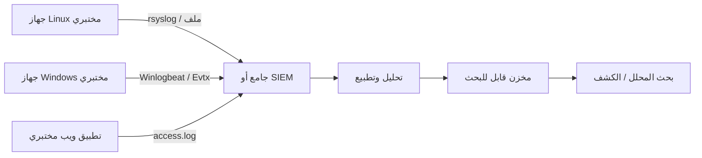

# المسار 2 · المرحلة 2.1 — مصادر السجلات وخطوط الأنابيب

## لماذا هذه المرحلة مهمة

تبدأ هندسة الكشف بالرؤية. إذا لم تُولَّد الأحداث الصحيحة وتُجمع وتُحلَّل وتُخزَّن بشكل قابل للبحث، فلن يظهر أي قدر من منطق الارتباط الذكي اختراقاً. تركز هذه المرحلة على خط الأنابيب الأساسي الذي يحوّل نشاط المضيف والتطبيق الخام إلى بيانات يمكن لمركز العمليات الأمنية استخدامها: ماذا يُسجَّل، أين تعيش السجلات في بيئة مختبرية، كيف تتحرك، ولماذا مزامنة الوقت غير قابلة للتفاوض.

بدون جرد واضح لمصادر السجلات وفهم أساسي لمسار الشحن ← التحليل ← التخزين، تستند المراحل اللاحقة (البحث، تصميم الكشف، الفرز) إلى أدلة ناقصة.

---

## أهداف التعلم

بنهاية هذه المرحلة ستكون قادراً على:

- جرد مصادر سجلات المصادقة والعمليات والويب الأساسية على أنظمة Linux وWindows المختبرية
- شرح المراحل عالية المستوى لخط أنابيب التسجيل (التوليد ← الشحن ← التحليل/التطبيع ← التخزين/الفهرسة ← الاحتفاظ)
- تأكيد أن الطوابع الزمنية عبر مضيفات المختبر متزامنة وفهم العواقب عندما لا تكون كذلك
- تحديد وأخذ عينات من ملفات السجل أو قنوات الأحداث الرئيسية في المختبر
- ربط مصادر سجلات المختبر بأنواع الكشوفات التي ستكتبها لاحقاً

---

## المتطلبات السابقة

- إكمال مراحل الطور 2 رقم 2 و3 و9 (أسس Linux وWindows والتسجيل/الكشف)
- أجهزة افتراضية مختبرية (Linux ويفضّل Windows) تحت سيطرتك
- القدرة على قراءة الملفات بصلاحيات `sudo` / إدارية على تلك الأجهزة
- اختياري: شاحن سجلات بسيط أو جامع مركزي موجود مسبقاً في المختبر

---

## نقطة تحقق السلامة

1. تبقى كل عمليات فحص وجمع السجلات داخل مضيفات مختبرية تملكها أو تديرها.
2. لا تفعّل تسجيلاً مفصلاً أو شاحنات على أنظمة إنتاج كجزء من هذا المنهج.
3. تجنّب جمع أو تصدير سجلات تحتوي على بيانات اعتماد مستخدمين حقيقية أو بيانات شخصية من أنظمة غير مختبرية.
4. عند تجربة تدوير السجلات أو الشحن، التقط لقطة أولاً.

---

## المفاهيم الأساسية

### 1. ماذا يجب تسجيله (قائمة أولوية مختبرية)

| الفئة | أمثلة Linux | أمثلة Windows | لماذا يهم للكشف |
|-------|-------------|---------------|------------------|
| المصادقة | `/var/log/auth.log`، `secure`، journal `sshd` | سجل الأمان (4624، 4625، 4648، …) | فشل/نجاح الدخول، القوة الغاشمة، الحركة الجانبية |
| إنشاء العمليات | `auditd` execve، اختياري شبيه بـ Sysmon | الأمان 4688، Sysmon 1 | ثنائيات مشبوهة، العيش على الأرض |
| الويب / التطبيق | سجلات الوصول والخطأ (nginx، Apache، خاصة بالتطبيق) | سجلات IIS، سجلات أحداث التطبيق | هجمات الويب، الاستطلاع، فحوصات الحقن |
| الشبكة / الجدار الناري | `ufw`، `firewalld`، سجلات iptables | Windows Filtering Platform، سجلات الجدار الناري | مسح المنافذ، الاتصالات المحظورة |
| تغييرات الامتياز / الحساب | `auth.log`، سجلات `sudo` | 4720، 4732، 4672، … | الاستمرارية، تصعيد الامتياز |

لا تحتاج كل مصدر ممكن في اليوم الأول. ابدأ بسجلات المصادقة والويب؛ وسّع حسب ما تتطلبه كشوفات المختبر.

### 2. خط الأنابيب على مستوى عالٍ

```
التوليد ← الشحن ← التحليل / التطبيع ← الفهرسة / التخزين ← الاحتفاظ والوصول
```

- **التوليد** — يكتب نظام التشغيل أو التطبيق الحدث (syslog، سجل أحداث Windows، ملف تطبيق).
- **الشحن** — وكيل أو معيد توجيه (rsyslog، Fluent Bit، Winlogbeat، إلخ) ينقل الحدث إلى جامع أو SIEM.
- **التحليل / التطبيع** — تُستخرج الحقول وتُربط بمخطط مشترك (IP المصدر، المستخدم، الإجراء، النتيجة، …).
- **الفهرسة / التخزين** — تصبح الأحداث قابلة للبحث.
- **الاحتفاظ** — كم من الوقت تُحفظ البيانات عبر الإنترنت مقابل الأرشفة؛ مدفوع باحتياجات التحقيق وقيود قرص المختبر.

في مختبر أدنى قد تقرأ الملفات مباشرة فقط. ما زال خط الأنابيب المفاهيمي ينطبق عندما تقدّم لاحقاً SIEM خفيفاً أو حتى مجموعة ملفات JSON محللة.

### 3. مزامنة الوقت

يعتمد الارتباط على الترتيب. إذا كانت ساعة المضيف A متقدمة بخمس دقائق على المضيف B، يمكن أن يظهر تسلسل «فشل دخول ثم نجاح» معكوساً أو مستحيلاً إعادة بنائه. أفضل ممارسة مختبرية:

- شغّل NTP أو chrony على كل جهاز افتراضي.
- أكد الإزاحات بـ `timedatectl` / `w32tm`.
- فضّل UTC للطوابع الزمنية المخزّنة عندما يكون ذلك ممكناً.

### 4. مواقع سجلات المختبر (مرجع سريع)

**Linux (شائع):**

- `/var/log/auth.log` أو `/var/log/secure`
- `/var/log/syslog` أو journalctl
- الويب: `/var/log/nginx/access.log`، `/var/log/apache2/access.log`
- التدقيق: `/var/log/audit/audit.log` (إذا كان auditd مفعّلاً)

**Windows:**

- عارض الأحداث → سجلات Windows → الأمان، النظام، التطبيق
- سجلات Sysmon (إذا ثُبّت في المختبر)
- IIS: `%SystemDrive%\inetpub\logs\LogFiles`

---

## خريطة توضيحية: خط أنابيب تسجيل مختبري بسيط



---

## جولة مختبرية تفصيلية

1. على جهاز Linux مختبري، اعرض محتويات `/var/log` وحدد سجلات المصادقة والويب.
2. ولّد بضع محاولات دخول SSH فاشلة (من مضيف مختبر آخر أو جهاز المهاجم) وتأكد من ظهور أسطر جديدة بطوابع زمنية.
3. على جهاز Windows مختبري (إن توفر)، افتح عارض الأحداث وصفِّ سجل الأمان لأحداث الدخول (4624/4625).
4. تحقق من مزامنة الوقت على كلا المضيفين؛ سجّل أي إزاحة.
5. اختيارياً اضبط شاحناً بسيطاً أو انسخ فقط عينة من السجلات إلى مضيف تحليل مختبري مركزي.
6. وثّق الجرد: المضيف، مسار السجل أو القناة، الحجم التقريبي، وما إذا كانت الطوابع الزمنية تبدو موثوقة.

---

## الكود المصاحب

- `Codes/Bash/09_logging_detection/` — مساعدات لتتبع وتصنيف أساسي
- `Codes/Python/02_linux_security/parse_auth_failures.py` — محلل مثال لسجلات مصادقة مختبرية
- سكربتات إضافية للمسار 2 تحت `Codes/Python/Track-2-SOC/` عند نشرها

استخدم هذه فقط ضد ملفات سجلات مختبرية.

---

## الأخطاء الشائعة

- افتراض أن «السجلات موجودة» دون التحقق من احتوائها على الحقول اللازمة للكشف (IP المصدر، اسم المستخدم، النتيجة).
- تجاهل انحراف الساعة حتى يفشل تمرين ارتباط.
- شحن سجلات خام كاملة دون أي تصفية، ثم نفاد قرص المختبر.
- معاملة سجل أحداث Windows وsyslog Linux كقابلين للتبادل دون تطبيع أسماء الحقول.

---

## أفضل الممارسات

- ابدأ بقائمة أولوية قصيرة من المصادر ووسّع عمداً.
- طبّع مبكراً (أسماء حقول مشتركة) حتى في محلل مختبري بسيط.
- أبقِ احتفاظ المختبر متواضعاً لكنه كافٍ للسيناريوهات التي ستشغّلها (أيام إلى أسبوعين عادة يكفي).
- احمِ نزاهة السجلات؛ يجب ألا يتمكن مهاجمو المختبر من محو الأدلة دون كشف.
- وثّق الجرد حتى يتمكن تصميم الكشف اللاحق من الإشارة إلى أسماء المصادر الدقيقة.

---

## تمرين عملي

1. أنتج جرد مصادر سجلات مختبري من صفحة واحدةحدة يغطي على الأقل المصادقة ومصدر ويب أو عمليات واحداً على كل نظام تشغيل متاح.
2. ولّد عدداً صغيراً من أحداث مصادقة فاشلة وناجحة؛ تأكد من ظهورها بطوابع زمنية متسقة.
3. لاحظ أي فجوات (IP مصدر ناقص، اسم مستخدم ناقص، انحراف ساعة) من شأنها إعاقة الكشوفات اللاحقة.
4. احفظ الجرد؛ يصبح الأساس للمراحل 2.2–2.8.

---

## أسئلة المراجعة

1. لماذا تهم مزامنة الوقت لربط فشل دخول على مضيف واحد بنجاح دخول على مضيف آخر؟
2. اذكر ثلاثة مصادر سجلات مختبرية مفيدة بشكل خاص لكشف محاولات مصادقة بالقوة الغاشمة.
3. ما المراحل الرئيسية لخط أنابيب التسجيل، وأي مرحلة تحوّل النص الخام إلى حقول قابلة للبحث؟
4. كيف يمكن للتسجيل المفرط دون تخطيط احتفاظ أن يضر ببيئة مختبرية؟
5. ما الفرق بين *مصدر* سجل و*خط أنابيب* سجل؟

---

## الملخص

- يبدأ الكشف بتوليد الأحداث الصحيحة وجمعها.
- جرد واضح لمصادر سجلات المختبر وفهم أساسي لخط الأنابيب متطلبان أساسيان للبحث وتصميم الكشف.
- مزامنة الوقت متطلب صامت لأي ارتباط متعدد المضيفات.
- الجرد المنتَج هنا يغذي كل مرحلة لاحقة في المسار 2.

---

## المصادر وقراءات إضافية

- NIST SP 800-92 (دليل إدارة سجلات أمان الحاسوب) — مفاهيمي
- المرحلة 9 من الطور 2 (التسجيل والكشف والفريق الأزرق)
- صفحات `man` لـ Linux حول rsyslog وjournalctl وauditd
- توثيق Microsoft حول تدقيق أمان Windows (أحداث مختارة)

يبقى كل العمل العملي مقيّداً ببيئات مختبرية مصرح بها فقط.
