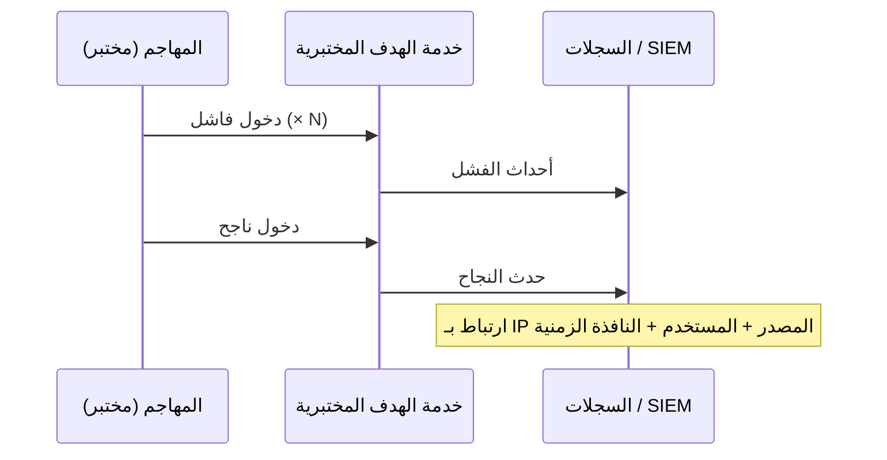

# المسار 2 · المرحلة 2.2 — بحث SIEM والارتباط

## لماذا هذه المرحلة مهمة

تصبح السجلات الخام مفيدة فقط عندما يستطيع المحلل طرح أسئلة دقيقة ودمج أحداث مرتبطة في قصة متماسكة. تتيح مهارات البحث الإجابة عن «من فشل في الدخول من أين؟» وتتيح مهارات الارتباط الإجابة عن «هل سبق تلك الإخفاقات نجاح دخول من نفس المصدر؟» كلاهما أساسي للفرز وللتحقق من الكشوفات التي ستصممها لاحقاً.

في بيئة مختبرية يمكنك توليد الأحداث الدقيقة التي تحتاجها، والبحث فيها، وممارسة بناء جداول زمنية بسيطة دون ضوضاء بيئة إنتاج.

---

## أهداف التعلم

بنهاية هذه المرحلة ستكون قادراً على:

- صياغة أسئلة بحث واضحة لأحداث المصادقة والأحداث المختبرية ذات الصلة
- تحديد أحداث الدخول الفاشلة والناجحة في سجلات المختبر أو SIEM بسيط
- ربط نوعين أو أكثر من الأحداث في جدول زمني قصير (مثلاً إخفاقات متبوعة بنجاح)
- توثيق منطق البحث حتى يمكن تحويله إلى كشف في المرحلة التالية
- التمييز بين بحث تحقيقي لمرة واحدة واستعلام كشف قابل لإعادة الاستخدام

---

## المتطلبات السابقة

- إكمال المرحلة 2.1 (جرد السجلات ومزامنة الوقت مؤكدة)
- القدرة على توليد أحداث مصادقة فاشلة وناجحة في المختبر (SSH، RDP، أو دخول ويب)
- الوصول إلى سجلات المختبر أو واجهة بحث خفيفة (grep، journalctl، SIEM بسيط، أو حتى جدول بيانات لأحداث محللة)

---

## نقطة تحقق السلامة

1. ولّد ضوضاء مصادقة فقط ضد خدمات مختبرية تتحكم بها.
2. لا تشغّل أدوات تخمين كلمات المرور ضد أي نظام غير مختبري.
3. أبقِ حسابات وكلمات مرور المختبر خارج سجلات البحث المشتركة أو لقطات الشاشة.

---

## المفاهيم الأساسية

### 1. من السؤال إلى البحث

تبدأ عمليات البحث التحقيقية الجيدة بسؤال بلغة بسيطة:

- «أظهر لي كل محاولات دخول SSH الفاشلة في الساعة الأخيرة.»
- «أي عناوين IP مصدر أنتجت إخفاقات ثم نجاحاً لاحقاً ضد نفس الحساب؟»
- «هل سبق أي إخفاقات دخول لتطبيق ويب جلسة ناجحة من نفس العميل؟»

ترجم السؤال إلى الحقول المتاحة في سجلات مختبرك (الطابع الزمني، IP المصدر، اسم المستخدم، النتيجة، الخدمة).

### 2. أنماط الارتباط المفيدة في المختبر

| النمط | الوصف | مثال مختبري |
|-------|--------|-------------|
| تسلسل | الحدث A ثم الحدث B ضمن نافذة زمنية | ≥5 إخفاقات متبوعة بنجاح من نفس IP |
| تجميع | عدد الأحداث يتجاوز عتبة | 20 دخول فاشل من IP واحد في 5 دقائق |
| ربط عبر مصادر | يظهر مفتاح مشترك في نوعي سجل | 401 ويب ثم إنشاء عملية لاحق على خادم التطبيق |

### 3. الجداول الزمنية

الجدول الزمني ببساطة أحداث مرتبة بمفتاح مشترك (IP، مستخدم، مضيف). حتى جدول مبني يدوياً ممارسة قيمة قبل الانتقال إلى قواعد ارتباط آلية.

---

## خريطة توضيحية: ارتباط فشل-ثم-نجاح

---

## جولة مختبرية تفصيلية

1. من جهاز مهاجم أو تحليل، ولّد حفنة من محاولات دخول فاشلة ضد SSH أو RDP أو دخول ويب مختبري.
2. اتبع بدخول ناجح واحد باستخدام حساب مختبري معروف.
3. ابحث في سجلات المصادقة عن IP المصدر أو اسم المستخدم.
4. ابنِ جدولاً زمنياً قصيراً: طوابع زمن الإخفاقات، طابع زمن النجاح، أي نشاط مثير لاحق.
5. اكتب منطق البحث بلغة بسيطة، وإن دعم أداتك ذلك، بصيغة استعلام الأداة.
6. لاحظ أي حقول ناقصة أجبرتك على التقريب (مثلاً لا منفذ مصدر، لا حقل نتيجة واضح).

---

## الكود والأدوات المصاحبة

- `grep`، `journalctl`، `Get-WinEvent` / عارض الأحداث
- محللات بسيطة من المرحلة 2.1
- أي واجهة بحث SIEM مختبرية مُكوَّنة مسبقاً
- أمثلة استعلام مستقبلية للمسار 2 تحت `Codes/Python/Track-2-SOC/`

---

## الأخطاء الشائعة

- البحث فقط عن الإخفاقات وعدم تأكيد ما إذا تبعها نجاح.
- تجاهل المناطق الزمنية أو انحراف الساعة عند ترتيب الأحداث.
- نسخ ولصق استعلامات SIEM إنتاج تشير إلى حقول لا تحتويها سجلات مختبرك.
- معاملة بحث ناجح لمرة واحدة ككشف منتهٍ (تصميم الكشف يأتي بعد ذلك).

---

## أفضل الممارسات

- ابدأ دائماً بسؤال واضح.
- فضّل مرشحات قائمة على الحقول على greps نص حر عندما تكون السجلات منظمة.
- سجّل البحث (أو الاستعلام) الدقيق الذي أنتج الجدول الزمني حتى يمكن إعادة استخدامه أو تحويله إلى قاعدة.
- تحقق من منطق الارتباط بسيناريوهات مختبرية إيجابية حقيقية وحركة خط أساس نظيفة.

---

## تمرين عملي

1. ولّد تسلسل مصادقة مختبري «فشل ثم نجاح».
2. ابحث وأنتج جدولاً زمنياً على الأقل لمجموعة الإخفاقات والنجاح.
3. اكتب سؤال البحث بلغة بسيطة والمرشح أو الاستعلام الملموس الذي استخدمته.
4. لاحظ تحسيناً واحداً لمصدر السجل أو التحليل يجعل البحث أسهل في المرة القادمة.

---

## أسئلة المراجعة

1. ما الفرق بين بحث تحقيقي واستعلام كشف قابل لإعادة الاستخدام؟
2. لماذا المفتاح المشترك (IP المصدر، اسم المستخدم، المضيف) أساسي للارتباط؟
3. كيف يمكن لانحراف الساعة بين مضيفين مختبريين أن يكسر جدولاً زمنياً «إخفاقات ثم نجاح»؟
4. أعطِ مثالاً على بحث بأسلوب تجميع مفيد لكشف القوة الغاشمة في المختبر.
5. لماذا يجب أن تفحص الدخول الناجح حتى عندما يكون اهتمامك الأساسي بالإخفاقات؟

---

## الملخص

- أسئلة البحث الدقيقة تحوّل السجلات إلى إجابات.
- يربط الارتباط أحداثاً مرتبطة في جداول زمنية تكشف سلوك المهاجم.
- التسلسلات المولَّدة مختبرياً تتيح لك ممارسة كلتا المهارتين بأمان وبشكل قابل للتكرار.
- منطق البحث الذي توثقه هنا يصبح المادة الخام لتصميم الكشف في المرحلة 2.3.

---

## المصادر وقراءات إضافية

- المرحلة 9 من الطور 2
- توثيق بحث SIEM للمورد أو مفتوح المصدر (نسخة مختبرية فقط)
- MITRE ATT&CK — تكتيكات الوصول الأولي / الوصول إلى بيانات الاعتماد (للتسمية لاحقاً)

يبقى كل العمل العملي مقيّداً ببيئات مختبرية مصرح بها فقط.
