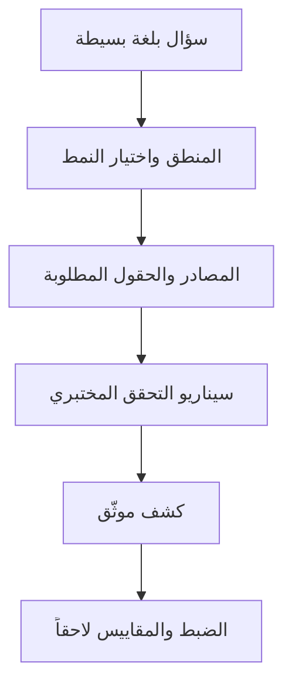

# المسار 2 · المرحلة 2.3 — تصميم الكشف

## لماذا هذه المرحلة مهمة

الكشف تعبير قابل لإعادة الاستخدام والاختبار عن «هذا النمط من الأحداث يستحق انتباه المحلل». الانتقال من بحث لمرة واحدة إلى كشف مصمم يفرض الوضوح: ماذا نبحث عنه بالضبط، خلال أي نافذة زمنية، بأي عتبة، وما السياق الذي يجب أن يحمله التنبيه؟ الكشوفات المصممة بشكل سيء تولّد ضوضاء؛ المصممة جيداً تُظهر قضايا مختبرية (ثم إنتاجية) حقيقية بمعدلات إيجابيات كاذبة مقبولة.

تعلّم هذه المرحلة كتابة الكشوفات أولاً بلغة بسيطة، ثم كمنطق ملموس، واختيار الأنماط المناسبة (عتبة، تسلسل، وجود/غياب) للسلوكيات المختبرية التي يمكنك توليدها.

---

## أهداف التعلم

بنهاية هذه المرحلة ستكون قادراً على:

- كتابة فكرة كشف بلغة بسيطة تتضمن الكيانات ذات الصلة والنافذة الزمنية والإجراء المقصود
- ترجمة تلك الفكرة إلى منطق ملموس (عتبة، تسلسل، أو نمط آخر)
- الاختيار بين قواعد عتبة بسيطة وقواعد تسلسل متعددة الأحداث لسيناريوهات مختبرية
- تحديد مصادر السجلات والحقول المطلوبة لكل كشف
- صياغة ثلاث كشوفات مختبرية على الأقل يمكنك التحقق منها وضبطها لاحقاً

---

## المتطلبات السابقة

- إكمال المرحلتين 2.1 و2.2
- القدرة على توليد الضوضاء المختبرية التي يُقصد بكل كشف التقاطها
- جرد السجلات وعينات استعلامات البحث من المراحل السابقة

---

## نقطة تحقق السلامة

1. صمّم واختبر الكشوفات فقط ضد أحداث مولَّدة مختبرياً.
2. لا تنشر قواعد تجريبية قد تؤثر على تنبيهات الإنتاج.
3. أبقِ أي حمولات اختبار أو أسماء حسابات معلّمة بوضوح كمختبرية فقط.

---

## المفاهيم الأساسية

### 1. بيان الكشف بلغة بسيطة

قالب بداية جيد:

> «نبّه عندما ينتج [الكيان] [N] [نوع حدث] خلال [نافذة زمنية] [اختياري: متبوعاً بحدث آخر]، وضمّن [حقول السياق] في التنبيه.»

مثال:

> «نبّه عندما ينتج أي IP مصدر 10 أو أكثر من محاولات دخول SSH فاشلة ضد مضيف مختبري خلال 5 دقائق، وضمّن اسم(أسماء) المستخدم المستهدف والطوابع الزمنية الأولى/الأخيرة.»

### 2. أنواع الأنماط

| النمط | متى تستخدمه | مثال مختبري |
|--------|--------------|--------------|
| **عتبة / تجميع** | حجم أحداث متشابهة | ≥15 دخول فاشل من IP واحد في 5 دقائق |
| **تسلسل** | أحداث مرتبة | إخفاقات متبوعة بنجاح من نفس IP خلال 10 دقائق |
| **وجود** | حدث نادر أو محظور | استخدام حساب «كناري» مختبري |
| **غياب** | نبض متوقع مفقود | توقف وكيل المختبر عن الإبلاغ |
| **إحصائي / خط أساس** | انحراف عن الطبيعي (متقدم) | عملية غير عادية من مستخدم خادم ويب |

ابدأ بالعتبة والتسلسل؛ يغطيان معظم كشوفات المختبر المبكرة.

### 3. العناصر المطلوبة لتصميم كشف

- الاسم والوصف بلغة بسيطة
- تسميات تكتيك/تقنية ATT&CK (عالية المستوى، للتواصل — المرحلة 2.5)
- مصدر(مصادر) السجل والحقول الحرجة
- المنطق (العتبة، النافذة، التسلسل)
- سياق التنبيه (ما يجب أن يراه المحلل)
- سيناريو إيجابي حقيقي متوقع في المختبر
- مخاطر إيجابيات كاذبة معروفة وأفكار ضبط أولية

### 4. من البحث إلى الكشف

عمليات البحث التي كتبتها في المرحلة 2.2 هي النماذج الأولية. يضيف الكشف:

- الاستمرارية (يعمل باستمرار أو وفق جدول)
- إجراء التنبيه
- الملكية والتوثيق
- خطة للتحقق والضبط

---

## خريطة توضيحية: تدفق تصميم الكشف

---

## جولة مختبرية تفصيلية

1. راجع ضوضاء المصادقة والويب التي يمكنك توليدها.
2. صغ ثلاثة بيانات كشف بلغة بسيطة (مثلاً عتبة قوة غاشمة، تسلسل فشل-ثم-نجاح، انفجار 404/401 ويب).
3. لكل منها، اسرد مصدر السجل الدقيق والحقول المطلوبة.
4. نفّذ أو حاكِ المنطق (قاعدة SIEM، سكربت بسيط، أو حتى grep مجدول + عد).
5. ولّد سيناريو الإيجابي الحقيقي المختبري وتأكد من إطلاق الكشف.
6. سجّل موقفاً واحداً محتملاً لإيجابية كاذبة لكل قاعدة.

---

## الكود المصاحب

- `Codes/Python/09_logging_detection/simple_detection_demo.py`
- `Codes/Python/Track-2-SOC/` (عند النشر)
- أوامر shell لعد العتبة على ملفات سجلات مختبرية

---

## الأخطاء الشائعة

- كتابة كشوفات تتطلب حقولاً لا تحتويها سجلات مختبرك.
- ضبط عتبات منخفضة جداً بحيث ينبّه نشاط المختبر العادي باستمرار.
- نسيان توثيق سيناريو الإيجابي الحقيقي، مما يجعل التحقق اللاحق مستحيلاً.
- معاملة كشف كمنتهٍ بعد أول إيجابي حقيقي دون النظر في الإيجابيات الكاذبة.

---

## أفضل الممارسات

- ابدأ بقواعد عالية الإشارة منخفضة التعقيد.
- اقرن دائماً كشفاً بإجراء تحقق مختبري.
- ضمّن سياقاً كافياً في التنبيه حتى يتمكن المحلل من الفرز دون عمليات بحث إضافية فورية.
- أصدِر وعلّق منطق الكشف بنفس طريقة شيفرة الإنتاج.
- خطط للضبط (المرحلة 2.7) من المسودة الأولى.

---

## تمرين عملي

1. اكتب ثلاثة تصاميم كشف مختبرية باستخدام العناصر أعلاه.
2. تحقق من كل منها بسيناريو إيجابي حقيقي تولّده.
3. لاحظ خطراً واحداً على الأقل لإيجابية كاذبة لكل كشف.
4. احفظ التصاميم؛ ستُنقَّح في مراحل لاحقة وتُضمَّن في حزمة المشروع النهائي.

---

## أسئلة المراجعة

1. ما الفرق بين بحث وكشف؟
2. متى تختار نمط تسلسل على عتبة بسيطة؟
3. لماذا يجب أن يتضمن كل تصميم كشف سيناريو إيجابي حقيقي مختبري؟
4. اذكر ثلاث قطع سياق مفيدة لتضمينها في تنبيه متعلق بالمصادقة.
5. كيف يقيّد جرد السجلات من المرحلة 2.1 الكشوفات التي يمكنك كتابتها؟

---

## الملخص

- يحوّل تصميم الكشف الأسئلة التحقيقية إلى منطق قابل لإعادة الاستخدام والاختبار.
- اللغة البسيطة أولاً، النمط الملموس ثانياً، التحقق ثالثاً.
- أنماط العتبة والتسلسل تغطي معظم احتياجات المختبر المبكرة.
- التصاميم الثلاثة المنتَجة هنا تصبح نواة مشروع المسار 2 النهائي.

---

## المصادر وقراءات إضافية

- المرحلة 9 من الطور 2
- مواصفة قاعدة Sigma (مفاهيمية — استخدام مختبري)
- MITRE ATT&CK للتسمية (المرحلة 2.5)
- أدلة هندسة الكشف للموردين (سياق مختبري)

يبقى كل العمل العملي مقيّداً ببيئات مختبرية مصرح بها فقط.
