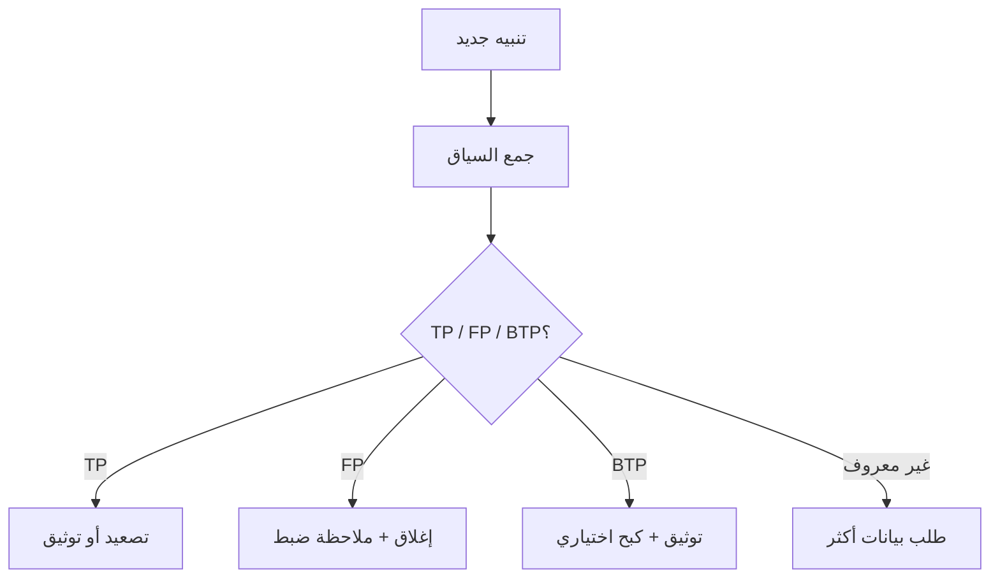

# المسار 2 · المرحلة 2.4 — فرز التنبيهات والإيجابيات الكاذبة

## لماذا هذه المرحلة مهمة

حتى الكشوفات المصممة جيداً تنتج تنبيهات يجب فرزها. مهمة المحلل الأولى هي تقرير ما إذا كان التنبيه يمثل إيجابياً حقيقياً يستحق التصعيد، أو إيجابياً كاذباً يمكن إغلاقه، أو إيجابياً حقيقياً منخفض الأثر يحتاج فقط إلى توثيق. خلط الشدة (مدى سوء النشاط إن كان حقيقياً) بالثقة (مدى تأكدنا من أن النشاط حقيقي) يؤدي إما إلى إرهاق التنبيهات أو حوادث فائتة.

تتيح البيئات المختبرية توليد ظروف إيجابية حقيقية وكاذبة عمداً، وممارسة الفرز المنظم، وتوثيق كبح أو توصيات ضبط آمنة.

---

## أهداف التعلم

بنهاية هذه المرحلة ستكون قادراً على:

- فصل مفاهيم الشدة والثقة عند تقييم تنبيه
- تطبيق عملية فرز بسيطة على تنبيهات مختبرية (تصنيف أولي، مراجعة أدلة، قرار، توثيق)
- تحديد أسباب شائعة للإيجابيات الكاذبة في كشوفات المصادقة والويب المختبرية
- توثيق كبح أو توصية ضبط آمنة دون تعطيل إشارة مفيدة
- إنتاج جدول فرز قصير سيظهر لاحقاً في المشروع النهائي

---

## المتطلبات السابقة

- إكمال المراحل 2.1–2.3
- كشوفات مختبرية قليلة على الأقل يمكن أن تطلق
- القدرة على توليد نشاط مختبري يبدو خبيثاً وحميداً

---

## نقطة تحقق السلامة

1. افرز فقط تنبيهات مختبرية.
2. لا تكبح أو تعطّل قواعد على أي نظام غير مختبري.
3. وثّق كل قرار حتى يبقى تاريخ المختبر مفهوماً.

---

## المفاهيم الأساسية

### 1. الشدة مقابل الثقة

| المفهوم | المعنى | توضيح مختبري |
|---------|--------|---------------|
| **الشدة** | الأثر المحتمل إذا كان النشاط حقيقياً | دخول مسؤول ناجح بعد قوة غاشمة = شدة عالية |
| **الثقة** | مدى تأكدنا من أن الكشف حدد النشاط بشكل صحيح | إخفاقات كثيرة من IP ماسح معروف قد تكون ثقة منخفضة حتى يُفحص السياق |

يمكن أن يكون التنبيه عالي الشدة / منخفض الثقة (يحتاج أدلة أكثر) أو منخفض الشدة / عالي الثقة (ما زال يستحق التسجيل).

### 2. عملية فرز بسيطة

1. **الاعتراف** — ادّعِ التنبيه حتى يعرف الآخرون أنه يُعالَج.
2. **وضع السياق** — اجلب الأحداث الخام، سمعة IP المصدر (داخلي للمختبر)، المستخدم، دور المضيف، تنبيهات ذات صلة حديثة.
3. **التصنيف** — إيجابي حقيقي (TP)، إيجابي كاذب (FP)، إيجابي حقيقي حميد (BTP)، أو يحتاج معلومات أكثر.
4. **التصرف** — صعّد، أغلق بسبب، أو اطلب ضبطاً.
5. **التوثيق** — ملاحظة قصيرة يمكن للمحللين المستقبليين فهمها.

### 3. أسباب إيجابيات كاذبة مختبرية شائعة

- عتبات مضبوطة منخفضة جداً لنشاط مسح أو اختبار مختبري عادي
- حسابات مختبرية مشتركة يستخدمها متعلمون متعددون
- انحراف ساعة ينتج انتهاكات تسلسل ظاهرية
- تحليل ناقص (حقل خاطئ مُستخرَج)
- سكربتات إدارية شرعية تبدو كثنائيات عيش على الأرض

### 4. الكبح الآمن مقابل إعادة الضبط

- **الكبح** — تجاهل مؤقت أو مشروط (مثلاً «تجاهل هذه القاعدة لـ IP ماسح الثغرات المعروف خلال نافذة المختبر الأسبوعية»).
- **إعادة الضبط** — تغيير المنطق (رفع العتبة، إضافة استثناء لعملية معروفة جيدة، تشديد النافذة الزمنية).

فضّل إعادة الضبط عندما تكون القاعدة صاخبة أساساً؛ استخدم كبحاً ضيقاً عندما يكون الاستثناء مؤقتاً أو شديد التحديد.

---

## خريطة توضيحية: تدفق قرار الفرز

---

## جولة مختبرية تفصيلية

1. ولّد مزيجاً من نشاط إيجابي حقيقي (قوة غاشمة أو مسح مقصود) وحميد قد يطلق كشوفاتك أيضاً.
2. لكل تنبيه ناتج، سر عبر عملية الفرز أعلاه.
3. سجّل التصنيف وملخص الدليل والقرار في جدول بسيط.
4. لإيجابية كاذبة واحدة على الأقل، اقترح إما شرط كبح أو إعادة ضبط لمنطق الكشف.
5. أكد أن سيناريو الإيجابي الحقيقي ما زال يطلق بعد أي تغيير.

---

## المواد المصاحبة

- قالب جدول فرز (markdown أو جدول بيانات)
- تصاميم الكشف من المرحلة 2.3
- عينات سجلات مختبرية

---

## الأخطاء الشائعة

- إغلاق تنبيهات كـ FP دون تسجيل السبب، فتعود نفس الضوضاء.
- كبح قاعدة بأكملها بدلاً من استثناء ضيق.
- تصعيد كل تنبيه عالي الشدة دون فحص الثقة.
- تغيير منطق الكشف دون إعادة التحقق من مسار الإيجابي الحقيقي.

---

## أفضل الممارسات

- وثّق دائماً التصنيف وسبباً من سطر واحد.
- أبقِ الكبح ضيقاً قدر الإمكان ومحدوداً زمنياً عندما يكون ذلك ممكناً.
- أعد التحقق من الكشوفات بعد أي ضبط.
- عامل ممارسة الفرز المختبرية كإعداد لعمل نوبات الإنتاج.

---

## تمرين عملي

1. ولّد أو اجمع خمسة تنبيهات مختبرية على الأقل (مزيج من TP وFP إن أمكن).
2. افرز كل واحد وأكمل جدولاً بأعمدة: معرّف التنبيه / القاعدة، التصنيف، الدليل الرئيسي، القرار، ملاحظة الضبط (إن وجدت).
3. طبّق ضبطاً أو كبحاً آمناً واحداً وتأكد من أن مسار الإيجابي الحقيقي ما زال يعمل.
4. احفظ الجدول للمشروع النهائي.

---

## أسئلة المراجعة

1. ما الفرق بين الشدة والثقة؟
2. لماذا «يحتاج معلومات أكثر» فئة فرز مفيدة؟
3. متى يُفضَّل كبح ضيق على تغيير منطق الكشف؟
4. كيف يمكن لحسابات مختبرية مشتركة أن تزيد معدلات الإيجابيات الكاذبة؟
5. لماذا يجب إعادة اختبار سيناريو إيجابي حقيقي بعد الضبط؟

---

## الملخص

- يحوّل الفرز التنبيهات إلى قرارات.
- فصل الشدة عن الثقة يمنع كل من المبالغة في الرد والتقليل منه.
- تحليل الإيجابيات الكاذبة الموثّق يدفع تصميماً وضبطاً أفضل للكشف.
- جدول الفرز المنتَج هنا مكوّن مطلوب لمشروع المسار 2 النهائي.

---

## المصادر وقراءات إضافية

- المرحلة 9 من الطور 2
- كتيبات فرز SOC (مفاهيمية)
- أدبيات هندسة الكشف حول إدارة الإيجابيات الكاذبة

يبقى كل العمل العملي مقيّداً ببيئات مختبرية مصرح بها فقط.
