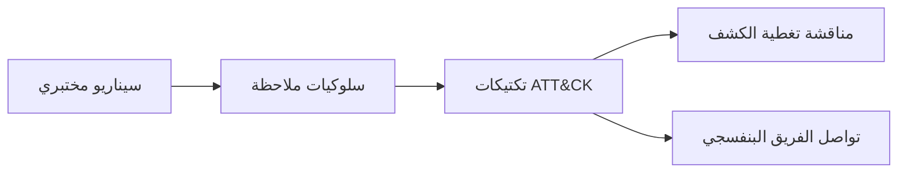

# المسار 2 · المرحلة 2.5 — ربط الهجوم في المختبر

## لماذا هذه المرحلة مهمة

يوفر MITRE ATT&CK لغة مشتركة لوصف سلوك الخصم. في مختبر (ولاحقاً في SOC حقيقي) يكون القول «يرتبط هذا النشاط بالوصول إلى بيانات الاعتماد والاكتشاف» أكثر فائدة بكثير من وصف كل سطر سجل بمعزل. يحسّن ربط السيناريوهات المختبرية بتكتيكات ATT&CK التواصل مع محللين آخرين وشركاء الفريق البنفسجي (المسار 5) وقراء التقارير. يساعد أيضاً في تحديد أولويات الكشوفات التي يجب بناؤها تالياً.

هذه المرحلة خفيفة عمداً: تسمّي نشاطاً مختبرياً بأسماء التكتيكات (واختيارياً معرّفات التقنيات) للتواصل، وليس كتمرين استخبارات تهديدات كامل.

---

## أهداف التعلم

بنهاية هذه المرحلة ستكون قادراً على:

- اختيار تكتيكات ATT&CK مناسبة لسيناريوهات مختبرية شغّلتها أو لاحظتها بالفعل
- شرح لماذا تسميات مستوى التكتيك مفيدة حتى عندما يكون تفصيل مستوى التقنية ناقصاً
- إنتاج جدول ربط قصير يربط نشاطاً مختبرياً بـ 2–3 تكتيكات
- استخدام الربط لإعلام مناقشات تغطية الكشف

---

## المتطلبات السابقة

- إكمال المراحل 2.1–2.4
- الإلمام بسيناريو مختبري واحد على الأقل (استطلاع، اختبار ويب، قوة غاشمة للمصادقة، إلخ) من الطور 2 أو مراحل المسار 2 السابقة
- الوصول إلى مصفوفة ATT&CK (المؤسسة) للمرجع — عبر الإنترنت أو نسخة غير متصلة

---

## نقطة تحقق السلامة

1. الربط نشاط توثيق وتواصل فقط.
2. لا تستخدم تسميات ATT&CK لتبرير أي اختبار خارج المختبر.
3. أبقِ التركيز على سيناريوهات مختبرية تتحكم بها.

---

## المفاهيم الأساسية

### 1. التكتيكات مقابل التقنيات

- **التكتيك** — الهدف التكتيكي للخصم (مثلاً الوصول الأولي، التنفيذ، الاستمرارية، الوصول إلى بيانات الاعتماد، الاكتشاف، الحركة الجانبية، الجمع، التسريب، الأثر).
- **التقنية** — الطريقة المحددة المستخدمة لتحقيق ذلك الهدف.

للعمل المختبري المبكر، تسميات مستوى التكتيك عادة كافية وأكثر استقراراً.

### 2. لماذا تربط النشاط المختبري

- مفردات مشتركة مع مسارات أخرى (خاصة تمارين الفريق البنفسجي في المسار 5)
- تحليل التغطية: «أي التكتيكات تعالجها كشوفاتنا الحالية؟»
- وضوح التقرير: تصبح النتائج والتنبيهات أسهل تجميعاً وتحديد أولويات

### 3. أمثلة ربط مختبرية عملية

| النشاط المختبري | تكتيكات ATT&CK محتملة |
|-------------------|-------------------------|
| مسح منافذ أو تعداد خدمات ضد مضيفات مختبر | الاكتشاف، الاستطلاع (إن خارجي) |
| SSH/RDP فاشل ثم ناجح | الوصول إلى بيانات الاعتماد، الوصول الأولي |
| حقن ويب أو XSS على تطبيق تدريبي | الوصول الأولي (إن أدى إلى وصول إضافي)، التنفيذ (في بعض التفسيرات) |
| إنشاء مستخدم مختبري جديد أو مهمة مجدولة | الاستمرارية، تصعيد الامتياز |
| قراءة ملفات حساسة بعد الوصول | الجمع، الاكتشاف |

معرّفات التقنيات الدقيقة اختيارية؛ أسماء التكتيكات هي الأولوية لهذه المرحلة.

---

## خريطة توضيحية: من نشاط المختبر إلى التكتيكات



---

## جولة مختبرية تفصيلية

1. اختر سيناريو مختبرياً واحداً أديته بالفعل (مثلاً تسلسل المصادقة من المرحلة 2.2 أو اختبار ويب من المسار 1).
2. اسرد السلوكيات القابلة للملاحظة (دخول فاشل، دخول ناجح، بدء عملية، انفجار 404 ويب، إلخ).
3. استشر مصفوفة ATT&CK وعيّن 2–3 تكتيكات تصف أفضل هدف الخصم الذي توضحه تلك السلوكيات.
4. اكتب إدخالاً قصيراً للربط:

```
   السيناريو: قوة غاشمة SSH مختبرية متبوعة بنجاح
   السلوكيات: عدة دخول فاشل، نجاح واحد، أمر لاحق
   التكتيكات: الوصول إلى بيانات الاعتماد، الوصول الأولي، (اختياري) التنفيذ
   ملاحظات: استُخدم للتحقق من الكشف في المرحلة 2.3
```

5. اختيارياً لاحظ أي من كشوفاتك الحالية تغطي كل تكتيك.

---

## الأخطاء الشائعة

- إجبار كل فعل مختبري في تقنية ATT&CK عندما يكون التطابق ضعيفاً.
- استخدام تسميات ATT&CK كبديل لأوصاف تقنية واضحة لما لوحظ.
- ربط حوادث إنتاج بأدلة مختبرية فقط (أبقِ السياقات منفصلة).

---

## أفضل الممارسات

- فضّل التكتيكات على التقنيات عندما تكون الأدلة محدودة.
- أبقِ الربط قصيراً ومرتبطاً بأدلة مختبرية ملموسة.
- أعد زيارة الربط عندما تضيف كشوفات جديدة أو تشغّل سيناريوهات جديدة.
- استخدم نفس التسميات عند التواصل مع شركاء المسار 5 (محاكاة الخصم).

---

## تمرين عملي

1. اربط سيناريو مختبرياً واحداً على الأقل من الطور 2 أو المسار 2 بـ 2–3 تكتيكات ATT&CK.
2. أنتج إدخالاً من فقرة أو جدول كما هو موضح أعلاه.
3. لاحظ أي تكتيك ليس لديك حالياً تغطية كشف له.
4. احفظ الربط للمشروع النهائي ولأي تمارين فريق بنفسجي.

---

## أسئلة المراجعة

1. ما الفرق بين تكتيك وتقنية ATT&CK؟
2. لماذا تكون تسميات مستوى التكتيك غالباً كافية لعمل الكشف المختبري؟
3. كيف يمكن لربط الهجوم أن يحسّن التواصل بين مسار SOC ومسار محاكاة خصم؟
4. أعطِ مثالاً على نشاط مختبري يرتبط بشكل طبيعي بالوصول إلى بيانات الاعتماد.
5. لماذا يجب أن يبقى الربط مرتبطاً بسلوكيات ملاحظة ملموسة بدلاً من نية مفترضة؟

---

## الملخص

- توفر تكتيكات ATT&CK لغة مشتركة للتواصل المختبري وSOC.
- الربط نشاط توثيق خفيف يحسّن مناقشات تغطية الكشف.
- الربط المنتَج هنا يغذي مشروع المسار 2 النهائي والتعاون مع المسار 5.

---

## المصادر وقراءات إضافية

- مصفوفة MITRE ATT&CK Enterprise
- مراحل الاستطلاع والويب في الطور 2
- نظرة عامة على المسار 5 (حلقة الفريق البنفسجي)

يبقى كل العمل العملي مقيّداً ببيئات مختبرية مصرح بها فقط.
