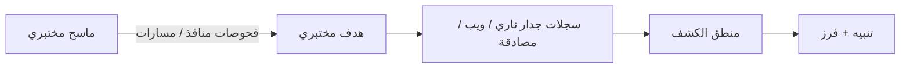

# المسار 2 · المرحلة 2.6 — كشف الويب والاستطلاع

## لماذا هذه المرحلة مهمة

الاستطلاع وفحص تطبيقات الويب من أوائل الأنشطة التي يؤديها خصم (أو مختبر مصرح به). كشفها في بيئة مختبرية يبني نفس المهارات اللازمة لملاحظة المسح الخارجي أو القوة الغاشمة للدلائل أو فحص الحقن ضد أصول ويب إنتاجية. لأنك تتحكم في الماسح والهدف، يمكنك توليد بيانات إيجابية حقيقية نظيفة، وكتابة كشوفات، وقياس فعاليتها دون أثر جانبي.

تربط هذه المرحلة عمل الاستطلاع والويب من الطور 2 والمسار 1 بممارسات هندسة الكشف في المسار 2.

---

## أهداف التعلم

بنهاية هذه المرحلة ستكون قادراً على:

- توليد حركة مسح منافذ وفحص ويب مختبرية ضد أهداف مصرح بها فقط
- تحديد مصادر السجلات التي تلتقط تلك الحركة (جدار ناري، سجلات وصول ويب، سجلات مصادقة)
- تصميم أو تنقيح كشوفات لضوضاء المسح وانفجارات مصادقة أو أخطاء ويب
- التحقق من الكشوفات بسيناريوهات مختبرية إيجابية حقيقية
- توثيق الكشوفات بنفس الأسلوب المستخدم في المراحل 2.3–2.4

---

## المتطلبات السابقة

- إكمال المراحل 2.1–2.5
- شبكة مختبرية بمضيف هدف واحد على الأقل وتطبيق ويب
- أدوات مسح آمنة محدودة بالمختبر (مثلاً `safe_lab_nmap.sh` أو ما يعادله)
- سجلات وصول ويب وسجلات مصادقة متاحة

---

## نقطة تحقق السلامة

1. يجب أن يستهدف كل مسح وفحص فقط مضيفات وتطبيقات مختبرية تتحكم بها.
2. استخدم أغلفة محدودة المعدل أو «آمنة»؛ لا توجّه ماسحات عامة الغرض إلى شبكات غير مختبرية أبداً.
3. التقط لقطات للأهداف إذا كان الفحص قد يؤثر على حالة التطبيق.
4. لا تستخدم الكشوفات المختبرية كمبرر لمسح أي نظام خارجي.

---

## المفاهيم الأساسية

### 1. إشارات قابلة للملاحظة لاستطلاع مختبري

| النشاط | إشارات مختبرية نموذجية |
|---------|--------------------------|
| مسح منافذ | محاولات اتصال متعددة بمنافذ مغلقة أو مفلترة من مصدر واحد؛ رفضات جدار ناري؛ توقيت بأسلوب nmap |
| تعداد خدمات | اتصال ثم قطع سريع، أو فحوصات خاصة بالبروتوكول |
| اكتشاف مسارات ويب | حجم عالٍ من استجابات 404، مسارات متسلسلة أو شبيهة بقائمة كلمات |
| فحص مصادقة ويب | انفجارات استجابات 401/403، دخول فاشل في سجلات التطبيق أو خادم الويب |
| فحص حقن | أحرف غير عادية أو أجزاء SQL/سكربت في المعاملات (مرئية في سجلات الوصول أو سجلات WAF إن وُجدت) |

### 2. مصادر السجلات المهمة

- سجلات جدار ناري للمضيف أو الشبكة
- سجلات وصول ويب وخطأ خادم الويب
- سجلات مصادقة التطبيق
- اختيارياً تنبيهات IDS/IPS إن وُجد مستشعر مختبري (المسار 3)

### 3. أفكار كشف (نقاط بداية)

- عتبة محاولات اتصال بمنافذ مغلقة من IP مصدر واحد ضمن نافذة قصيرة
- انفجار استجابات 404 لمسارات مميزة من عميل واحد
- انفجار دخول ويب فاشل أو 401 من عميل واحد
- تسلسل: نشاط شبيه بالمسح متبوع باتصال أو دخول ناجح من نفس المصدر

---

## خريطة توضيحية: كشف استطلاع مختبري

---

## جولة مختبرية تفصيلية

1. من مضيف ماسح مختبري مصرح به، شغّل مسح منافذ أو اكتشاف مسارات ويب مسيطراً ومنخفض المعدل ضد هدف مختبري (استخدم الغلاف الآمن إن وُفر).
2. تأكد من ظهور النشاط في السجلات ذات الصلة.
3. صمّم أو اضبط كشفاً سيطلق على ذلك النمط.
4. أعد تشغيل النشاط المختبري وتحقق من الكشف.
5. ولّد كمية صغيرة من حركة حميدة وافحص الإيجابيات الكاذبة.
6. وثّق الكشف باستخدام قالب المرحلة 2.3 وافرز أي تنبيهات وفق المرحلة 2.4.

---

## الكود المصاحب

- `Codes/Bash/05_reconnaissance/safe_lab_nmap.sh` (أو ماسح مختبري آمن معادل)
- محللات سجلات ويب وعروض كشف تحت `Codes/Python/Track-2-SOC/` و`Codes/Python/09_logging_detection/`

---

## الأخطاء الشائعة

- تشغيل ماسحات غير مقيّدة تُرهق خدمات المختبر أو القرص.
- كتابة كشوفات تعمل فقط لتوقيع أداة واحدة بالضبط بدلاً من السلوك العام.
- تجاهل سجلات الويب عندما تكون الإشارة المثيرة في طبقة التطبيق بدلاً من الشبكة.

---

## أفضل الممارسات

- فضّل عتبات سلوكية على توقيعات هشة.
- تحقق دائماً بحركة مختبرية إيجابية حقيقية وحميدة.
- حدّ معدل المسح المختبري حتى تبقى السجلات قابلة للقراءة والخدمات تعمل.
- اربط الكشوفات بتكتيكات ATT&CK (الاكتشاف، الاستطلاع، الوصول إلى بيانات الاعتماد، إلخ).

---

## تمرين عملي

1. نفّذ سيناريو مسح منافذ أو فحص ويب مختبري مسيطراً واحداً.
2. اكتب أو نقّح كشفاً واحداً على الأقل للضوضاء الناتجة.
3. تحققه، افرز التنبيه، وسجّل أي ضبط مطلوب.
4. أضف الكشف إلى حزمتك المتنامية للمشروع النهائي.

---

## أسئلة المراجعة

1. أي مصادر سجلات الأكثر فائدة لكشف مسح منافذ مختبري؟
2. لماذا قد يكون انفجار استجابات 404 إشارة استطلاع ويب مفيدة؟
3. كيف يحسّن تحديد معدل عمليات المسح المختبرية كلاً من السلامة وجودة الكشف؟
4. أعطِ مثالاً على كشف تسلسل يربط الاستطلاع بفعل ناجح لاحق.
5. لماذا يجب أن تُوثَّق كشوفات الاستطلاع المختبرية مع ذلك بتكتيكات ATT&CK؟

---

## الملخص

- يولّد الاستطلاع وفحص الويب المختبري إشارات نظيفة وقابلة للسيطرة لممارسة الكشف.
- سجلات الجدار الناري والويب والمصادقة هي المصادر الأساسية.
- الكشوفات السلوكية المُتحقَّق منها في المختبر تنتقل جيداً إلى الاستخدام التشغيلي لاحقاً تحت تفويض مناسب.
- الكشوفات المكتوبة هنا تقوي حزمة مشروع المسار 2 النهائي.

---

## المصادر وقراءات إضافية

- مرحلتا الطور 2 رقم 5 و7
- المسار 1 (نتائج الويب تصبح حالات استخدام كشف)
- ممارسات المسح المختبري الآمن

يبقى كل العمل العملي مقيّداً ببيئات مختبرية مصرح بها فقط.
