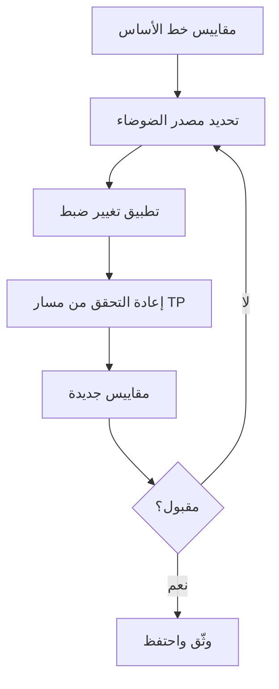

# المسار 2 · المرحلة 2.7 — الضبط والمقاييس

## لماذا هذه المرحلة مهمة

كشف يطلق باستمرار على نشاط مختبري حميد أسوأ من عدم وجود كشف: يدرب المحللين على تجاهل التنبيهات. الضبط هو العملية المنضبطة لضبط المنطق أو العتبات أو الاستثناءات بحيث تظهر الإيجابيات الحقيقية بينما تنخفض الإيجابيات الكاذبة إلى مستوى مقبول. المقاييس — حجم التنبيهات قبل وبعد تغيير، معدل الإيجابيات الحقيقية في سيناريوهات مختبرية، الوقت حتى الفرز — تحوّل الضبط من تخمين إلى تحسين قائم على الأدلة.

تغلق هذه المرحلة الحلقة على الكشوفات المصممة سابقاً: قس، غيّر، أعد القياس، وثّق.

---

## أهداف التعلم

بنهاية هذه المرحلة ستكون قادراً على:

- قياس حجم التنبيهات لكشف مختبري قبل وبعد تغيير ضبط
- تقرير ما إذا كنت ستعيد ضبط المنطق، أو تضيف كبحاً ضيقاً، أو تعطّل قاعدة
- تسجيل مقاييس بسيطة تُظهر التحسين
- إعادة التحقق من مسار الإيجابي الحقيقي بعد كل تغيير
- توثيق قرارات الضبط لحزمة المشروع النهائي

---

## المتطلبات السابقة

- إكمال المراحل 2.1–2.6
- كشف مختبري واحد على الأقل ينتج إيجابيات حقيقية وبعض الضوضاء
- القدرة على توليد حركة مختبرية مسيطر عليها وعد التنبيهات

---

## نقطة تحقق السلامة

1. اضبط فقط كشوفات مختبرية.
2. لا تعطّل أو تضعف قواعد على أنظمة غير مختبرية كجزء من هذا المنهج.
3. احتفظ بسجل لكل تغيير حتى يكون تاريخ المختبر قابلاً للاستعادة.

---

## المفاهيم الأساسية

### 1. لماذا نقيس

بدون أرقام قبل/بعد يستحيل معرفة ما إذا ساعد تغيير. حتى في مختبر صغير، عد التنبيهات على سيناريو توليد ثابت يكفي.

### 2. رافعات الضبط

| الرافعة | مثال استخدام مختبري |
|----------|----------------------|
| العتبة | ارفع من 5 إلى 15 إخفاقاً في 5 دقائق |
| النافذة الزمنية | قصّر أو أطِل نافذة الارتباط |
| تضمين / استثناء | تجاهل IP ماسح مختبري معروف أو حساب |
| دقة الحقل | تتطلب اسم خدمة محدد أو رمز نتيجة |
| كبح (ضيق) | استثناء مؤقت خلال تمرين مختبري مجدول |

### 3. إرشاد القرار

- **أعد الضبط** عندما تكون القاعدة صاخبة أساساً لنشاط المختبر العادي.
- **كبح ضيق** عندما يكون الاستثناء مؤقتاً أو شديد التحديد.
- **عطّل** فقط عندما لا يبقى للكشف قيمة إيجابية حقيقية في المختبر (نادر؛ فضّل الإصلاح).

### 4. مقاييس بسيطة

- عدد التنبيهات لسيناريو مختبري معياري (قبل / بعد)
- معدل التقاط الإيجابي الحقيقي (هل ما زال الهجوم المقصود ينبّه؟)
- معدل الإيجابيات الكاذبة التقريبي تحت حمل مختبري حميد
- ملاحظات المحلل حول جهد الفرز

---

## خريطة توضيحية: دورة الضبط

---

## جولة مختبرية تفصيلية

1. اختر كشفاً مختبرياً صاخباً واحداً.
2. ولّد سيناريو إيجابي حقيقي معياري وفترة نشاط حميد؛ سجّل أعداد التنبيهات.
3. طبّق تغيير ضبط واحداً (عتبة، استثناء، أو نافذة).
4. أعد تشغيل نفس سيناريوهات الإيجابي الحقيقي والحميد؛ سجّل الأعداد الجديدة.
5. أكد أن الهجوم المقصود ما زال ينتج تنبيهاً.
6. وثّق التغيير والمقاييس والخطر المتبقي (إن وُجد).

---

## الأخطاء الشائعة

- تغيير رافعات متعددة دفعة واحدة بحيث يكون أثر كل منها غير واضح.
- ضبط مسار الإيجابي الحقيقي بعيداً.
- الفشل في تسجيل أرقام خط الأساس.
- معاملة «صفر تنبيهات» كنجاح عندما أصبح الكشف أعمى.

---

## أفضل الممارسات

- غيّر متغيراً واحداً في كل مرة عندما يكون ذلك ممكناً.
- أعد دائماً التحقق من الإيجابيات الحقيقية.
- فضّل تحسينات منطق دائمة على كبح واسع دائم.
- احتفظ بملاحظات الضبط بجانب تصميم الكشف حتى يكون التاريخ مرئياً.

---

## تمرين عملي

1. اختر كشفاً مختبرياً واحداً ينتج ضوضاء.
2. التقط حجم تنبيهات خط الأساس لسيناريو ثابت.
3. طبّق ووثّق تغيير ضبط واحداً.
4. التقط الحجم بعد التغيير وتأكد من أن كشف الإيجابي الحقيقي ما زال يعمل.
5. أضف مقاييس قبل/بعد والقرار إلى مواد مشروعك النهائي.

---

## أسئلة المراجعة

1. لماذا قياس خط أساس ضروري قبل الضبط؟
2. متى يُفضَّل كبح ضيق على رفع عتبة؟
3. ما خطر الضبط دون إعادة التحقق من مسار الإيجابي الحقيقي؟
4. اذكر مقياسين بسيطين عمليين في بيئة مختبرية.
5. كيف يساعد تاريخ الضبط الموثّق المحللين المستقبليين أو تمارين الفريق البنفسجي؟

---

## الملخص

- يحوّل الضبط الكشوفات الصاخبة إلى موثوقة.
- تحوّل المقاييس الآراء إلى أدلة.
- المختبر المكان المثالي لممارسة حلقة قس–غيّر–أعد القياس.
- الكشوفات المضبوطة ومقاييسها عناصر مطلوبة لمشروع المسار 2 النهائي.

---

## المصادر وقراءات إضافية

- أدبيات هندسة الكشف حول إرهاق التنبيهات والضبط
- المرحلة 9 من الطور 2
- مراحل المسار 2 السابقة

يبقى كل العمل العملي مقيّداً ببيئات مختبرية مصرح بها فقط.
