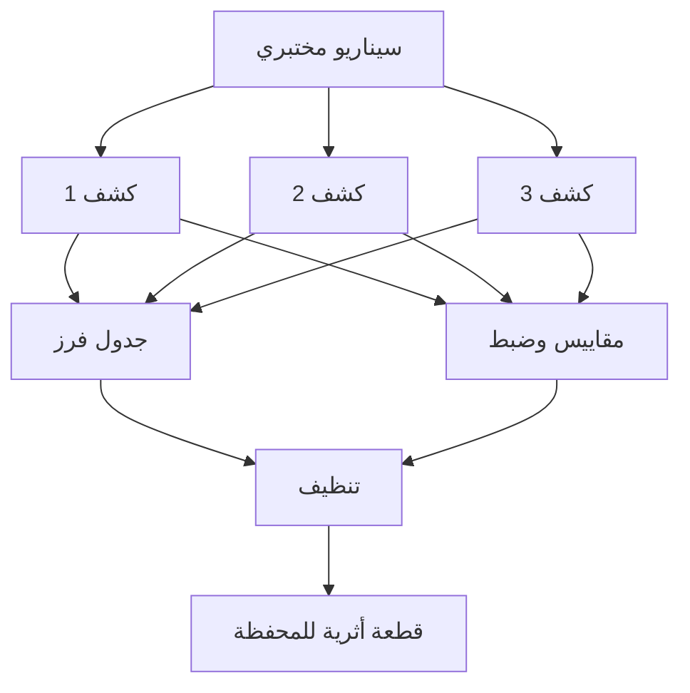

# المسار 2 · المرحلة 2.8 — حزمة الكشوفات الختامية

## لماذا هذه المرحلة مهمة

حزمة الكشف هي المخرج الملموس لجهد هندسة الكشف: مجموعة متماسكة من القواعد، والسيناريو المختبري الذي يتحقق منها، وانضباط الفرز المُطبَّق على تنبيهاتها، وتاريخ الضبط الذي يبقيها صحية. إنتاج واحدة في بيئة مختبرية مسيطر عليها يُظهر أنك تستطيع الانتقال من جرد السجلات عبر التصميم والتحقق والفرز والتحسين — بالضبط دورة الحياة المتوقعة في SOC أو فريق كشف.

يجمع هذا المشروع النهائي المراحل 2.1–2.7 في قطعة أثرية واحدة للمحفظة.

---

## أهداف التعلم

بنهاية هذه المرحلة ستكون قادراً على:

- تجميع سيناريو مختبري يمارس كشوفات متعددة
- تسليم ثلاث كشوفات موثّقة على الأقل مع أدلة تحقق
- تضمين جدول فرز وملاحظات ضبط
- تأكيد تنظيف المختبر واستعادة اللقطات
- تقديم الحزمة بحيث يتمكن ممارس آخر من فهم التغطية والقيود والخطوات التالية

---

## المتطلبات السابقة

- إكمال كل مراحل المسار 2 السابقة
- البيئة المختبرية ما زالت معزولة وتحت سيطرتك
- إدخالات دفتر وتصاميم كشف وجداول فرز ومقاييس من مراحل سابقة

---

## نقطة تحقق السلامة

1. تُولَّد الحزمة بأكملها وتُتحقَّق فقط داخل المختبر.
2. لا تغادر قواعد أو سكربتات أو حركة حدود المختبر.
3. بعد التحقق، استعد اللقطات وأزل أي حسابات مختبرية مؤقتة أو بيانات اختبار.
4. احذف أي بيانات اعتماد أو رموز مختبرية من الحزمة النهائية.

---

## هيكل المخرج المطلوب

### 1. العنوان والنطاق

- اسم الحزمة والتاريخ
- أهداف المختبر ومصادر السجلات المستخدمة
- بيان صريح بأن كل النشاط كان عملاً مختبرياً مصرحاً به فقط

### 2. السيناريو المختبري

صف السيناريو من طرف إلى طرف الذي ستشغّله (أو شغّلته) للتحقق من الحزمة. مخطط مثال:

- توليد ضوضاء استطلاع / مسح ضد مضيف مختبري
- توليد إخفاقات مصادقة ثم نجاح
- توليد فحص ويب أو انفجارات أخطاء ضد تطبيق مختبري
- اختياري: فعل بسيط بعد الوصول يرتبط بتكتيك إضافي

ضمّن تكتيكات ATT&CK التي تتوقع أن يمارسها السيناريو (من المرحلة 2.5).

### 3. الكشوفات (≥3)

لكل كشف قدّم:

- الاسم والوصف بلغة بسيطة
- المنطق / النمط (عتبة، تسلسل، إلخ)
- مصدر(مصادر) السجل والحقول الرئيسية
- تسمية(تسميات) تكتيك ATT&CK
- نتيجة التحقق الإيجابي الحقيقي (هل أطلق على السيناريو المختبري؟)
- مخاطر إيجابيات كاذبة متبقية معروفة
- ملخص تاريخ الضبط (من المرحلة 2.7)

### 4. جدول الفرز

جدول تنبيهات مولَّدة خلال تشغيل التحقق:

| التنبيه / القاعدة | التصنيف (TP/FP/BTP) | الدليل الرئيسي | القرار / ملاحظة |
|-------------------|---------------------|----------------|-----------------|

### 5. ملخص المقاييس والضبط

- أحجام تنبيهات قبل/بعد لقاعدة مضبوطة واحدة على الأقل
- تأكيد أن مسارات الإيجابي الحقيقي ما زالت تعمل
- أي فجوات تغطية متبقية

### 6. تأكيد التنظيف

- استعادة اللقطات
- إزالة حسابات أو ملفات مؤقتة
- إعادة خدمات المختبر إلى خط الأساس

### 7. تأملات / خطوات تالية (قصيرة)

- ما تغطيه الحزمة جيداً
- ما ستضيفه بمزيد من الوقت أو مصادر سجلات إضافية
- كيف يمكن للحزمة دعم تمرين فريق بنفسجي مع المسار 5

---

## شريط الجودة

يجب أن يتمكن قارئ من:

- فهم السلوكيات المختبرية المغطاة بالضبط
- إعادة إنتاج سيناريو التحقق
- رؤية أن الفرز والضبط نُفّذا عمداً
- الثقة بأن المختبر تُرك في حالة نظيفة

تجنّب:

- قواعد غير موثّقة
- ادعاءات تغطية لتكتيكات لم تمارسها أبداً
- أسراراً غير محذوفة
- غياب تأكيد الإيجابي الحقيقي

---

## خريطة توضيحية: تجميع المشروع النهائي

---

## المخرج العملي

1. أنهِ السيناريو المختبري وشغّله.
2. اجمع أو أعد التحقق من ثلاث كشوفات على الأقل.
3. أكمل جدول الفرز وملاحظات الضبط.
4. أعد البيئة المختبرية.
5. جمّع الحزمة في وثيقة markdown واحدة (أو بأسلوب PDF) واحفظها في مجلد محفظتك.

---

## فحص ذاتي قبل التسليم

- [ ] النطاق محدود بأهداف مختبرية
- [ ] ≥3 كشوفات مع أدلة تحقق
- [ ] جدول فرز موجود
- [ ] ملاحظات ضبط / مقاييس موجودة
- [ ] التنظيف مؤكد
- [ ] تسميات تكتيك ATT&CK مستخدمة حيث يناسب
- [ ] لا بيانات اعتماد حية في الوثيقة

---

## الملخص

- حزمة الكشف هي دليل المحفظة على كفاءة المسار 2.
- السيناريو والكشوفات والفرز والضبط والتنظيف معاً تُظهر دورة هندسة كشف كاملة.
- انضباط المختبر يبقى غير قابل للتفاوض.
- حزمة منظمة جيداً تنتقل مباشرة إلى عمل كشف مهني تحت تفويض مناسب ومراقبة تغيير.

---

## المصادر وقراءات إضافية

- كل مراحل المسار 2 السابقة
- المرحلة 9 من الطور 2
- ممارسات مجتمع هندسة الكشف (مفاهيمية)

يبقى كل العمل العملي مقيّداً ببيئات مختبرية مصرح بها فقط. إكمال هذا المسار لا يُخوّل مراقبة أو هندسة كشف ضد أي نظام خارج اتفاق مختبرك.
