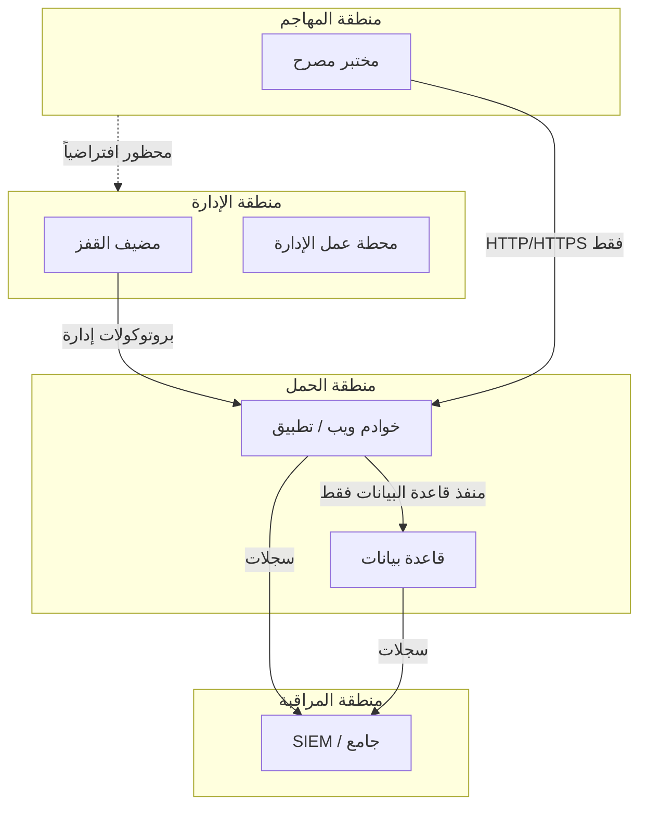

# المسار 3 · المرحلة 3.1 — التجزئة والسياسة

## لماذا هذه المرحلة مهمة

تجزئة الشبكة من أعلى الضوابط الدفاعية تأثيراً. بتقسيم بيئة مختبرية (أو إنتاجية) إلى مناطق بمستويات ثقة مختلفة وفرض السياسة عند الحدود، تحدّ من نصف قطر الانفجار لمضيف مخترق، وتصعّب الحركة الجانبية، وتنشئ نقاط مراقبة طبيعية. بدون مناطق واضحة وعقلية افتراضي-الرفض، يمكن لكل مضيف التحدث إلى كل مضيف آخر — بالضبط الشرط الذي يحوّل موطئ قدم مختبري واحد إلى اختراق بيئة كاملة.

تعلّم هذه المرحلة رسم مناطق ثقة لمختبرك الخاص، والتعبير عن نية سياسة بسيطة، وإعداد الأرض لتقوية المضيف وإدارة الثغرات والمراقبة في مراحل لاحقة.

---

## أهداف التعلم

بنهاية هذه المرحلة ستكون قادراً على:

- تحديد ورسم مناطق ثقة منطقية لبيئة مختبرية (مثلاً الإدارة، الحمل، شبيهة بـ DMZ، المهاجم، المراقبة)
- التعبير عن نية الافتراضي-الرفض بلغة سياسة بسيطة
- ربط أي خدمات ومضيفات مختبرية تنتمي إلى أي منطقة
- شرح كيف تدعم التجزئة الكشف والاستجابة للحوادث
- إنتاج مخطط مختبري محدَّث يعكس المناطق المختارة

---

## المتطلبات السابقة

- المختبر من الطور 2 ما زال يعمل ومعزولاً
- إلمام أساسي بطوبولوجيا شبكة المختبر (من مرحلتي الطور 2 رقم 1 و4)
- القدرة على التقاط واستعادة لقطات لأجهزة أو حاويات مختبرية

---

## نقطة تحقق السلامة

1. تبقى كل تجارب التجزئة داخل شبكة المختبر التي تتحكم بها.
2. التقط لقطة قبل تغيير قواعد الجدار الناري أو تكوين الشبكة الافتراضية.
3. لا تطبق أفكار تجزئة المختبر مباشرة على شبكات إنتاج دون مراقبة تغيير واختبار مناسبين.
4. احتفظ بمسار موثّق للعودة إلى اتصال مختبري كامل حتى تتمكن من الاستعادة إن كانت قاعدة مقيدة جداً.

---

## المفاهيم الأساسية

### 1. مناطق الثقة

منطقة الثقة مجموعة أنظمة تشترك في وضع أمني مشابه ويُسمح لها بالتواصل بحرية أكبر فيما بينها مقارنة بالأنظمة خارج المنطقة. مناطق مختبرية شائعة تشمل:

| المنطقة | محتويات نموذجية | مستوى الثقة |
|----------|------------------|--------------|
| الإدارة | مضيفات القفز، محطات عمل الإدارة، خوادم التكوين | أعلى (مسيطر عليها بإحكام) |
| الحمل / التطبيق | تطبيقات ويب، قواعد بيانات، خدمات مختبر تحت الاختبار | متوسط |
| المراقبة / SOC | جامعي سجلات، SIEM، مستشعرات | عالٍ (قراءة في الغالب من مناطق أخرى) |
| المهاجم / الأحمر | أجهزة افتراضية اختبار مصرح بها | معزولة؛ صادر فقط حسب الحاجة |
| خارجي / غير موثوق | إنترنت محاكى أو وصلة صاعدة مقيّدة | الأدنى |

### 2. نية الافتراضي-الرفض

يجب أن تبدأ السياسة من «ارفض الكل» ثم تسمح صراحة بالتدفقات المطلوبة لعمل المختبر. هذا عكس شبكة مسطحة حيث كل شيء مسموح ما لم يُحظر.

أمثلة بلغة بسيطة:

- «يجوز لمنطقة الحمل بدء اتصالات بمنفذ قاعدة البيانات على مضيف مخزن البيانات؛ لا يجوز لأي منطقة أخرى.»
- «يجوز لمنطقة المهاجم الوصول إلى منافذ HTTP/HTTPS للحمل فقط؛ لا بروتوكولات إدارة.»
- «يجوز لمنطقة المراقبة تلقي حركة syslog وأحداث Windows من كل المناطق؛ لا تبدأ تقريباً شيئاً.»

### 3. نقاط فرض السياسة

في مختبر تكون هذه عادة:

- قواعد جدار ناري للمراقب أو المفتاح الافتراضي
- جدران نارية قائمة على المضيف (nftables، firewalld، Windows Firewall)
- جهاز توجيه أو تصفية مختبري اختياري

التكنولوجيا الدقيقة أقل أهمية من وضوح حدود المناطق ووضع الافتراضي-الرفض.

### 4. لماذا تساعد التجزئة الكشف

- يجب أن تعبر الحركة الجانبية حداً يمكن تسجيله والتنبيه عليه.
- التدفقات غير الطبيعية بين المناطق تبرز بوضوح أكبر من الضوضاء داخل شبكة مسطحة.
- يصبح الاحتواء تغييراً في السياسة بدلاً من مطاردة كل مضيف مخترق.

---

## خريطة توضيحية: مناطق ثقة مختبرية

---

## جولة مختبرية تفصيلية

1. جرد المضيفات المختبرية الحالية والخدمات التي تقدمها.
2. عيّن كل مضيف (أو مجموعة مضيفات) إلى منطقة منطقية.
3. ارسم أو حدّث مخططاً يُظهر المناطق والتدفقات المقصودة المسموحة.
4. عبّر عن السياسة في قائمة قصيرة من بيانات السماح؛ كل شيء آخر مرفوض.
5. (اختياري) نفّذ مجموعة فرعية من السياسة على جدران نارية المضيف أو الشبكة الافتراضية واختبر أن سير عمل المختبر المطلوب ما زال ينجح.
6. وثّق مخطط المنطقة وقائمة السياسة؛ يصبحان خط الأساس لمراحل المسار 3 اللاحقة.

---

## الأخطاء الشائعة

- إنشاء مناطق على الورق مع ترك شبكة المختبر مسطحة تماماً.
- السماح لمنطقة المهاجم بوصول غير مقيّد «للراحة».
- نسيان أن أنظمة المراقبة نفسها تحتاج حماية ووصولاً مسيطراً عليه.
- تغيير قواعد دون لقطة أو مسار تراجع موثّق.

---

## أفضل الممارسات

- ابدأ بسيطاً: ثلاث أو أربع مناطق تكفي لمعظم المختبرات.
- فضّل قوائم سماح صريحة على مكدسات استثناء معقدة.
- أعد زيارة المخطط كلما أضفت خدمة مختبرية جديدة.
- استخدم نفس أسماء المناطق في قواعد الكشف وملاحظات الحوادث حتى يبقى التواصل متسقاً.
- عامل منطقة الإدارة كعالية القيمة؛ احمها وفقاً لذلك.

---

## تمرين عملي

1. أنتج مخطط شبكة مختبري محدَّثاً يُظهر ثلاث مناطق ثقة على الأقل.
2. اكتب قائمة سياسة افتراضي-رفض قصيرة (5–10 بيانات سماح) بلغة بسيطة.
3. حدد تدفقاً واحداً موجوداً حالياً لكن يجب حظره أو تقييده وفق السياسة الجديدة.
4. احفظ المخطط والسياسة؛ يغذيان المراحل 3.2–3.7 ومشروع المسار 3 النهائي.

---

## أسئلة المراجعة

1. ما الفرق العملي بين شبكة مختبرية مسطحة وأخرى مجزأة؟
2. لماذا يجعل الافتراضي-الرفض الحركة الجانبية أصعب على الخصم؟
3. اذكر ثلاث مناطق مختبرية مفيدة شائعة والغرض الأساسي لكل منها.
4. كيف تحسّن التجزئة نسبة الإشارة إلى الضوضاء لكشوفات الشبكة؟
5. ماذا يجب أن تفعل قبل تنفيذ قاعدة جدار ناري مقيدة في المختبر؟

---

## الملخص

- تقسم التجزئة المختبر إلى مناطق ثقة بحدود مسيطر عليها.
- تفرض سياسة الافتراضي-الرفض مسارات تواصل مقصودة.
- تدعم المناطق الواضحة المراقبة والكشف والاحتواء.
- المخطط وقائمة السياسة المنتَجان هنا أساسيان لبقية المسار 3.

---

## المصادر وقراءات إضافية

- NIST SP 800-215 (دليل لمشهد شبكة مؤسسة آمنة) — مفاهيمي
- أدبيات بنية الثقة الصفرية (مبادئ عالية المستوى)
- مراحل إعداد المختبر وتحليل الشبكة في الطور 2
- المسار 2 (كشوفات تستفيد من إشارات عبور المناطق)

يبقى كل العمل العملي مقيّداً ببيئات مختبرية مصرح بها فقط.
