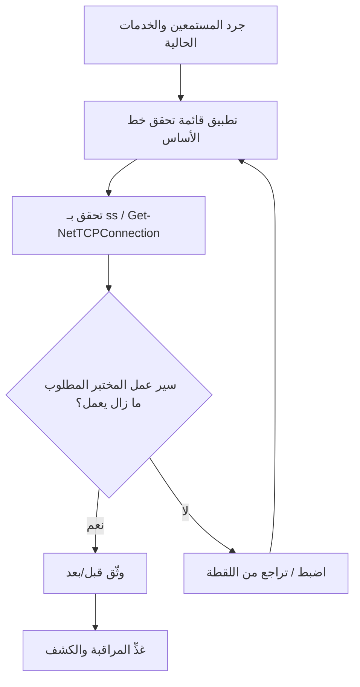

# المسار 3 · المرحلة 3.2 — خطوط أساس تقوية المضيف

## لماذا هذه المرحلة مهمة

تقلل التجزئة (المرحلة 3.1) نصف قطر انفجار الاختراق؛ تقلل تقوية المضيف احتمالية نجاح الاختراق أصلاً. يعرض مضيف مختبري مقوّى خدمات أقل، ويعمل بأقل امتياز، ويُزال منه البرمجيات غير الضرورية، ويقدم سطحاً هجومياً أصغر لأي مختبر مصرح أو خصم محاكى.

تحوّل خطوط الأساس التقوية المرتجلة إلى ممارسة قابلة للتكرار والتدقيق. في مختبر تخلق أيضاً إشارات أنظف لعمل الكشف (المسار 2) لأن الضوضاء العادية أقل والمستمعين غير المتوقعين يبرزون.

---

## أهداف التعلم

بنهاية هذه المرحلة ستكون قادراً على:

- تطبيق قائمة تحقق خط أساس تقوية موجزة على مضيف Linux و/أو Windows مختبري
- تحديد وتقليل الخدمات المستمعة غير الضرورية والمنافذ المفتوحة
- التحقق من النتيجة بأدوات قياسية (`ss`، `Get-NetTCPConnection`، إلخ)
- توثيق الحالة قبل/بعد حتى يكون التغيير قابلاً للتكرار والعكس
- ربط تقوية المضيف بمناطق الثقة المحددة في المرحلة 3.1

---

## المتطلبات السابقة

- إكمال المرحلة 3.1 (المناطق ونية الافتراضي-الرفض محددة)
- جهاز Linux مختبري واحد على الأقل، ويفضّل جهاز Windows واحد، تحت سيطرتك
- قدرة لقطة قبل أي تغيير
- إلمام بإدارة الحزم والخدمات الأساسية من الطور 2

---

## نقطة تحقق السلامة

1. التقط لقطة لكل مضيف مختبري قبل تطبيق تغييرات التقوية.
2. اعمل فقط على مضيفات تنتمي إلى مختبرك المعزول.
3. فضّل تغييرات قابلة للعكس (تعطيل خدمة، تشديد قاعدة جدار ناري) على غير قابلة للعكس.
4. احتفظ بمسار موثّق للعودة إلى حالة مختبرية وظيفية.
5. لا تطبق خطوط أساس المختبر هذه على أنظمة إنتاج دون اختبار ومراقبة تغيير مناسبين.

---

## المفاهيم الأساسية

### 1. ما يغطيه خط الأساس (تركيز مختبري)

| المنطقة | أمثلة Linux | أمثلة Windows |
|---------|-------------|---------------|
| الخدمات المستمعة | تعطيل الشياطين غير المستخدمة؛ تأكيد بـ `ss -tulpn` | إيقاف/تعطيل خدمات غير ضرورية؛ `Get-NetTCPConnection` |
| الجدار الناري المحلي | nftables / firewalld / ufw افتراضي-رفض + سماح صريح | Windows Firewall مع أمان متقدم |
| الحسابات والامتيازات | لا sudo بدون كلمة مرور للعمل الروتيني؛ إزالة حسابات غير مستخدمة | مسؤول محلي محدود؛ أفكار بأسلوب LAPS مفاهيمية فقط |
| حالة التصحيح والحزم | الحزم المطلوبة فقط؛ تحديثات في الوقت المناسب داخل المختبر | الميزات المطلوبة فقط؛ Windows Update في المختبر |
| التسجيل | سجلات auth والعمليات والجدار الناري محتفظ بها | الأمان + Sysmon إن وُجد |
| برمجيات غير ضرورية | إزالة مترجمات، مفسّرات قديمة، تطبيقات عينة إن لم تُحتَج | إزالة ميزات اختيارية غير مطلوبة لدور المختبر |

### 2. مبدأ أقل وظيفة

يجب أن يشغّل المضيف فقط الخدمات المطلوبة لدوره المختبري. مضيف قاعدة بيانات خالص لا يحتاج خادم ويب؛ مضيف قفز لا يحتاج مكدس تطبيقات سطح مكتب كامل. تقليل الوظيفة يقلل سطح الهجوم وحجم ضوضاء السجل العادية.

### 3. التحقق جزء من خط الأساس

التقوية دون تحقق ناقصة. بعد كل تغيير:

- أعد سرد المنافذ المستمعة
- أكد أن سير عمل المختبر المطلوب ما زال ينجح
- أكد أن المضيف ما زال يظهر في منطقة الثقة الصحيحة ويمكنه الوصول إلى (أو الوصول منه) الأقران المقصودين

### 4. العلاقة بالمناطق

تتسامح مضيفات منطقة الإدارة عادة مع خدمات مستمعة أقل وقواعد جدار ناري محلي أشد من مضيفات منطقة حمل يجب أن تقبل حركة تطبيق. يجب أن يكون خط الأساس واعياً بالدور.

---

## خريطة توضيحية: حلقة تغذية راجعة لتقوية المضيف



---

## جولة مختبرية تفصيلية

### مضيف Linux مختبري

1. التقط لقطة للجهاز.
2. شغّل جرداً:
   ```bash
   ss -tulpn
   systemctl list-units --type=service --state=running
   ```
3. حدد الخدمات غير المطلوبة لدور المضيف المختبري.
4. عطّلها أو اخفِها (`systemctl disable --now …` أو ما يعادل).
5. شدّد الجدار الناري المحلي ليطابق سياسة المنطقة من المرحلة 3.1 (افتراضي-رفض + سماح صريح).
6. أعد تشغيل `ss -tulpn` وتأكد من بقاء المنافذ المتوقعة فقط.
7. اختبر سير عمل المختبر المعتمد على هذا المضيف.
8. سجّل المنافذ المستمعة قبل/بعد والخدمات التي غُيّرت.

### مضيف Windows مختبري (إن توفر)

1. التقط لقطة.
2. جرد:
   ```powershell
   Get-NetTCPConnection -State Listen
   Get-Service | Where-Object Status -eq 'Running'
   ```
3. أوقف وعطّل الخدمات غير المطلوبة.
4. راجع قواعد Windows Firewall؛ تأكد من توافقها مع سياسة المنطقة.
5. أعد التحقق من المستمعين واتصال المختبر.
6. وثّق التغييرات.

يمكن لسكربتات مصاحبة مثل `Codes/Bash/02_linux_security/host_inspect.sh` و`Codes/PowerShell/03_windows_security/Host-Inspect.ps1` تسريع خطوة الجرد؛ استخدمها فقط على مضيفات مختبرية.

---

## الأخطاء الشائعة

- تعطيل خدمة يعتمد عليها سير عمل مختبري بصمت، ثم قضاء ساعات في تصحيح الاتصال.
- تقوية جهاز المهاجم أو التحليل فقط مع ترك مضيفات الهدف مفتوحة على مصراعيها.
- تطبيق قائمة تحقق «بأسلوب CIS» عامة دون تكييفها لدور المختبر للمضيف.
- نسيان إعادة تفعيل أو إعادة تكوين التسجيل بعد تغييرات الخدمة.

---

## أفضل الممارسات

- التقط لقطة أولاً، غيّر ثانياً، تحقق ثالثاً، وثّق رابعاً.
- أبقِ خطوط الأساس قصيرة وواعية بالدور بدلاً من موسوعية.
- فضّل تعطيل الخدمات على إزالة الحزم عندما تهم القابلية للعكس.
- وافق كل قاعدة جدار ناري محلي مع سياسة المنطقة المكتوبة في المرحلة 3.1.
- أعد تشغيل الجرد بعد أي تغيير مختبري كبير (تطبيق جديد، منطقة جديدة، إلخ).

---

## تمرين عملي

1. اختر مضيف Linux واحداً و(إن توفر) مضيف Windows مختبرياً واحداً.
2. أنتج تقريراً قصيراً قبل/بعد: المنافذ المستمعة، الخدمات المعطّلة، وضع الجدار الناري.
3. أكد أن المضيف ما زال يؤدي دوره المختبري ويحترم حدود المناطق.
4. احفظ التقرير؛ يصبح دليلاً لمشروع المسار 3 النهائي.

---

## أسئلة المراجعة

1. لماذا التحقق جزء أساسي من خط أساس تقوية؟
2. كيف تتفاعل تقوية المضيف مع مناطق الثقة المحددة في المرحلة 3.1؟
3. ما الفرق العملي بين تعطيل خدمة وإزالة الحزمة التي توفرها؟
4. اذكر ثلاث فئات خدمات مستمعة غير ضرورية عادة على مضيف قاعدة بيانات مختبري خالص.
5. لماذا يجب توثيق تغييرات تقوية المختبر بأدلة قبل/بعد؟

---

## الملخص

- تقلل تقوية المضيف سطح الهجوم والضوضاء العادية.
- قائمة تحقق خط أساس قصيرة واعية بالدور أكثر فائدة في مختبر من معيار شامل يُطبَّق أعمى.
- يحوّل التحقق والتوثيق التقوية إلى ممارسة قابلة للتكرار.
- أدلة قبل/بعد المنتَجة هنا تدعم المراقبة اللاحقة ومشروع المسار 3 النهائي.

---

## المصادر وقراءات إضافية

- CIS Benchmarks (أقسام مختارة، استخدام مفاهيمي فقط في المختبر)
- مراحل أمان Linux وWindows في الطور 2
- NIST SP 800-123 (دليل أمان الخادم العام) — مبادئ عالية المستوى
- سكربتات مصاحبة تحت `Codes/Bash/02_linux_security/` و`Codes/PowerShell/03_windows_security/`

يبقى كل العمل العملي مقيّداً ببيئات مختبرية مصرح بها فقط.
