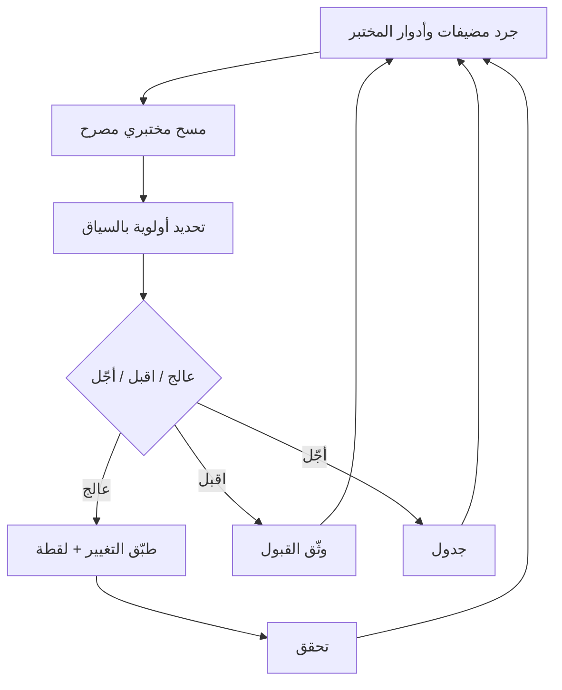

# المسار 3 · المرحلة 3.3 — دورة إدارة الثغرات

## لماذا هذه المرحلة مهمة

إدارة الثغرات هي العملية المستمرة لاكتشاف نقاط الضعف وتحديد أولوياتها ومعالجتها والتحقق منها في أنظمة مصرح لك بتقييمها. في مختبر هي الطريقة المنضبطة لإبقاء أهداف التدريب ضعيفة عمداً فقط حيث تريدها، مع تقوية كل شيء آخر. نفس الدورة — جرد، مسح، تحديد أولوية، معالجة، تحقق — تنتقل مباشرة إلى بيئات تشغيلية تحت تفويض ومراقبة تغيير مناسبين.

تركز هذه المرحلة على نسخة خفيفة بمقياس مختبري من الدورة حتى تمارس التفكير دون مقياس أو خطر برنامج إدارة ثغرات إنتاجي.

---

## أهداف التعلم

بنهاية هذه المرحلة ستكون قادراً على:

- تنفيذ دورة إدارة ثغرات مختبرية كاملة: جرد ← مسح مصرح ← تحديد أولوية ← قرار معالجة ← تحقق
- التمييز بين «ضعيف عمداً للتدريب» و«معرّض دون قصد»
- تحديد أولوية النتائج بسياق مختبري (قابلية الاستغلال في المختبر، المنطقة المتأثرة، الضوابط التعويضية)
- توثيق أعلى النتائج بأدلة واضحة وقرار معالجة أو قبول
- التحقق من أن معالجة قللت فعلاً التعرض الملاحظ

---

## المتطلبات السابقة

- إكمال المرحلتين 3.1 و3.2 (المناطق محددة، المضيفات مقوّاة جزئياً على الأقل)
- مضيفات مختبرية تملكها ويجوز لك مسحها
- أدوات مسح مختبرية آمنة (مثلاً `safe_lab_nmap.sh` أو ما يعادل)
- قدرة لقطة

---

## نقطة تحقق السلامة

1. امسح فقط مضيفات مختبرية تتحكم بها وداخل النطاق صراحة.
2. استخدم أغلفة محدودة المعدل أو «آمنة»؛ لا توجّه ماسحات عامة الغرض إلى شبكات غير مختبرية أبداً.
3. التقط لقطة قبل أي معالجة تغيّر التكوين أو الحزم.
4. لا تعامل نتائج مسح المختبر كتفويض لمسح أي نظام آخر.
5. فضّل التحقق غير التدميري (إعادة مسح، فحص شعار، فحص إصدار) على محاولات استغلال ما لم تكن النتيجة على تطبيق تدريبي مقصود.

---

## المفاهيم الأساسية

### 1. الدورة المختبرية

```
جرد ← مسح مصرح ← تحديد أولوية ← قرر (عالج / اقبل / أجّل) ← تحقق ← أعد الجرد
```

كل خطوة خفيفة في مختبر لكنها ما زالت متعمدة.

### 2. الجرد أولاً

اعرف ما تمسحه: أسماء المضيفات/IP، الأدوار، المناطق، أنظمة التشغيل، والخدمات التي يجب أن تكون موجودة. مستمع غير متوقع اكتشف أثناء التقوية (المرحلة 3.2) جزء بالفعل من الجرد.

### 3. المسح المختبري المصرح

- النطاق هو شبكة المختبر أو مضيف واحد.
- الأدوات محدودة بتلك المعتمدة للمختبر (أغلفة nmap آمنة، OpenVAS/Greenbone في حاوية مختبر، إلخ).
- الشدة مسيطر عليها حتى تبقى الخدمات قابلة للاستخدام لعمل مختبري آخر.

### 4. تحديد الأولوية بالسياق

درجات الشدة (CVSS، إلخ) نقطة بداية، لا الإجابة النهائية. يشمل سياق المختبر:

- هل الخدمة معرّضة عمداً للتدريب (DVWA، Juice Shop، إلخ)؟
- أي منطقة ثقة تحتوي المضيف؟
- هل توجد ضوابط تعويضية (تجزئة، جدار ناري محلي، أقل امتياز)؟
- هل النتيجة قابلة للاستغلال عن بُعد داخل شبكة المختبر؟

قد تُقبل نتيجة عالية الشدة على تطبيق تدريبي مقصود لأغراض تعليمية؛ نفس النتيجة على مضيف قفز في منطقة الإدارة يجب معالجتها فوراً.

### 5. المعالجة مقابل القبول

- **عالج** — صحّح، عطّل خدمة، شدّد تكويناً، طبّق ضابطاً تعويضياً.
- **اقبل** — وثّق لماذا يُتسامح مع الخطر داخل المختبر (عادة لأن المضيف هدف تدريبي متعمد).
- **أجّل** — جدول لنافذة صيانة مختبرية لاحقة؛ ما زال وثّق.

### 6. التحقق

بعد المعالجة، أعد المسح أو أعد فحص النتيجة المحددة. تأكيد أن التعرض ذهب (أو قُلّل) يغلق الحلقة.

---

## خريطة توضيحية: دورة ثغرات مختبرية



---

## جولة مختبرية تفصيلية

1. اختر مضيف مختبرياً واحداً (أو مجموعة صغيرة) وسجّل دوره ومنطقته.
2. شغّل مسحاً مسيطراً مختبرياً فقط (اكتشاف إصدار، سكربتات آمنة، أو ماسح ثغرات محصور بالمختبر).
3. راجع النتائج؛ افصل التعرضات التدريبية المقصودة عن غير المقصودة.
4. اختر أعلى ثلاث نتائج ليست ثغرات تدريبية متعمدة.
5. لكل من الثلاث:
   - سجّل الدليل (المنفذ، الخدمة، الإصدار، مقتطف مخرج الماسح)
   - عيّن أولوية مختبرية
   - قرر عالج / اقبل / أجّل واكتب مبرراً من جملة واحدة
6. إن عالجت، التقط لقطة، طبّق التغيير، وأعد التحقق.
7. حدّث الجرد ومخطط المنطقة إن تغيّر ملف تعرض المضيف.

قد تُستخدم مساعدات مصاحبة مثل `Codes/Bash/05_reconnaissance/safe_lab_nmap.sh` وعروض شدة مفاهيمية تحت `Codes/Python/06_vulnerability/` — فقط ضد أهداف مختبرية.

---

## الأخطاء الشائعة

- مسح أنظمة خارج حدود المختبر «لرؤية ما يحدث».
- معاملة كل CVSS عالٍ كعاجل بنفس القدر دون سياق مختبري.
- معالجة ثغرة تدريبية مقصودة وبالتالي كسر تمارين المسار 1 أو 5 اللاحقة.
- الفشل في التحقق بعد تغيير، وترك النتيجة مفتوحة بينما تعتقد أنها مغلقة.

---

## أفضل الممارسات

- أبقِ الدورة قصيرة ومتكررة في مختبر؛ تحسين مستمر صغير أفضل من مسوحات نادرة كبيرة.
- افصل دائماً «هدف تدريبي» عن «يجب تقويته».
- وثّق قرارات القبول حتى يفهم مستقبلك (أو متعلم آخر) لماذا تبقى نتيجة.
- وافق تحديد الأولوية مع مناطق الثقة من المرحلة 3.1 — نتائج منطقة الإدارة عادة تتفوق على نتائج تدريبية في منطقة الحمل.
- غذِّ النتائج المتبقية إلى المراقبة والكشف (المسار 2 / المرحلة 3.6).

---

## تمرين عملي

1. أكمل دورة مختبرية كاملة واحدة على مضيف واحد أو مجموعة صغيرة من المضيفات.
2. أنتج تقريراً قصيراً يحتوي على:
   - لقطة جرد
   - نطاق المسح والأداة
   - أعلى ثلاث نتائج غير تدريبية مع دليل وأولوية وقرار
   - نتيجة التحقق لأي معالجة نُفّذت
3. احفظ التقرير لمشروع المسار 3 النهائي.

---

## أسئلة المراجعة

1. لماذا يجب أن يسبق الجرد المسح في دورة إدارة ثغرات؟
2. كيف يغيّر سياق المختبر أولوية نتيجة عالية الشدة؟
3. ما الفرق بين قبول نتيجة وتجاهلها ببساطة؟
4. لماذا التحقق خطوة مطلوبة بعد المعالجة؟
5. كيف يمكن لنتائج ثغرات متبقية تحسين مراقبة الشبكة في المرحلة 3.6؟

---

## الملخص

- إدارة الثغرات دورة مستمرة، لا مسح لمرة واحدة.
- تركز الممارسة المختبرية على نطاق واضح وتحديد أولوية سياقي وتحقق.
- التعرضات التدريبية المقصودة تُدار عمداً؛ كل شيء آخر يُقوّى أو يُقبل مع توثيق.
- تقرير الدورة المنتَج هنا قطعة أثرية أساسية لمشروع المسار 3 النهائي.

---

## المصادر وقراءات إضافية

- NIST SP 800-40 (دليل تقنيات إدارة تصحيح المؤسسة) — مفاهيمي
- المرحلة 6 من الطور 2 (مفاهيم تقييم الثغرات)
- CIS Controls (مختارة) — تكييف مختبري فقط
- ممارسات المسح المختبري الآمن

يبقى كل العمل العملي مقيّداً ببيئات مختبرية مصرح بها فقط.
