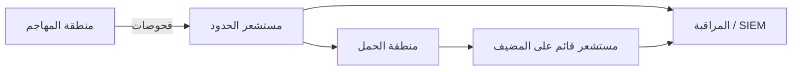

# المسار 3 · المرحلة 3.4 — مفاهيم IDS/IPS

## لماذا هذه المرحلة مهمة

تجلس أنظمة كشف التسلل (IDS) وأنظمة منع التسلل (IPS) على مسار الشبكة أو المضيف وتقيّم الحركة أو نشاط النظام مقابل أنماط معروفة أو خطوط أساس سلوكية. في مختبر توفر طريقة ملموسة لمراقبة كيف يمكن تحويل الاستطلاع ومحاولات الاستغلال وانتهاكات السياسة إلى تنبيهات. فهم الفرق بين الكشف والمنع، ونهج التوقيع مقابل الشذوذ، وأهمية وضع المستشعر يُعدّك للدفاع عن المختبر والتعاون مع مهندسي الكشف (المسار 2).

تبقى هذه المرحلة مفاهيمية ومركزة على المختبر: تولّد حركة تفهمها بالفعل وتفكر فيما سيراه مستشعر، دون الحاجة إلى نشر IDS بمستوى إنتاج كامل.

---

## أهداف التعلم

بنهاية هذه المرحلة ستكون قادراً على:

- شرح الفرق بين IDS (اكتشف ونبّه) وIPS (اكتشف واحظر/تفاعل)
- مقارنة الكشف القائم على التوقيع والقائم على الشذوذ على المستوى المفاهيمي
- التفكير في وضع المستشعر نسبة إلى مناطق الثقة المحددة في المرحلة 3.1
- توليد حركة مختبرية ووصف الإشارات القابلة للملاحظة التي قد يرفعها IDS
- تحديد قيود شائعة (التملص، الإيجابيات الكاذبة، الحركة المشفرة) تؤثر على مستشعرات المختبر والتشغيل على حد سواء

---

## المتطلبات السابقة

- إكمال المراحل 3.1–3.3
- القدرة على توليد حركة مختبرية مسيطر عليها (مسح، فحوصات ويب، ضوضاء مصادقة)
- اختياري: IDS/IPS مختبري خفيف (Suricata، Snort في وضع IDS، أو مستشعر قائم على المضيف) موجود مسبقاً في المختبر

---

## نقطة تحقق السلامة

1. تبقى كل توليد الحركة داخل المختبر.
2. إن توفر وضع IPS، استخدمه فقط على مقاطع مختبرية وبمسار تراجع واضح (لقطات).
3. لا توجّه مستشعرات أو قواعد مختبرية إلى شبكات غير مختبرية.
4. فضّل وضع IDS (تنبيه فقط) أثناء التعلم؛ فعّل الحظر فقط بعد فهم سلوك التنبيه.

---

## المفاهيم الأساسية

### 1. IDS مقابل IPS

| الوضع | الإجراء عند التطابق | استخدام مختبري نموذجي |
|-------|---------------------|------------------------|
| **IDS** | توليد تنبيه / سجل | تعلم، ضبط، تحقق من كشوفات |
| **IPS** | تنبيه وإسقاط / رفض / إعادة تعيين | إظهار المنع؛ يتطلب اختباراً حذراً حتى لا تُكسر سير عمل المختبر |

كثير من المحركات الحديثة يمكنها العمل في أي من الوضعين؛ التمييز سياسة، لا تكنولوجيا خالصة.

### 2. التوقيع مقابل الشذوذ

- **قائم على التوقيع** — يطابق أنماطاً معروفة (قاعدة لاستغلال محدد، عتبة مسح منافذ، وكيل مستخدم سيء معروف، إلخ). دقة عالية للتهديدات المعروفة؛ أعمى عن الجديدة.
- **قائم على الشذوذ** — ينمذج «الطبيعي» وينبّه على الانحراف. يمكن أن يُظهر نشاطاً غير معروف؛ عرضة لإيجابيات كاذبة عندما ما زال خط أساس المختبر يتغير.

تبدأ معظم مستشعرات المختبر العملية بقواعد توقيع / عتبة وتضيف لاحقاً فحوصات إحصائية أو سلوكية بسيطة.

### 3. وضع المستشعر والمناطق

يحدد الوضع ما يمكن للمستشعر رؤيته:

- **مضمّن / على الحدود** بين المناطق — يرى الحركة التي تعبر حدود الثقة (مثالي لإشارات انتهاك السياسة والحركة الجانبية).
- **Span / tap على مقطع حمل** — يرى حركة شرق-غرب داخل منطقة.
- **قائم على المضيف** — يرى النشاط على مضيف مختبري واحد (عملية، ملف، شبكة محلية).

وافق وضع المستشعر مع مخطط المنطقة من المرحلة 3.1. مستشعر لا يرى أبداً مسار المهاجم-إلى-الحمل لن ينبّه أبداً على المسح المختبري الذي شغّلته للتو.

### 4. قيود ستلاحظها في المختبر

- الحركة المشفرة (HTTPS، SSH) تخفي الحمولة؛ تبقى البيانات الوصفية والشهادات مرئية.
- التجزئة والترميز وحيل البروتوكول يمكن أن تتملص من توقيعات بسيطة.
- نشاط المختبر الصاخب (مسوحاتك الخاصة، التحديثات، متعلمون آخرون) يولّد إيجابيات كاذبة حتى الضبط.
- مستشعر بلا سياق (منطقة، دور الأصل، خدمات متوقعة) ينتج تنبيهات منخفضة القيمة.

---

## خريطة توضيحية: المستشعر نسبة إلى المناطق

---

## جولة مختبرية تفصيلية

1. راجع مخطط المنطقة واختر حداً أو مضيفاً واحداً حيث يكون المستشعر ذا قيمة.
2. ولّد حركة مختبرية مسيطر عليها يجب أن تكون مرئية عند تلك النقطة (مسح منافذ، انفجار 404 ويب، مصادقة فاشلة، إلخ).
3. إن توفر IDS مختبري، لاحظ ما إذا كان ينبّه وعلى أي قاعدة أو عتبة.
4. إن لم يوجد مستشعر، اكتب ملاحظة قصيرة «ما سيراه IDS»: المصدر، الوجهة، الحجم، الأنماط المميزة، وقاعدة أو عتبة مقترحة.
5. ناقش (أو وثّق) قيداً واحداً — مثلاً كانت الحركة مشفرة، أو كان المسح بطيئاً بما يكفي للبقاء تحت عتبة.
6. اختيارياً أضف أو شدّد قاعدة مختبرية وأعد توليد الحركة لتأكيد التنبيه.

---

## الأخطاء الشائعة

- توقع أن يرى IDS «كل شيء» عندما يوضع فقط على مقطع واحد.
- تفعيل حظر IPS قبل فهم حجم التنبيهات، مما يكسر سير عمل المختبر.
- معاملة تطابق توقيع كدليل على استغلال ناجح بدلاً من دليل على حركة مطابقة أو محاولة.
- تجاهل الحركة المشفرة وافتراض أن قواعد قائمة على الحمولة ستطلق دائماً.

---

## أفضل الممارسات

- ضع المستشعرات حيث تحدث حركة عبور المناطق أو عالية القيمة.
- ابدأ بوضع IDS (تنبيه فقط)؛ انتقل إلى IPS فقط بعد الضبط.
- ادمج مستشعرات الشبكة مع كشف قائم على المضيف وقائم على السجل (المسار 2) للدفاع المتعمق.
- وثّق الحركة المختبرية التي يُقصد بكل قاعدة التقاطها حتى يكون الضبط المستقبلي ممكناً.
- اقبل أن بعض نشاط المختبر سيبدو دائماً شاذاً حتى تنضج خطوط الأساس.

---

## تمرين عملي

1. ولّد نمط حركة مختبري واحداً (مسح، فحص ويب، أو ضوضاء مصادقة).
2. اكتب ملاحظة قصيرة تصف:
   - أين يجب أن يجلس مستشعر لملاحظته
   - أي توقيع أو عتبة ستلتقطه
   - قيداً واحداً قد يقلل جودة الكشف
3. إن وُجد مستشعر مختبري، التقط التنبيه الفعلي (أو غيابه) واشرحه.
4. احفظ الملاحظة لمشروع المسار 3 النهائي ولمناقشات الكشف مع المسار 2.

---

## أسئلة المراجعة

1. ما الفرق التشغيلي بين وضع IDS وIPS؟
2. لماذا يهم وضع المستشعر نسبة إلى مناطق الثقة أكثر من علامة المستشعر؟
3. أعطِ ميزة واحدة وعيباً واحداً للكشف القائم على التوقيع في مختبر.
4. كيف يمكن للحركة المشفرة أن تحد مما يمكن لـ IDS شبكة ملاحظته؟
5. لماذا يجب إدخال قواعد IPS مختبرية فقط بعد فهم سلوك IDS؟

---

## الملخص

- IDS يكتشف وينبّه؛ IPS يمكنه أيضاً الحظر — اختر الوضع عمداً في المختبر.
- نهجا التوقيع والشذوذ يكملان بعضهما؛ يبدأ معظم عمل المختبر بالتواقيع والعتبات.
- الوضع على حدود المناطق يعظم قيمة الإشارات التي تولّدها بالفعل.
- فهم القيود يمنع الثقة المفرطة في أي مستشعر واحد.

---

## المصادر وقراءات إضافية

- NIST SP 800-94 (دليل أنظمة كشف ومنع التسلل) — مفاهيمي
- توثيق Suricata / Snort (نسخ مختبرية)
- مراحل تحليل الشبكة والتسجيل في الطور 2
- ممارسات هندسة الكشف في المسار 2

يبقى كل العمل العملي مقيّداً ببيئات مختبرية مصرح بها فقط.
