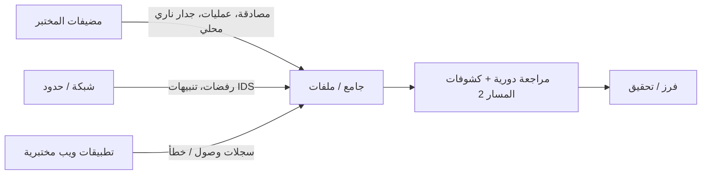

# المسار 3 · المرحلة 3.6 — مراقبة شبكة المختبر

## لماذا هذه المرحلة مهمة

التجزيء والتقوية وإدارة الثغرات والمستشعرات والوصول عن بُعد المسيطر عليه لا تقدم قيمة إلا إذا كان أحد يراقب الإشارات الناتجة. مراقبة المختبر هي ممارسة جمع مجموعة صغيرة عالية القيمة من الملاحظات القابلة للملاحظة من المضيف والشبكة عمداً حتى يمكن ملاحظة النشاط غير الطبيعي — سواء من مختبر مصرح أو سوء تكوين أو خصم محاكى — والتحقيق فيه.

تحدد هذه المرحلة مجموعة مراقبة أدنى قابلة للتطبيق لمختبر صغير وتربطها بمهارات الكشف والفرز المطورة في المسار 2.

---

## أهداف التعلم

بنهاية هذه المرحلة ستكون قادراً على:

- تعريف مجموعة مراقبة أدنى (إشارات مضيف + شبكة) مناسبة لمختبر صغير
- ربط كل إشارة بمناطق الثقة وخطوط أساس التقوية ومسارات الوصول عن بُعد المُنشأة بالفعل
- تقرير ماذا تحتفظ، ولكم من الوقت، وأين ستُراجع
- إنتاج خطة مراقبة قصيرة يمكن الحفاظ عليها لأسبوعين على الأقل من الدراسة المختبرية
- تحديد فجوات ستُملأ بمستشعرات أو مصادر سجلات إضافية لاحقاً

---

## المتطلبات السابقة

- إكمال المراحل 3.1–3.5
- مرحلتا المسار 2 2.1–2.2 على الأقل (مصادر السجلات والبحث)
- مضيفات المختبر ما زالت تولّد السجلات وحركة الشبكة المناقشة سابقاً

---

## نقطة تحقق السلامة

1. تبقى المراقبة داخل المختبر؛ لا تعيد توجيه سجلات المختبر إلى خدمات تجارية خارجية ما لم تتحكم بالكامل في الوجهة والبيانات غير حساسة.
2. يجب أن تحترم فترات الاحتفاظ حدود قرص المختبر؛ لا تملأ الأقراص ثم تفقد عملاً آخر.
3. يجب أن يتبع الوصول إلى بيانات المراقبة نفسها نفس مبادئ المنطقة والوصول عن بُعد المحددة بالفعل.

---

## المفاهيم الأساسية

### 1. مجموعة مراقبة مختبرية أدنى

مجموعة بداية عملية لمختبر صغير:

| فئة الإشارة | أمثلة | لماذا تهم |
|-------------|--------|-----------|
| المصادقة | فشل/نجاح SSH، RDP، VPN، دخول ويب | قوة غاشمة، استخدام بيانات اعتماد، إساءة وصول عن بُعد |
| سياسة الشبكة | رفضات جدار ناري، محاولات عبور مناطق غير متوقعة | انتهاكات تجزئة، محاولات حركة جانبية |
| مستمعو المضيف والعمليات | منافذ مستمعة جديدة، بدء عمليات غير عادية | استمرارية، خدمات غير مصرح بها |
| الويب / التطبيق | سجلات وصول (رموز حالة، مسارات غير عادية)، فشل مصادقة | استطلاع، فحوصات حقن، نتائج المسار 1 |
| مستشعر / IDS | تنبيهات من IDS/IPS مختبري إن وُجد | أنماط سيئة معروفة، انتهاكات عتبة |
| صحة النظام | قرص، خدمة حرجة متوقفة | التوفر وموثوقية المختبر |

لا تحتاج كل مصدر ممكن في اليوم الأول. ابدأ بالمصادقة + الجدار الناري/السياسة + سجل تطبيق واحد، ثم وسّع.

### 2. إيقاع الجمع والمراجعة

- **الجمع** — غُطي بالفعل في المرحلة 2.1 من المسار 2 (شحن ← تحليل ← تخزين). في مختبر أدنى قد يكون ملفات محلية بالإضافة إلى نسخ مركزية عرضية.
- **المراجعة** — مجدولة (مثلاً يومياً أو بعد كل تمرين مختبري) بدلاً من فورية بحتة. مقياس المختبر يجعل المراجعة الدورية واقعية.
- **الاحتفاظ** — تاريخ كافٍ لإعادة بناء سيناريو مختبري متعدد الأيام (غالباً 7–14 يوماً يكفي).

### 3. ربط المراقبة بمراحل سابقة

- مخطط المنطقة (3.1) يخبرك أي الحدود تستحق المراقبة.
- خطوط أساس التقوية (3.2) تقلل الضوضاء العادية حتى تبرز الشذوذ.
- نتائج الثغرات (3.3) التي قُبلت أو أُجّلت تصبح عناصر مراقبة صريحة.
- وضع IDS (3.4) ومسار الوصول عن بُعد (3.5) يحددان مصادر سجل عالية القيمة.

### 4. من المراقبة إلى الكشف

الإشارات التي تختار الاحتفاظ بها هي المادة الخام للكشوفات المصممة في المسار 2. خطة مراقبة تتجاهل فشل المصادقة ستجعل كشوفات القوة الغاشمة مستحيلة؛ خطة تتجاهل رفضات عبور المناطق ستفوت انتهاكات التجزئة.

---

## خريطة توضيحية: تدفق مراقبة مختبرية أدنى

---

## جولة مختبرية تفصيلية

1. اسرد المضيفات والمناطق الحالية في المختبر.
2. لكل منطقة أو مضيف عالي القيمة، اختر 2–4 إشارات ملموسة ستُجمع.
3. أكد أن الإشارات تُولَّد فعلاً وقابلة للوصول للمراجعة (مسار ملف، فهرس SIEM، إلخ).
4. قرر فترة احتفاظ بسيطة وإيقاع مراجعة (مثلاً «راجع رفضات المصادقة والجدار الناري بعد كل تمرين مختبري وفي نهاية كل يوم دراسة»).
5. اكتب خطة مراقبة من صفحة واحدةحدة تتضمن:
   - الإشارات والمصادر
   - أين تعيش
   - كم من الوقت تُحفظ
   - من يراجعها ومتى
   - الفجوات المعروفة
6. اختيارياً ولّد حادثاً مختبرياً صغيراً (دخول فاشل، مسح محظور، إلخ) وتأكد من ظهور الإشارات وإمكانية العثور عليها.

---

## الأخطاء الشائعة

- جمع كل شيء ثم عدم النظر إليه أبداً.
- مراقبة جهاز المهاجم فقط مع تجاهل الأهداف.
- ضبط الاحتفاظ قصيراً جداً بحيث لا يمكن إعادة بناء سيناريو مختبري متعدد الأيام.
- معاملة المراقبة كمشكلة تكنولوجيا خالصة بدلاً من مشكلة انضباط مراجعة.

---

## أفضل الممارسات

- فضّل مجموعة صغيرة من مصادر عالية الإشارة على جمع شامل.
- وافق المراقبة مع تصميم المنطقة والوصول عن بُعد المختار بالفعل.
- اجعل المراجعة عادة مختبرية مجدولة، لا فكرة لاحقة.
- غذِّ فجوات المراقبة مرة أخرى إلى المرحلة 3.2 (التقوية) والمسار 2 (تصميم الكشف).
- احمِ بيانات المراقبة نفسها بنفس ضوابط الوصول المستخدمة لمنطقة الإدارة.

---

## تمرين عملي

1. أنتج خطة مراقبة مختبرية من صفحة واحدةحدة تغطي على الأقل المصادقة وسياسة الشبكة وإشارة تطبيق أو مضيف واحدة.
2. أكد أن كل إشارة مدرجة متاحة حالياً وقابلة للمراجعة.
3. شغّل نشاطاً مختبرياً قصيراً يجب أن ينتج إشارات مرئية وتحقق من ظهورها.
4. لاحظ فجوة واحدة ستغلقها تالياً واحفظ الخطة لمشروع المسار 3 النهائي.

---

## أسئلة المراجعة

1. لماذا مجموعة مراقبة أدنى أكثر فائدة في مختبر من محاولة جمع كل سجل ممكن؟
2. كيف تؤثر مناطق الثقة من المرحلة 3.1 على أي إشارات شبكة تستحق المراقبة؟
3. ما العلاقة بين مراقبة المختبر والكشوفات المكتوبة في المسار 2؟
4. لماذا يهم طول الاحتفاظ حتى في مختبر صغير؟
5. أعطِ مثالاً على فجوة مراقبة ستخفي انتهاك تجزئة.

---

## الملخص

- تحوّل المراقبة البنية الدفاعية إلى واقع قابل للملاحظة.
- مجموعة صغيرة متعمدة من إشارات المضيف والشبكة كافية للتعلم المختبري وتتوسع إلى ممارسة تشغيلية.
- خطة المراقبة المنتَجة هنا مخرج مسار 3 وأساس لعمل كشف مستدام.

---

## المصادر وقراءات إضافية

- المرحلة 9 من الطور 2 ومرحلتا المسار 2 2.1–2.2
- NIST SP 800-92 (إدارة السجلات) — مفاهيمي
- مراحل المسار 3 السابقة (المناطق، التقوية، المستشعرات، الوصول عن بُعد)

يبقى كل العمل العملي مقيّداً ببيئات مختبرية مصرح بها فقط.
