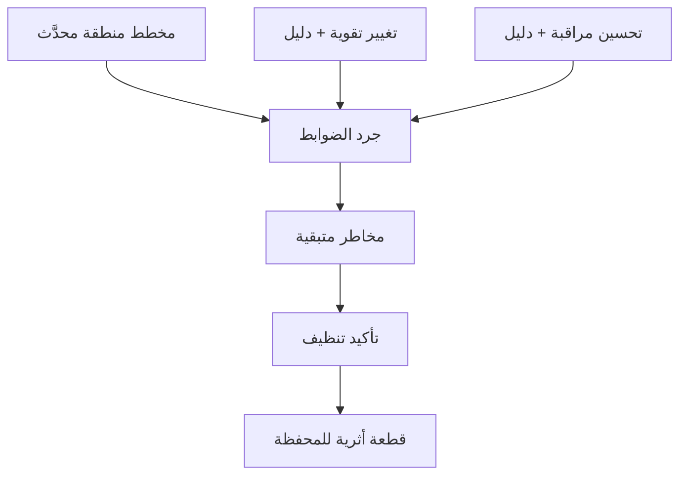

# المسار 3 · المرحلة 3.7 — مشروع ختامي: مختبر محمي

## لماذا هذه المرحلة مهمة

المختبر المحمي هو الدليل الملموس على أن التجزئة وتقوية المضيف وإدارة الثغرات ووعي المستشعر والوصول عن بُعد المسيطر عليه والمراقبة طُبّقت كنظام متماسك بدلاً من تمارين معزولة. يطلب المشروع النهائي توثيق ذلك النظام، وإثبات تحسين تقوية واحد على الأقل وتحسين مراقبة واحد بأدلة، وترك المختبر في حالة أنظف وأكثر قابلية للملاحظة مما كان عليه عند بدء المسار.

القطعة الأثرية الناتجة مناسبة للمحفظة وتعمل كخط أساس حي لأي تمارين مسار 5 (محاكاة خصم) أو مسار 2 (كشف) لاحقة تعيد استخدام نفس البيئة.

---

## أهداف التعلم

بنهاية هذه المرحلة ستكون قادراً على:

- إنتاج مخطط مختبري محدَّث يُظهر مناطق الثقة والمضيفات الرئيسية ومسارات الوصول عن بُعد المقصودة
- جرد الضوابط الموجودة حالياً (تجزئة، تقوية، مسح، مستشعرات، مراقبة)
- إظهار وإثبات تحسين تقوية واحد على الأقل وتحسين مراقبة واحد بأدلة
- توثيق المخاطر المتبقية والخطوات التالية بصدق
- تأكيد تنظيف المختبر ونظافة اللقطات

---

## المتطلبات السابقة

- إكمال المراحل 3.1–3.6
- المختبر ما زال تحت سيطرتك ومعزولاً
- إدخالات دفتر ومخططات وأدلة من مراحل سابقة

---

## نقطة تحقق السلامة

1. تبقى كل التغييرات والأدلة داخل حدود المختبر.
2. تُلتقط اللقطات قبل تغييرات التقوية أو المراقبة النهائية وتُستعاد أو تُحتفظ حسب الاقتضاء.
3. لا تُترك واجهات إدارة مختبرية معرّضة لشبكات غير موثوقة.
4. لا تحتوي الوثائق النهائية على بيانات اعتماد حية أو رموز حساسة.

---

## هيكل المخرج المطلوب

### 1. العنوان والنطاق

- عنوان المشروع النهائي والتاريخ
- معرّف بيئة المختبر
- بيان صريح بأن كل العمل نُفّذ على أنظمة مختبرية مصرح بها فقط

### 2. مخطط المختبر الحالي

- مناطق الثقة (من المرحلة 3.1، محدَّثة)
- المضيفات الرئيسية وأدوارها
- مسار الوصول عن بُعد / القفز (من المرحلة 3.5)
- موقع أي مستشعرات أو جامعي مختبر
- التدفقات المقصودة المسموحة (مستوى عالٍ)

### 3. جرد الضوابط

جدول أو قائمة موجزة تغطي:

| منطقة الضابط | الحالة في هذا المختبر | الدليل / الملاحظات |
|---------------|-------------------------|----------------------|
| التجزئة / المناطق | … | مرجع المخطط |
| خطوط أساس تقوية المضيف | … | منافذ أو خدمات قبل/بعد |
| دورة الثغرات | … | آخر مسح + أعلى القرارات |
| وعي IDS/IPS | … | وضع أو ملاحظات «ما سيراه IDS» |
| مسار الوصول عن بُعد | … | تقييم مضيف قفز / تعرض مباشر |
| مجموعة المراقبة | … | إشارات مجمعة وإيقاع مراجعة |

### 4. تغيير تقوية مُتحقَّق

- ما غُيّر (خدمة معطّلة، قاعدة جدار ناري، حزمة أُزيلت، إلخ)
- أدلة قبل وبعد (مخرج أمر، لقطات شاشة، قوائم مستمعين)
- تأكيد أن سير عمل المختبر المطلوب ما زال ينجح
- رابط إلى المنطقة أو خط الأساس الذي حفّز التغيير

### 5. تحسين المراقبة

- أي إشارة أو ممارسة مراجعة أُضيفت أو عُزّزت
- دليل على أن الإشارة تُجمع وقابلة للمراجعة
- كيف تدعم الكشف أو التحقيق (رابط إلى المسار 2 إن انطبق)

### 6. المخاطر المتبقية والخطوات التالية

- قائمة صادقة بالفجوات المتبقية (مثلاً لا مستشعر قائم على المضيف بعد، ثغرات تدريبية مقبولة، احتفاظ قصير)
- إجراءات تالية ذات أولوية إن توفر مزيد من وقت المختبر

### 7. تأكيد التنظيف

- اللقطات محتفظ بها أو مستعادة حسب الاقتضاء
- حسابات أو بيانات اختبار مؤقتة أُزيلت
- المختبر تُرك في حالة معروفة وموثّقة

---

## شريط الجودة

يجب أن يتمكن قارئ من:

- فهم الوضع الدفاعي الحالي للمختبر من المخطط والجرد وحدهما
- إعادة إنتاج أو التحقق من تحسينات التقوية والمراقبة المُدّعاة من الأدلة
- رؤية أن المخاطر المتبقية معترف بها بدلاً من إخفائها
- الثقة بأن حدود المختبر وقواعد السلامة احترمت

تجنّب:

- ادعاءات غامضة دون أدلة
- مخططات لم تعد تطابق البيئة الجارية
- أسراراً غير محذوفة
- بيانات «كل شيء مثالي»

---

## خريطة توضيحية: تدفق أدلة المشروع النهائي

---

## المخرج العملي

1. حدّث مخطط المختبر وجرد الضوابط من ملاحظات المراحل السابقة.
2. نفّذ (أو أعد التحقق من) تغيير تقوية واحد وتحسين مراقبة واحد؛ التقط أدلة.
3. اكتب قسم المخاطر المتبقية بصدق.
4. أكد التنظيف وحالة اللقطة.
5. جمّع وثيقة المشروع النهائي الكاملة واحفظها في مجلد محفظتك.

---

## فحص ذاتي قبل التسليم

- [ ] المخطط يُظهر المناطق الحالية ومسار الوصول عن بُعد
- [ ] جرد الضوابط يغطي المناطق الست كلها
- [ ] تغيير تقوية واحد على الأقل مع أدلة قبل/بعد
- [ ] تحسين مراقبة واحد على الأقل مع دليل
- [ ] المخاطر المتبقية مدرجة
- [ ] التنظيف مؤكد
- [ ] لا بيانات اعتماد حية في الوثيقة

---

## الملخص

- يثبت المشروع النهائي للمختبر المحمي أن ضوابط المسار 3 طُبّقت كنظام.
- المخطط والجرد والتغييرات المُتحقَّقة والمخاطر المتبقية الصادقة معاً تشكل خط أساس مختبري مهني.
- نفس خط الأساس يصبح نقطة البداية للتحقق من الكشف (المسار 2) ومحاكاة الخصم المصرح بها (المسار 5).

---

## المصادر وقراءات إضافية

- كل مراحل المسار 3 السابقة
- ممارسات سلامة وتوثيق المختبر في الطور 2
- نظرات عامة على المسار 2 والمسار 5 للاستخدام عبر المسارات للمختبر المحمي

يبقى كل العمل العملي مقيّداً ببيئات مختبرية مصرح بها فقط. إكمال هذا المسار لا يُخوّل عمليات دفاعية أو مراقبة ضد أي نظام خارج اتفاق مختبرك.
