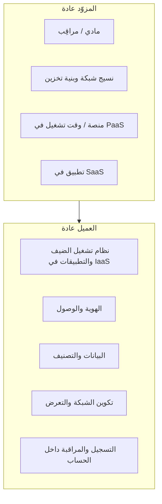

# المسار 4 · المرحلة 4.1 — المسؤولية المشتركة

## لماذا هذه المرحلة مهمة

أمان السحابة ليس «مشكلة شخص آخر». ينشر كل مزوّد رئيسي نموذج مسؤولية مشتركة يقسّم واجبات الأمان بين المزوّد والعميل. سوء فهم ذلك التقسيم من أكثر مصادر سوء تكوين السحابة شيوعاً: يفترض العملاء أن المزوّد يقوّي أنظمة تشغيل الضيف أو سياسات الهوية أو تشفير البيانات عندما تبقى تلك الضوابط فعلياً من واجب العميل.

تُرسي هذه المرحلة رؤية واضحة واعية بنموذج الخدمة لمن المسؤول عن ماذا، حتى يمكن تطبيق المراحل اللاحقة (الهوية، التعرض الشبكي، التخزين، التسجيل) في الطبقة الصحيحة.

---

## أهداف التعلم

بنهاية هذه المرحلة ستكون قادراً على:

- شرح نموذج المسؤولية المشتركة لـ IaaS وPaaS وSaaS على المستوى المفاهيمي
- تحديد أي ضوابط الأمان تبقى عادة من واجب العميل في كل نموذج
- إنتاج تقسيم مسؤولية من صفحة واحدةحدة لخدمة مختبرية أو طبقة مجانية تستخدمها فعلياً
- تجنّب الخطأ الشائع بافتراض أن المزوّد يؤمّن كل شيء فوق المراقِب أو مستوى التحكم

---

## المتطلبات السابقة

- إكمال الطور 2؛ إلمام أساسي ببيئة سحابة أو افتراضية واحدة على الأقل (مراقِب مختبر محلي، حساب طبقة مجانية، أو محاكي)
- مفاهيم المسار 3 عن المناطق والتقوية مفيدة لكنها غير مطلوبة بصرامة
- القدرة على قراءة توثيق المسؤولية المشتركة الرسمي للمزوّد للخدمة قيد الدراسة

---

## نقطة تحقق السلامة

1. استخدم فقط بيئات مختبرية أو طبقة مجانية أو محاكية تتحكم بها.
2. لا تطبّق تغييرات تكوين على حسابات سحابة إنتاج كجزء من هذا المنهج.
3. فضّل الفحص للقراءة فقط لمصفوفات المسؤولية قبل إجراء أي تغييرات.
4. لا تضع أبداً بيانات إنتاج حقيقية أو أسراراً في موارد سحابة طبقة مجانية أو مختبرية مستخدمة للتدريب.

---

## المفاهيم الأساسية

### 1. نماذج الخدمة الثلاثة الكلاسيكية

| النموذج | يدير المزوّد عادة | يدير العميل عادة |
|----------|--------------------|--------------------|
| **IaaS** (البنية كخدمة) | المضيفات المادية، المراقِب، نسيج الشبكة، بنية التخزين | نظام تشغيل الضيف، التطبيقات، الهوية والوصول داخل الضيف، ضوابط الشبكة التي تُكوّنها، البيانات |
| **PaaS** (المنصة كخدمة) | نظام التشغيل، وقت التشغيل، البرمجيات الوسيطة، كثير من تصحيح المنصة | شيفرة التطبيق، البيانات، الهوية والوصول إلى التطبيق، بعض التكوين |
| **SaaS** (البرمجيات كخدمة) | تقريباً المكدس بالكامل بما في ذلك التطبيق | تصنيف البيانات، وصول المستخدم، بعض خيارات التكوين، أجهزة النقاط النهائية التي تستهلك الخدمة |

تختلف الحدود الدقيقة حسب المزوّد والخدمة المحددة؛ استشر دائماً التوثيق الحالي للمزوّد.

### 2. ما يبقى عادة على العميل

حتى في PaaS وSaaS، يحتفظ العميل عادة بمسؤولية:

- من يمكنه الوصول (الهوية والوصول)
- تصنيف البيانات والحماية على مستوى البيانات (التشفير حيث يقدمه المزوّد كخيار)
- التكوين الذي تضبطه (مجموعات الأمان، سياسات الحاويات، سياسات الاحتفاظ)
- أجهزة النقاط النهائية وشبكة العميل التي تتصل بالسحابة
- مراقبة ما يحدث داخل حسابك أو مستأجرك

### 3. لماذا يهم سوء الفهم

أمثلة شائعة لسوء التكوين ناتج عن التباس المسؤولية:

- ترك منفذ إدارة لجهاز افتراضي IaaS مفتوحاً على الإنترنت لأن «السحابة آمنة»
- افتراض أن قاعدة بيانات PaaS مشفرة في السكون دون تفعيل الخيار
- منح مستخدمي SaaS صلاحيات واسعة لأن «المزوّد يتعامل مع الأمان»

كل من هذه تقع على جانب العميل من النموذج.

### 4. تطبيق مختبري / طبقة مجانية

حتى حساب طبقة مجانية صغير أو مختبر قائم على مراقِب يوضح التقسيم:

- المراقِب والمضيف المادي (أو مكافئ المزوّد) مقابل نظام تشغيل الضيف والتطبيقات التي تثبّتها
- ما يُؤمّنه المزوّد تلقائياً مقابل ما يجب عليك تفعيله (التشفير، التسجيل، قيود الشبكة)

---

## خريطة توضيحية: طبقات المسؤولية المشتركة

---

## جولة مختبرية تفصيلية

1. اختر خدمة واحدة تستخدمها فعلياً في المختبر أو الطبقة المجانية (جهاز افتراضي، مخزن كائنات، قاعدة بيانات مُدارة، أو SaaS تدريبي).
2. افتح مصفوفة المسؤولية المشتركة الرسمية للمزوّد لتلك الخدمة (أو أقرب فئة خدمة).
3. ارسم جدولاً من عمودين: «المزوّد» و«أنا / العميل» لخمس مناطق على الأقل (هوية، شبكة، بيانات، تصحيح، تسجيل).
4. لكل منطقة، اكتب ضابطاً ملموساً واحداً يقع على جانبك.
5. لاحظ أي منطقة كنت تفترض خطأً أن المزوّد يغطيها بالكامل.
6. احفظ التقسيم؛ يصبح مرجعاً للمراحل 4.2–4.7.

---

## الأخطاء الشائعة

- معاملة «السحابة» ككيان واحد بدلاً من نماذج خدمة مختلفة بحدود مختلفة.
- تخطي توثيق المزوّد والاعتماد على مقالات مدونات عامة.
- افتراض أن الطبقة المجانية أو المختبر معفيان من نفس منطق المسؤولية.
- وضع بيانات إنتاج في حسابات تدريبية لأن «المزوّد يشفر كل شيء».

---

## أفضل الممارسات

- اقرأ مصفوفة المسؤولية الرسمية لكل خدمة جديدة قبل الاعتماد عليها.
- وثّق تقسيمك الخاص لحسابات المختبر/التدريب حتى لا تُنسى الواجبات.
- عامل خيارات التكوين (التشفير، التسجيل، الشبكة) كضوابط عميل يجب تفعيلها عمداً.
- أعد زيارة التقسيم عندما تتبنى خدمة أو نموذجاً جديداً.

---

## تمرين عملي

1. أنتج تقسيم مسؤولية من صفحة واحدةحدة لخدمة مختبرية أو طبقة مجانية واحدة.
2. ضمّن خمس مناطق على الأقل وملموسية واضحة حول ما يجب عليك فعله.
3. لاحظ افتراضاً خاطئاً واحداً على الأقل صححته أثناء التمرين.
4. احفظ الوثيقة لمشروع المسار 4 النهائي.

---

## أسئلة المراجعة

1. ما الفرق الرئيسي في مسؤولية العميل بين IaaS وSaaS؟
2. اذكر ثلاث مناطق تبقى عادة من واجب العميل حتى في PaaS.
3. لماذا يُعد افتراض أن «المزوّد يؤمّن نظام التشغيل» خطأً شائعاً في IaaS؟
4. كيف يساعد تقسيم مسؤولية مكتوب على منع سوء التكوين لاحقاً؟
5. لماذا ما زال نموذج المسؤولية المشتركة ينطبق على حسابات الطبقة المجانية والتدريبية؟

---

## الملخص

- يقسّم نموذج المسؤولية المشتركة واجبات الأمان بين المزوّد والعميل حسب نموذج الخدمة.
- الهوية والبيانات والتكوين والتعرض الشبكي والتسجيل داخل الحساب تبقى عادة على العميل.
- تقسيم مكتوب واضح لخدمة مختبرية أو طبقة مجانية حقيقية يمنع سوء الفهم المكلف.
- يصبح هذا التقسيم الأساس لكل مرحلة لاحقة في المسار 4.

---

## المصادر وقراءات إضافية

- مصفوفات المسؤولية المشتركة الرسمية لـ AWS وAzure وGCP (اختر ما تستخدمه)
- CSA Cloud Controls Matrix (مفاهيمي)
- مراحل البنية والأساسيات في الطور 2

يبقى كل العمل العملي مقيّداً ببيئات مختبرية أو طبقة مجانية أو محاكية مصرح بها فقط.
