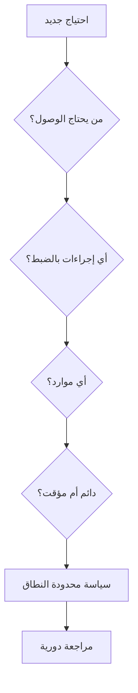

# المسار 4 · المرحلة 4.2 — الهوية وأقل امتياز

## لماذا هذه المرحلة مهمة

الهوية هي محيط الأمان الجديد في السحابة. معظم اختراقات السحابة الناجحة تستغل بيانات اعتماد مسروقة أو مفرطة الامتياز أو سياسات وصول معيبة بدلاً من ثغرات بنية تحتية غريبة. أقل امتياز — منح فقط الأذونات المطلوبة للمهمة — هو الضابط الأساسي الذي يحد من الضرر عندما تُساء استخدام هوية.

في بيئة مختبرية أو طبقة مجانية يمكنك ممارسة إنشاء هويات محدودة النطاق، وتجنّب مفاتيح طويلة العمر حيث أمكن، ومراجعة من يمكنه فعل ماذا دون المخاطرة بحساب إنتاج.

---

## أهداف التعلم

بنهاية هذه المرحلة ستكون قادراً على:

- شرح لماذا تُعد الهوية محيطاً أساسياً في السحابة
- تطبيق أقل امتياز على مستخدم أو دور أو كيان خدمة مختبري
- التمييز بين أذونات دائمة وطويلة العمر مقابل مؤقتة أو قائمة على الأدوار
- مراجعة سياسة وصول مختبرية بسيطة وتحديد أذونات مفرطة
- توثيق توصية هوية لحساب مختبري أو طبقة مجانية

---

## المتطلبات السابقة

- إكمال المرحلة 4.1 (المسؤولية المشتركة مفهومة)
- وصول إلى حساب سحابة مختبري أو طبقة مجانية أو محاكي يمكنك فيه إنشاء هويات
- القدرة على قراءة سياسات IAM أو مكافئها (JSON أو واجهة رسومية)

---

## نقطة تحقق السلامة

1. اعمل فقط داخل حسابات مختبرية أو طبقة مجانية أو تدريبية تتحكم بها.
2. لا تستخدم أبداً مفاتيح وصول إنتاج أو بيانات اعتماد جذر للتدريب.
3. احذف أو عطّل الهويات التجريبية بعد التمرين.
4. لا تضع أسراراً حقيقية في سياسات أو متغيرات بيئة مختبرية.

---

## المفاهيم الأساسية

### 1. الهوية كمحيط

في السحابة، غالباً ما تُعرَّف الشبكة بشكل فضفاض أو ديناميكي. ما يهم هو:

- **من** (مستخدم، دور، كيان خدمة، هوية مثيل)
- **ماذا** يمكنه فعله (إجراءات على موارد)
- **تحت أي شروط** (وقت، عنوان IP، MFA، علامات)

فشل التحكم في الوصول المكسور في السحابة غالباً ما يكون فشلاً في الهوية.

### 2. أقل امتياز عملياً

| ممارسة | وصف مختبري |
|--------|-------------|
| ابدأ بالرفض | لا أذونات ما لم تُمنَح صراحة |
| نطاق المورد | قيّد الإجراءات بحاوية أو مشروع أو مجموعة موارد محددة |
| فضّل الأدوار على المستخدمين | أدوار مؤقتة أو قابلة للافتراض بدلاً من مفاتيح مستخدم طويلة العمر |
| تجنّب أحرف البدل | `*` على الإجراءات أو الموارد علامة تحذير |
| راجع دورياً | من لا يزال لديه وصول ولماذا |

### 3. أذونات طويلة العمر مقابل مؤقتة

- **طويلة العمر** — مفاتيح وصول، كلمات مرور، مفاتيح API لا تنتهي ما لم تُدوَّر يدوياً. خطر إن سُرقت.
- **مؤقتة** — أدوار مفترضة، رموز قصيرة العمر، جلسات موحدة. تحد من نافذة الإساءة.

في المختبر فضّل أدواراً قابلة للافتراض وبيانات اعتماد قصيرة العمر كلما دعم المزوّد ذلك.

### 4. كيانات الخدمة وهويات الآلات

غالباً ما تحتاج التطبيقات والمشغلات إلى هويتها الخاصة. منحها حساب مسؤول «للراحة» من أكثر الأخطاء شيوعاً. أنشئ هوية مخصصة بأدنى مجموعة إجراءات مطلوبة.

---

## خريطة توضيحية: قرار أقل امتياز

---

## جولة مختبرية تفصيلية

1. في حسابك المختبري أو الطبقة المجانية، حدد هوية موجودة واحدة (مستخدم أو دور أو كيان خدمة).
2. اسرد الأذونات الفعلية الممنوحة (سياسة مرفقة أو مجموعة).
3. حدد إذناً واحداً على الأقل أوسع مما يحتاجه دور المختبر (مثلاً وصول مسؤول كامل، `*` على كل الموارد).
4. أنشئ (أو عدّل) سياسة أو دور محدود النطاق يلبي فقط حاجة المختبر.
5. اختبر أن سير العمل المطلوب ما زال ينجح بالإذن الأضيق.
6. وثّق قبل/بعد وتوصية: «استبدل X بـ Y لأن…».

---

## الأخطاء الشائعة

- استخدام حساب الجذر أو المالك للعمل اليومي في المختبر.
- إنشاء مفاتيح وصول طويلة العمر ثم نسيانها في مستودعات أو سكربتات.
- نسخ سياسات مثال من الإنترنت دون تضييق الموارد.
- منح كيانات الخدمة نفس صلاحيات المستخدمين البشريين.

---

## أفضل الممارسات

- لا تستخدم الجذر/المالك إلا لإعداد الحساب الأولي وإجراءات الاسترداد.
- فضّل الأدوار والرموز قصيرة العمر على المفاتيح طويلة العمر.
- نطاق كل سياسة بموارد وعلامات محددة عندما يكون ذلك ممكناً.
- سجّل واستعرض أحداث افتراض الأدوار وفشل المصادقة (المرحلة 4.5).
- احذف هويات ويب المختبر عند انتهاء الحاجة.

---

## تمرين عملي

1. أنتج هوية أو دور مختبري محدود النطاق واحداً بأقل امتياز.
2. وثّق الأذونات الممنوحة وما استُبعد عمداً.
3. اختبر أن مهمة المختبر المقصودة ما زالت تعمل.
4. اكتب توصية من فقرة قصيرة لحسابك التدريبي.
5. احفظها لمشروع المسار 4 النهائي.

---

## أسئلة المراجعة

1. لماذا تُوصف الهوية غالباً بأنها المحيط الجديد في السحابة؟
2. ما خطر مفاتيح الوصول طويلة العمر مقارنة بالأدوار المؤقتة؟
3. أعطِ مثالاً على إذن مفرط شائع في حساب تدريبي.
4. كيف يدعم نطاق المورد أقل امتياز؟
5. لماذا يجب أن تحصل كيانات الخدمة على هويات مخصصة بدلاً من حسابات بشرية مشتركة؟

---

## الملخص

- الهوية أساسية لأمان السحابة؛ أقل امتياز هو الضابط الأساسي.
- ابدأ بالرفض، نطاق الموارد، فضّل الوصول المؤقت، راجع دورياً.
- الممارسة المختبرية بسياسات محدودة النطاق تبني عادات تنتقل إلى التشغيل.
- توصية الهوية المنتَجة هنا جزء من خط أساس المسار 4.

---

## المصادر وقراءات إضافية

- أدلة IAM لأفضل الممارسات من مزوّدك (AWS IAM، Azure RBAC، GCP IAM)
- المرحلة 4.1 (المسؤولية المشتركة)
- مفاهيم التحكم في الوصول في المسار 1

يبقى كل العمل العملي مقيّداً ببيئات مختبرية أو طبقة مجانية أو محاكية مصرح بها فقط.
