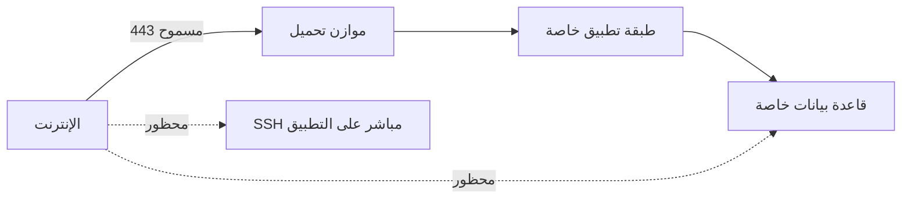

# المسار 4 · المرحلة 4.3 — الشبكة والتعرض

## لماذا هذه المرحلة مهمة

سوء تكوين الشبكة من أكثر أسباب حوادث السحابة شيوعاً: قواعد مجموعات أمان مفتوحة على مصراعيها، حاويات تخزين عامة عن طريق الخطأ، موازنات تحميل تعرض خدمات إدارة، وشبكات فرعية بلا مسارات مسيطر عليها إلى الإنترنت. في نموذج المسؤولية المشتركة، تقع ضوابط الشبكة التي تُكوّنها على العميل.

تعلّم هذه المرحلة التفكير في التعرض بنفس عقلية المناطق من المسار 3، مطبّقة على بنيات سحابية أو محاكية: ما يجب أن يكون عاماً، ما يجب أن يبقى خاصاً، وكيف تتحقق.

---

## أهداف التعلم

بنهاية هذه المرحلة ستكون قادراً على:

- تحديد أسطح الشبكة المعرّضة في مشروع سحابة مختبري أو محاكي
- تطبيق عقلية الافتراضي-الرفض على مجموعات الأمان / جدران النارية / قواعد الشبكة
- التمييز بين موارد يجب أن تكون عامة مقابل خاصة
- إنتاج قائمة تحقق تعرض قصيرة لحسابك التدريبي
- ربط قرارات التعرض بالهوية (المرحلة 4.2) والمراقبة (المرحلة 4.5)

---

## المتطلبات السابقة

- إكمال المرحلتين 4.1 و4.2
- مشروع أو جهاز افتراضي سحابي مختبري أو محاكي بضوابط شبكة قابلة للتكوين
- إلمام بمفاهيم التجزئة من المسار 3 مفيد

---

## نقطة تحقق السلامة

1. غيّر فقط موارد الشبكة في حسابات مختبرية أو طبقة مجانية أو محاكية.
2. تجنّب فتح منافذ إدارة (SSH، RDP، لوحات تحكم) على `0.0.0.0/0`.
3. التقط حالة التكوين قبل التغييرات حتى تتمكن من التراجع.
4. لا تختبر التعرض ضد موارد لا تملكها.

---

## المفاهيم الأساسية

### 1. ما يُعد «معرّضاً»

- قاعدة مجموعة أمان أو جدار ناري تسمح بوارد من الإنترنت إلى منفذ حساس
- مورد تخزين أو قاعدة بيانات بوصول عام أو وصول مصادق من أي مكان
- موازن تحميل أو بوابة API تنشر مساراً إدارياً دون قيود
- عنوان IP عام مرفق بمضيف كان يُقصد به أن يكون خاصاً فقط

### 2. الافتراضي-الرفض في السحابة

نفس مبدأ المرحلة 3.1:

- ابدأ بلا وصول وارد
- اسمح صراحة فقط بالتدفقات المطلوبة (مثلاً 443 من الإنترنت إلى موازن التحميل؛ SSH فقط من مضيف قفز أو نطاق IP معروف)
- فضّل الشبكات الفرعية الخاصة للأعباء التي لا تحتاج اتصالاً وارداً مباشراً

### 3. عام مقابل خاص

| نوع المورد | تفضيل مختبري نموذجي |
|-------------|----------------------|
| خادم ويب للواجهة / موازن تحميل | عام على 443 فقط |
| قاعدة بيانات، طابور، مخزن داخلي | خاص؛ لا عنوان IP عام |
| مضيف قفز / حصن | وصول وارد مقيّد بإحكام أو عبر VPN / نقطة نهاية خاصة |
| تخزين كائنات للتوزيع العام | عام فقط إن كان مقصوداً صراحة؛ وإلا خاص |

### 4. التحقق

بعد التكوين، تحقق من الخارج (من منظور الإنترنت أو من شبكة أخرى) ومن الداخل. أدوات مثل فحوصات المنافذ من مضيف بعيد مصرح، أو قوائم جرد موارد المزوّد، أو ماسحات تكوين بسيطة تساعد — فقط ضد مواردك.

---

## خريطة توضيحية: تعرض مقصود مقابل عرضي

---

## جولة مختبرية تفصيلية

1. جرد موارد الشبكة في مشروعك المختبري (مجموعات أمان، قواعد جدار ناري، عناوين IP عامة، حاويات بسياسات وصول).
2. لكل قاعدة واردة، اسأل: هل هذا مطلوب؟ من أي مصدر؟ إلى أي منفذ؟
3. شدّد قاعدة واحدة مفرطة الاتساع على الأقل (مثلاً استبدل `0.0.0.0/0` على SSH بمصدر قفز أو عطّل القاعدة).
4. أكد أن سير عمل المختبر المطلوب ما زال يعمل.
5. اكتب قائمة تحقق تعرض قصيرة: الموارد المعرّضة عمداً، تلك التي قُيّدت، وأي عناصر متبقية مفتوحة للمراجعة.

---

## الأخطاء الشائعة

- نسخ مجموعة أمان «سماح للكل» من درس تعليمي وتركها في مكانها.
- إرفاق عناوين IP عامة بقواعد بيانات أو مخازن داخلية للراحة.
- نسيان أن بعض خدمات التخزين لها ضوابط وصول منفصلة عن جدار ناري الشبكة الافتراضية.
- اختبار التعرض فقط من داخل نفس الشبكة، مما يفوّت الرؤية الخارجية الحقيقية.

---

## أفضل الممارسات

- ارفض افتراضياً؛ اسمح صراحة.
- أبقِ قواعد البيانات والمخازن الداخلية خاصة.
- قيّد منافذ الإدارة بشدة أو أزل التعرض العام تماماً.
- راجع التعرض كلما أُضيف مورد جديد.
- اربط تنبيهات التعرض بالتسجيل (المرحلة 4.5).

---

## تمرين عملي

1. أنتج قائمة تحقق تعرض لمشروعك المختبري أو المحاكي.
2. نفّذ تشديداً واحداً على الأقل ووثّق قبل/بعد.
3. لاحظ أي مورد ما زال أوسع مما تريد ولماذا.
4. احفظ قائمة التحقق للمشروع النهائي.

---

## أسئلة المراجعة

1. لماذا تقع ضوابط الشبكة التي تُكوّنها على العميل في نموذج المسؤولية المشتركة؟
2. أعطِ مثالاً على تعرض عرضي شائع في حساب تدريبي.
3. كيف تنطبق عقلية الافتراضي-الرفض على مجموعات الأمان؟
4. لماذا يجب أن تبقى قواعد البيانات خاصة في معظم تصاميم المختبر؟
5. ما الذي يجب التحقق منه بعد تشديد قاعدة شبكة؟

---

## الملخص

- سوء تكوين الشبكة سبب رائد لحوادث السحابة ويقع على العميل.
- الافتراضي-الرفض والتمييز الواضح بين العام والخاص يقللان التعرض.
- قائمة تحقق تعرض مختبرية ممارسة قابلة للتكرار تغذي خط الأساس النهائي.

---

## المصادر وقراءات إضافية

- أدلة شبكة وأمان المزوّد (مجموعات الأمان، جدران نارية VPC/VNet)
- المرحلة 3.1 (التجزئة والسياسة)
- المرحلة 4.1 (المسؤولية المشتركة)

يبقى كل العمل العملي مقيّداً ببيئات مختبرية أو طبقة مجانية أو محاكية مصرح بها فقط.
