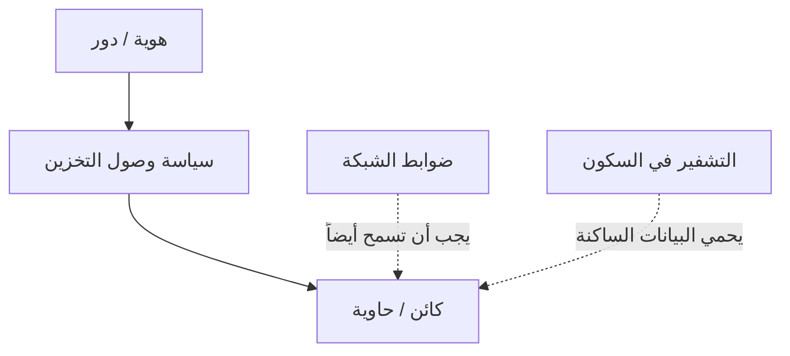

# المسار 4 · المرحلة 4.4 — التخزين والبيانات

## لماذا هذه المرحلة مهمة

غالباً ما تكون البيانات الهدف النهائي. سوء تكوين التخزين — حاويات عامة، تشفير في السكون معطّل، سياسات احتفاظ مفقودة، أذونات واسعة جداً — يحوّل حساب سحابة عادياً إلى مصدر تسريب. في نموذج المسؤولية المشتركة، يقع تصنيف البيانات واختيار التشفير وضوابط الوصول إلى كائنات التخزين بقوة على العميل.

تعلّم هذه المرحلة ممارسة خط أساس تخزين بسيط في بيئة مختبرية أو طبقة مجانية: من يمكنه القراءة/الكتابة، ما إذا كانت البيانات مشفرة في السكون، وما إذا كان الوصول العام مقصوداً.

---

## أهداف التعلم

بنهاية هذه المرحلة ستكون قادراً على:

- تحديد موارد التخزين في مشروع مختبري وتصنيفها (عامة مقصودة مقابل خاصة)
- التحقق من حالة التشفير في السكون حيث يعرض المزوّد الخيار
- مراجعة سياسات الوصول إلى التخزين لأذونات مفرطة أو عامة
- إنتاج خط أساس تخزين قصير لحسابك التدريبي
- ربط ضوابط التخزين بالهوية (4.2) والتعرض الشبكي (4.3)

---

## المتطلبات السابقة

- إكمال المراحل 4.1–4.3
- مورد تخزين واحد على الأقل في المختبر أو الطبقة المجانية (حاوية كائنات، قرص، مشاركة ملفات، أو قاعدة بيانات مُدارة)
- القدرة على قراءة سياسات الوصول وإعدادات التشفير

---

## نقطة تحقق السلامة

1. استخدم فقط موارد تخزين مختبرية أو تدريبية؛ لا بيانات إنتاج حقيقية.
2. لا تجعل حاوية عامة إلا إن كان التمرين يتطلب صراحة كائناً عاماً تجريبياً قصير العمر.
3. احذف الكائنات العامة التجريبية فوراً بعد التحقق.
4. احذف أي بيانات اعتماد من أسماء الكائنات أو البيانات الوصفية.

---

## المفاهيم الأساسية

### 1. أسئلة خط أساس التخزين

لكل مورد تخزين اسأل:

- من يمكنه قراءة أو كتابة أو حذف الكائنات؟
- هل الوصول العام مقصود أم حادث؟
- هل التشفير في السكون مفعّل (بمفتاح يديره المزوّد أو العميل)؟
- هل التشفير أثناء النقل مفروض للوصول؟
- ما سياسة الاحتفاظ / دورة الحياة إن وُجدت؟

### 2. عام مقابل خاص

| النية | التكوين النموذجي |
|-------|-------------------|
| خاص (افتراضي) | لا وصول مجهول؛ فقط هويات أو أدوار محددة |
| عام للقراءة (توزيع مقصود) | وصول قراءة مجهول فقط على بادئة أو كائنات محددة؛ لا كتابة عامة |
| عام عن طريق الخطأ | سياسة أو قائمة ACL تمنح `Everyone` أو `AllUsers` دون قصد |

### 3. التشفير في السكون

معظم المزوّدين يقدمون تشفيراً بمفتاح يديره المزوّد افتراضياً أو كخيار قابل للتبديل. تحقق من أنه مفعّل لموارد المختبر. إدارة مفاتيح العميل (CMK) موضوع متقدم؛ يكفي الوعي بوجود الخيار للمختبر.

### 4. العلاقة بالهوية والشبكة

- سياسات التخزين تشير غالباً إلى هويات (المرحلة 4.2).
- حتى الحاوية الخاصة يمكن أن تكون قابلة للوصول إن سمحت ضوابط الشبكة (المرحلة 4.3) بوصول غير مقيّد وسرقت بيانات الاعتماد.
- الدفاع المتعمق: هوية صحيحة + شبكة صحيحة + سياسة تخزين صحيحة.

---

## خريطة توضيحية: طبقات وصول التخزين

---

## جولة مختبرية تفصيلية

1. اسرد موارد التخزين في مشروعك المختبري.
2. لكل منها، سجّل: عام أم خاص، حالة التشفير في السكون، من لديه وصول.
3. أصلح أو وثّق قضية واحدة (مثلاً حاوية تُركت عامة، تشفير معطّل، سياسة أحرف بدل).
4. إن أنشأت كائناً عاماً تجريبياً، تحقق من الوصول ثم احذفه فوراً.
5. اكتب خط أساس تخزين قصير: قائمة الموارد، الحالة المقصودة، أي انحرافات متبقية.

---

## الأخطاء الشائعة

- ترك قوائم ACL العامة من دروس تعليمية في مكانها.
- افتراض أن «التشفير افتراضي» دون التحقق من المورد المحدد.
- منح صلاحيات كتابة واسعة لكيانات خدمة تحتاج قراءة فقط.
- تخزين أسرار في كائنات «خاصة» بأذونات هوية مفرطة الاتساع.

---

## أفضل الممارسات

- خاص افتراضياً؛ عام فقط عمداً ولفترة محدودة.
- فعّل التشفير في السكون لكل مورد تخزين تدريبي.
- نطاق سياسات التخزين بنفس انضباط سياسات الهوية.
- استخدم قواعد دورة الحياة لانتهاء صلاحية بيانات المختبر تلقائياً عندما يكون ذلك ممكناً.
- راقب أحداث الوصول إلى التخزين (المرحلة 4.5).

---

## تمرين عملي

1. أنتج خط أساس تخزين لمشروعك المختبري.
2. صحّح انحرافاً واحداً على الأقل (وصول عام، تشفير، أو سياسة).
3. وثّق قبل/بعد.
4. احفظ خط الأساس للمشروع النهائي.

---

## أسئلة المراجعة

1. لماذا يقع تكوين وصول التخزين عادة على العميل؟
2. ما الفرق بين حاوية عامة مقصودة وأخرى عامة عن طريق الخطأ؟
3. كيف يكمل التشفير في السكون ضوابط الوصول؟
4. لماذا ما زالت ضوابط الشبكة مهمة حتى للتخزين «الخاص»؟
5. ما الذي يجب فعله بكائن عام تجريبي بعد التحقق منه؟

---

## الملخص

- ضوابط التخزين والبيانات واجبات عميل في نموذج المسؤولية المشتركة.
- الخاص افتراضياً، التشفير مفعّل، السياسات محدودة النطاق تشكل خط أساس عملي.
- خط الأساس المختبري المنتَج هنا يغذي المشروع النهائي ومواقف تشغيلية لاحقة.

---

## المصادر وقراءات إضافية

- أدلة أمان التخزين للمزوّد (S3، Blob، Cloud Storage، إلخ)
- المرحلتان 4.2 و4.3
- مبادئ تصنيف البيانات (عالية المستوى)

يبقى كل العمل العملي مقيّداً ببيئات مختبرية أو طبقة مجانية أو محاكية مصرح بها فقط.
