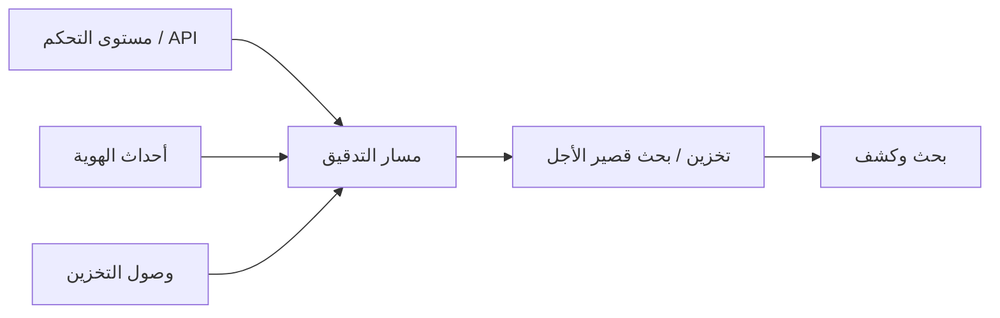

# المسار 4 · المرحلة 4.5 — التسجيل والكشف في السحابة

## لماذا هذه المرحلة مهمة

بدون سجلات، لا يمكنك اكتشاف إساءة استخدام الهوية أو تغييرات التعرض أو الوصول غير الطبيعي إلى التخزين. يوفّر مزوّدو السحابة مستويات تحكم وتدقيق وبيانات غنية — لكن يجب تفعيلها وتوجيهها والاحتفاظ بها ومراجعتها. في نموذج المسؤولية المشتركة، غالباً ما يقع تفعيل واستخدام تلك السجلات على العميل.

تربط هذه المرحلة مسار 2 (هندسة الكشف) بالسحابة: ما الذي يجب تسجيله في حساب تدريبي، وكيف تبحث عن إشارات عالية القيمة، وكيف تتجنب الفجوات الصامتة.

---

## أهداف التعلم

بنهاية هذه المرحلة ستكون قادراً على:

- تحديد مصادر السجلات السحابية الرئيسية ذات الصلة بالحسابات المختبرية (تدقيق مستوى التحكم، هوية، شبكة، تخزين)
- تفعيل أو تأكيد التسجيل لمشروع تدريبي واحد على الأقل
- البحث عن أحداث عالية القيمة (فشل مصادقة، تغييرات سياسة، وصول عام للتخزين)
- ربط إشارات السحابة بتصميم الكشف من المسار 2
- توثيق حد أدنى من مجموعة تسجيل لحسابك المختبري

---

## المتطلبات السابقة

- إكمال المراحل 4.1–4.4
- مرحلتا المسار 2 2.1–2.2 موصى بهما (مصادر السجلات والبحث)
- حساب مختبري أو طبقة مجانية يمكن فيه تفعيل سجلات التدقيق أو القراءة

---

## نقطة تحقق السلامة

1. فعّل التسجيل فقط في حسابات تتحكم بها.
2. تجنّب إرسال سجلات تدريبية تحتوي على بيانات حساسة إلى وجهات طرف ثالث غير مسيطر عليها.
3. احترم حدود التكلفة والحصص للطبقة المجانية؛ فضّل الاحتفاظ القصير في المختبر.
4. لا تستخدم سجلات المختبر كمبرر للوصول إلى سجلات إنتاج دون تفويض.

---

## المفاهيم الأساسية

### 1. فئات السجلات السحابية المفيدة

| الفئة | أمثلة | لماذا تهم |
|-------|--------|-----------|
| تدقيق مستوى التحكم | CloudTrail، Azure Activity، GCP Admin Activity | من غيّر ماذا في الحساب |
| الهوية والمصادقة | سجلات تسجيل الدخول، أحداث افتراض الأدوار | القوة الغاشمة، إساءة بيانات الاعتماد |
| الشبكة / التدفق | سجلات التدفق، سجلات جدار الناري | اتصال غير متوقع، مسح |
| التخزين / البيانات | سجلات وصول الحاويات، سجلات مفاتيح البيانات | قراءة/كتابة غير طبيعية، تعرض عام |
| DNS / اسم | استعلامات DNS إن وُجدت | اكتشاف قناة قيادة وتحكم أو تسريب |

### 2. التفعيل ليس اختيارياً

كثير من سجلات التدقيق القيمة معطّلة أو محتفظ بها لفترة قصيرة افتراضياً. خطوة المختبر الأولى: أكد أن مسار التدقيق لمستوى التحكم مفعّل ويغطي المنطقة/المشروع الذي تستخدمه.

### 3. إشارات عالية القيمة للمختبر

- فشل مصادقة أو وحدة تحكم متكررة
- إنشاء أو افتراض أدوار امتيازية
- تغييرات على مجموعات الأمان أو سياسات IAM أو سياسات الحاويات
- تمكين الوصول العام للتخزين
- إنشاء مفاتيح وصول جديدة أو بيانات اعتماد طويلة العمر

### 4. من السجل إلى الكشف

نفس دورة المسار 2 تنطبق: مصادر ← بحث ← تصميم كشف ← فرز ← ضبط. الفرق هو أن المصادر سحابية أصلية والحقول تتبع مخططات المزوّد.

---

## خريطة توضيحية: تدفق سجل سحابي مختبري

---

## جولة مختبرية تفصيلية

1. حدد خدمة تسجيل التدقيق لمزوّدك (أو مكافئ المحاكي).
2. أكد أنها مفعّلة للمشروع/المنطقة التدريبية؛ فعّلها إن لم تكن.
3. ولّد حدثين أو ثلاثة أحداث مسيطر عليها (تسجيل دخول، تغيير سياسة بسيط، سرد تخزين).
4. ابحث عن تلك الأحداث في واجهة السجلات أو التصدير.
5. اكتب استعلام بحث واحد عالي القيمة (مثلاً «كل تغييرات السياسة في آخر 24 ساعة» أو «فشل المصادقة»).
6. وثّق الحد الأدنى من مجموعة التسجيل: المصادر المفعّلة، الاحتفاظ، وجهات البحث.

---

## الأخطاء الشائعة

- افتراض أن التسجيل «يعمل فقط» دون التحقق من التفعيل.
- الاحتفاظ بالسجلات لوقت قصير جداً بحيث لا يمكن التحقيق في سيناريو مختبري متعدد الأيام.
- تسجيل كل شيء دون خطة مراجعة، مما يؤدي إلى تكلفة وضوضاء.
- تجاهل سجلات التخزين والهوية والتركيز فقط على الشبكة.

---

## أفضل الممارسات

- فعّل تدقيق مستوى التحكم مبكراً في أي حساب تدريبي.
- ابدأ بمجموعة صغيرة من الإشارات عالية القيمة؛ وسّع عمداً.
- وافق الاحتفاظ مع احتياجات التحقيق المختبري وقيود التكلفة.
- غذِّ أحداث السحابة إلى نفس عقلية الفرز المستخدمة في المسار 2.
- احمِ الوصول إلى السجلات نفسها (أقل امتياز على قراءة السجلات).

---

## تمرين عملي

1. أكّد أو فعّل التسجيل لمشروعك المختبري.
2. ولّد وابحث عن ثلاثة أحداث مسيطر عليها على الأقل.
3. أنتج وثيقة مجموعة تسجيل أدنى من صفحة واحدةحدة.
4. اكتب استعلام بحث عالي القيمة واحداً واحفظه للمشروع النهائي.

---

## أسئلة المراجعة

1. لماذا غالباً ما يقع تفعيل سجلات التدقيق السحابية على العميل؟
2. اذكر ثلاث فئات سجلات سحابية مفيدة بشكل خاص لكشف إساءة الهوية.
3. كيف تختلف دورة الكشف السحابية عن دورة قائمة على المضيف من المسار 2؟
4. ما خطر الاحتفاظ القصير جداً بالسجلات في مختبر؟
5. لماذا يجب حماية الوصول إلى السجلات نفسها بأقل امتياز؟

---

## الملخص

- التسجيل السحابي ضابط عميل يجب تفعيله عمداً.
- تدقيق مستوى التحكم والهوية والشبكة والتخزين تشكل مجموعة أدنى قوية.
- البحث عن إشارات عالية القيمة يربط المسار 4 بالمسار 2.
- مجموعة التسجيل المنتَجة هنا جزء مطلوب من خط أساس المشروع النهائي.

---

## المصادر وقراءات إضافية

- أدلة تسجيل وتدقيق المزوّد
- المسار 2 (مصادر السجلات وتصميم الكشف)
- المرحلة 4.1 (المسؤولية المشتركة)

يبقى كل العمل العملي مقيّداً ببيئات مختبرية أو طبقة مجانية أو محاكية مصرح بها فقط.
