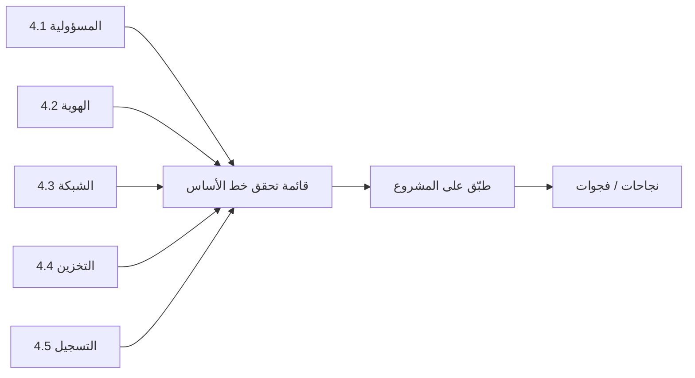

# المسار 4 · المرحلة 4.6 — قائمة تحقق خط الأساس الآمن

## لماذا هذه المرحلة مهمة

تحوّل قائمة تحقق خط أساس الضوابط المتفرقة من المراحل 4.1–4.5 إلى معيار قابل للتكرار يمكنك تطبيقه على كل مشروع سحابي أو محاكي جديد. بدونها، يُعاد اكتشاف نفس سوء التكوين في كل حساب تدريبي. مع قائمة تحقق قصيرة واعية بالمسؤولية، يصبح الإعداد الآمن عادة بدلاً من بطولة لمرة واحدة.

---

## أهداف التعلم

بنهاية هذه المرحلة ستكون قادراً على:

- تجميع قائمة تحقق خط أساس آمن موجزة تغطي المسؤولية والهوية والشبكة والتخزين والتسجيل
- تطبيق القائمة على مشروع مختبري أو طبقة مجانية واحد
- تسجيل النجاحات والفجوات بأدلة
- تنقيح القائمة بناءً على ما هو عملي فعلاً في بيئتك
- إعداد قائمة التحقق كقطعة أثرية قابلة لإعادة الاستخدام للمشروع النهائي

---

## المتطلبات السابقة

- إكمال المراحل 4.1–4.5
- مشروع سحابي أو محاكي مختبري واحد على الأقل لتقييمه
- ملاحظات وأدلة من المراحل السابقة

---

## نقطة تحقق السلامة

1. طبّق قائمة التحقق فقط على موارد تتحكم بها.
2. فضّل التغييرات القابلة للعكس والتوثيق على التعطيل العدواني.
3. لا تستخدم قائمة التحقق لتبرير تغييرات إنتاج دون مراقبة تغيير.

---

## المفاهيم الأساسية

### 1. هيكل قائمة تحقق عملية

| القسم | عناصر مثال |
|--------|-------------|
| المسؤولية | تقسيم مكتوب للخدمة قيد الاستخدام |
| الهوية | لا استخدام يومي للجذر؛ أدوار محدودة النطاق؛ لا مفاتيح طويلة العمر غير ضرورية |
| الشبكة | افتراضي-رفض؛ لا إدارة على `0.0.0.0/0`؛ خاص حيث يُقصد |
| التخزين | خاص افتراضياً؛ تشفير في السكون مفعّل؛ لا ACL عامة عرضية |
| التسجيل | تدقيق مستوى التحكم مفعّل؛ احتفاظ محدد؛ استعلام بحث عالي القيمة واحد على الأقل |
| عام | علامات/تسمية موارد؛ لا بيانات إنتاج في الحساب التدريبي |

### 2. دليل لكل عنصر

عنصر قائمة تحقق دون دليل مجرد أمل. لكل صف سجّل: مطابق / غير مطابق / غير منطبق، وملاحظة قصيرة أو لقطة شاشة أو مرجع أمر.

### 3. التنقيح

قوائم التحقق الأولى صارمة جداً أو فضفاضة جداً. بعد تطبيق واحد، عدّل الصياغة حتى تكون قابلة للتنفيذ في ساعة واحدة من وقت المختبر لمشروع صغير.

---

## خريطة توضيحية: من الضوابط إلى قائمة التحقق

---

## جولة مختبرية تفصيلية

1. اكتب أو انسخ قائمة تحقق من 10–15 عنصراً تغطي الأقسام أعلاه.
2. طبّقها على مشروعك المختبري الأساسي سطراً بسطر.
3. سجّل مطابق / غير مطابق / غير منطبق مع دليل موجز.
4. أصلح عنصرين غير مطابقين على الأقل إن كان ذلك آمناً وسريعاً.
5. نقّح صياغة أي عنصر كان غامضاً أو غير عملي.
6. احفظ قائمة التحقق المعبأة كقالب للمشروع التالي.

---

## الأخطاء الشائعة

- قائمة تحقق طويلة جداً لدرجة أن لا أحد يشغّلها.
- عناصر دون معايير نجاح قابلة للقياس.
- تعليم كل شيء «مطابق» دون دليل.
- نسيان قسم التسجيل أو المسؤولية.

---

## أفضل الممارسات

- أبقِ قائمة التحقق قصيرة بما يكفي للتشغيل في جلسة مختبرية واحدة.
- اطلب دليلاً لكل صف.
- أعد تشغيلها كلما أُنشئ مشروع تدريبي جديد.
- وافقها مع مصفوفة المسؤولية المشتركة للخدمات التي تستخدمها فعلياً.

---

## تمرين عملي

1. أنتج قائمة تحقق خط أساس آمن معبأة لمشروعك المختبري.
2. ضمّن عمود دليل لكل عنصر.
3. أصلح فجوة واحدة على الأقل أثناء التمرين.
4. احفظ قائمة التحقق المنقحة للمشروع النهائي.

---

## أسئلة المراجعة

1. لماذا قائمة تحقق قصيرة قابلة للتكرار أكثر قيمة من معيار موسوعي غير مستخدم؟
2. ما الذي يجب أن يصاحب كل عنصر قائمة تحقق؟
3. أي أقسام من المسار 4 يجب أن تظهر في خط الأساس؟
4. متى يجب إعادة تشغيل قائمة التحقق؟
5. كيف تمنع قائمة التحقق المعبأة تكرار سوء التكوين عبر مشاريع تدريبية؟

---

## الملخص

- تحوّل قائمة تحقق خط الأساس التعلم إلى معيار قابل للتطبيق.
- تغطي المسؤولية والهوية والشبكة والتخزين والتسجيل الحد الأدنى القابل للتطبيق.
- قائمة التحقق المعبأة والمنقحة هي المخرج الأساسي قبل المشروع النهائي.

---

## المصادر وقراءات إضافية

- معايير CIS لأساس السحابة (مفاهيمية؛ تكييف مختبري)
- مراحل المسار 4 4.1–4.5
- معايير تقوية المسار 3 (للتوازي)

يبقى كل العمل العملي مقيّداً ببيئات مختبرية أو طبقة مجانية أو محاكية مصرح بها فقط.
