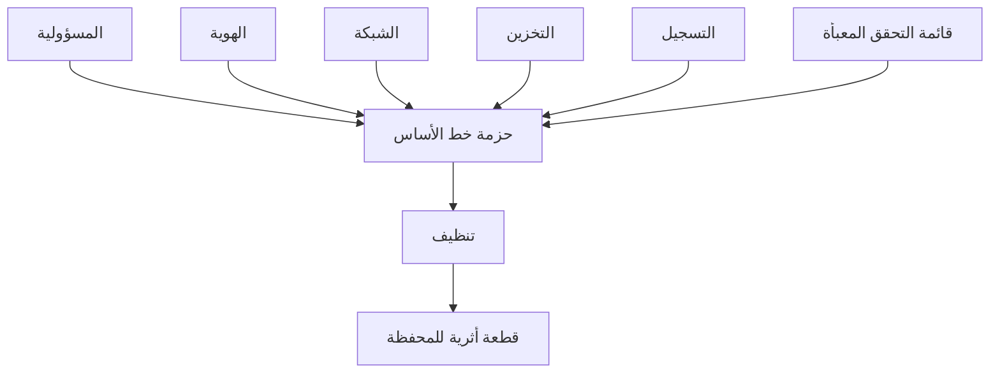

# المسار 4 · المرحلة 4.7 — مشروع ختامي: قائمة تحقق سحابة

## لماذا هذه المرحلة مهمة

يجمع المشروع النهائي المسار 4 في قطعة أثرية واحدة للمحفظة: تقسيم مسؤولية واضح، وضوابط هوية وشبكة وتخزين مطبّقة، وتسجيل مفعّل، وقائمة تحقق خط أساس معبأة بأدلة. يُظهر أنك تستطيع تأمين مشروع سحابي أو محاكي صغير عمداً وليس بالصدفة.

---

## أهداف التعلم

بنهاية هذه المرحلة ستكون قادراً على:

- تسليم حزمة خط أساس سحابي كاملة لمشروع مختبري أو طبقة مجانية واحد
- تضمين أدلة لكل منطقة ضابط رئيسية
- تسجيل المخاطر والفجوات المتبقية بصدق
- تأكيد التنظيف (إزالة هويات تجريبية، كائنات عامة، مفاتيح)
- تقديم الحزمة بحيث يتمكن ممارس آخر من إعادة تطبيق نفس الشريط

---

## المتطلبات السابقة

- إكمال المراحل 4.1–4.6
- مشروع سحابي أو محاكي مختبري واحد كهدف
- قوائم تحقق وأدلة من مراحل سابقة

---

## نقطة تحقق السلامة

1. يبقى كل العمل داخل حسابات تدريبية تتحكم بها.
2. لا بيانات إنتاج أو أسرار في الحزمة النهائية.
3. أزل الهويات التجريبية والكائنات العامة ومفاتيح الوصول طويلة العمر المُنشأة للتدريب.
4. وثّق حالة الحساب بعد التنظيف.

---

## هيكل المخرج المطلوب

### 1. العنوان والنطاق

- اسم المشروع والتاريخ
- المزوّد / المحاكي ومعرّف المشروع
- بيان «تدريبي / مختبري فقط»

### 2. تقسيم المسؤولية

- جدول من المرحلة 4.1 للخدمة (الخدمات) المستخدمة
- أي تصحيحات لافتراضات سابقة

### 3. الهوية وأقل امتياز

- الهويات/الأدوار المستخدمة
- دليل على نطاق محدود (لا جذر يومي، لا أحرف بدل غير ضرورية)
- أي مفاتيح طويلة العمر متبقية ولماذا (أو تأكيد الإزالة)

### 4. الشبكة والتعرض

- قائمة تحقق تعرض معبأة
- تشديد واحد على الأقل مع قبل/بعد
- تأكيد عدم وجود منافذ إدارة مفتوحة على العالم دون قصد

### 5. التخزين والبيانات

- موارد التخزين وحالتها (خاص، تشفير)
- أي إصلاحات وصول عام

### 6. التسجيل والكشف

- مصادر مفعّلة
- احتفاظ
- استعلام بحث عالي القيمة واحد على الأقل مع نتيجة مثال (محذوفة)

### 7. قائمة تحقق خط الأساس (معبأة)

- القائمة الكاملة من المرحلة 4.6 مع مطابق/غير مطابق/غير منطبق والدليل

### 8. المخاطر المتبقية والخطوات التالية

- فجوات صادقة
- إجراءات تالية ذات أولوية

### 9. تأكيد التنظيف

- ما أُزيل أو عُطّل
- حالة الحساب النهائية

---

## شريط الجودة

يجب أن يتمكن قارئ من:

- فهم ما يُؤمَّن ومن المسؤول
- رؤية أدلة ملموسة وليس ادعاءات عامة فقط
- إعادة تطبيق نفس قائمة التحقق على مشروع صغير آخر
- الثقة بأن المواد التدريبية لم تترك تعرضات خلفها

---

## خريطة توضيحية: تجميع المشروع النهائي

---

## المخرج العملي

1. جمّع كل الأقسام أعلاه من ملاحظاتك السابقة.
2. املأ أي فجوات بأدلة مختبرية جديدة إن لزم.
3. نفّذ التنظيف.
4. احفظ الحزمة كوثيقة واحدة في مجلد محفظتك.

---

## فحص ذاتي قبل التسليم

- [ ] تقسيم المسؤولية موجود
- [ ] أدلة هوية وشبكة وتخزين وتسجيل موجودة
- [ ] قائمة التحقق المعبأة مضمّنة
- [ ] المخاطر المتبقية مدرجة
- [ ] التنظيف مؤكد
- [ ] لا أسرار في الوثيقة

---

## الملخص

- مشروع المسار 4 النهائي هو خط أساس سحابي كامل وقابل للإثبات لمشروع تدريبي واحد.
- الأدلة والتنظيف والصدق حول الفجوات أهم من الكمال.
- الحزمة تنتقل إلى إعداد سحابة مهني تحت ضوابط وحوكمة مناسبة.

---

## المصادر وقراءات إضافية

- كل مراحل المسار 4 السابقة
- معايير CIS لأساس السحابة (مفاهيمية)
- ممارسات سلامة المختبر في الطور 2

يبقى كل العمل العملي مقيّداً ببيئات مختبرية أو طبقة مجانية أو محاكية مصرح بها فقط. إكمال هذا المسار لا يُخوّل تغييرات في حسابات سحابة إنتاج دون تفويض ومراقبة تغيير.
