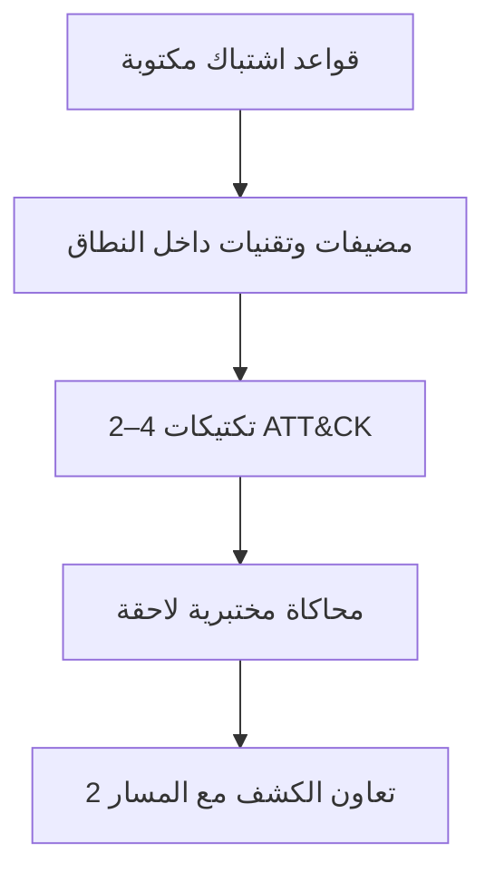

# المسار 5 · المرحلة 5.1 — ربط الهجوم والنطاق

## لماذا هذه المرحلة مهمة

تبدأ محاكاة الخصم المصرح بها (وأي شكل من تمارين الفريق البنفسجي) بحدود مكتوبة. بدون قواعد اشتباك واضحة (RoE)، حتى النشاط المختبري حسن النية يمكن أن ينحرف إلى منطقة غير آمنة أو غير مصرح بها. ثم يوفر ربط النشاط المخطط بتكتيكات ATT&CK مفردات مشتركة مع المدافعين (المسار 2) ويبقي التمرين مركزاً على سلوكيات قابلة للملاحظة والمناقشة بدلاً من «اختراق» مفتوح.

تنتج هذه المرحلة قواعد الاشتباك وخريطة التكتيكات عالية المستوى التي تحكم كل محاكاة مختبرية لاحقة في المسار.

---

## أهداف التعلم

بنهاية هذه المرحلة ستكون قادراً على:

- كتابة قواعد اشتباك مختبرية من صفحة واحدةحدة تحدد الأنظمة داخل النطاق والتقنيات المسموحة وظروف التوقف والاستثناءات الصريحة
- استخدام تكتيكات ATT&CK كتسميات تواصل (لا كمنتج استخبارات تهديدات كامل)
- تأكيد أن المحاكاة المخططة تبقى داخل حدود المختبر وقواعد سلامة المنهج
- إنتاج ربط قصير للسيناريو المختبري المقصود بـ 2–4 تكتيكات ATT&CK

---

## المتطلبات السابقة

- الطور 2 ومسار طور 3 آخر واحد على الأقل موصى به (خاصة المسار 2 للتعاون في الكشف)
- البيئة المختبرية ما زالت معزولة وتحت سيطرتك
- إلمام بمصفوفة ATT&CK Enterprise على مستوى التكتيك

---

## نقطة تحقق السلامة (غير قابلة للتفاوض)

1. **فقط أنظمة مختبرية تملكها أو لديك إذن كتابي صريح باختبارها.**
2. لا أهداف مواجهة للإنترنت، لا أنظمة طرف ثالث، لا بيئات إنتاج.
3. يجب تعريف ظروف التوقف مسبقاً (مثلاً: «توقف إن اتُصل بأي مضيف غير مختبري»، «توقف إن غادرت البيانات شبكة المختبر»).
4. لقطات قبل أي محاكاة قد تغيّر حالة المختبر.
5. عند الشك في النطاق — توقف وأعد التأكيد كتابياً.

هذا المسار لا يخوّل أبداً عمليات غير مصرح بها في العالم الحقيقي.

---

## المفاهيم الأساسية

### 1. قواعد الاشتباك (RoE) — الحد الأدنى

يجب أن تتضمن قواعد اشتباك مختبرية من صفحة واحدةحدة:

| القسم | المحتوى |
|--------|----------|
| الأنظمة داخل النطاق | أسماء المضيفات/IP، أسماء التطبيقات، الشبكات بالضبط |
| خارج النطاق صراحة | كل شيء آخر (الإنترنت، شبكات أخرى، حسابات سحابة إنتاج، إلخ) |
| التقنيات المسموحة | فئات عالية المستوى (مسح، مصادقة ضد حسابات مختبر، أنماط وصول أولي مدرجة، إلخ) |
| التقنيات المحظورة | DoS، تدمير، تصيد ضد بشر حقيقيين، مغادرة المختبر، إلخ |
| ظروف التوقف | محفزات فورية لإيقاف النشاط |
| جهات الاتصال / التصعيد | من يُبلَّغ إن حدث شيء غير متوقع |
| اللقطات والتنظيف | الالتزام بالاستعادة بعد التمرين |

### 2. تكتيكات ATT&CK كتسميات

استخدم أسماء التكتيكات (الوصول الأولي، التنفيذ، الاستمرارية، تصعيد الامتياز، الدفاع عن التملص، الوصول إلى بيانات الاعتماد، الاكتشاف، الحركة الجانبية، الجمع، التسريب، الأثر) للتواصل مع المدافعين. معرّفات التقنيات الاختيارية مفيدة لكنها ليست مطلوبة لهذه المرحلة.

### 3. لماذا يسبق النطاق التنفيذ

بدون نطاق مكتوب:

- من السهل «مجرد فحص منفذ آخر» خارج المختبر.
- لا يملك المدافعون صورة واضحة لما يجب أن يكتشفوه.
- يصبح التنظيف غير محدد.

النطاق أولاً؛ الإجراءات ثانياً.

---

## خريطة توضيحية: من النطاق إلى التكتيكات

---

## جولة مختبرية تفصيلية

1. اسرد المضيفات والتطبيقات المختبرية الدقيقة التي ستشارك في المحاكاة.
2. اكتب قواعد اشتباك من صفحة واحدةحدة باستخدام الجدول أعلاه.
3. اختر سيناريو عالي المستوى (مثلاً: استطلاع ← مصادقة فاشلة/ناجحة ← اكتشاف بسيط على المضيف).
4. اربط ذلك السيناريو بـ 2–4 تكتيكات ATT&CK.
5. راجع قواعد الاشتباك مقابل نقطة تحقق السلامة؛ أصلح أي غموض.
6. احفظ قواعد الاشتباك والربط؛ يحكمان المراحل 5.2–5.6.

---

## الأخطاء الشائعة

- قواعد اشتباك غامضة («المختبر كله») دون مضيفات مسمّاة.
- نسيان ظروف التوقف.
- تخطيط تقنيات تتطلب مغادرة شبكة المختبر.
- استخدام ATT&CK كقائمة مهام استغلال بدلاً من مفردات تواصل.

---

## أفضل الممارسات

- اكتب النطاق قبل تشغيل أي أداة.
- أبقِ قائمة التكتيكات قصيرة ومرتبطة بما ستلاحظه فعلياً.
- شارك قواعد الاشتباك مع أي شريك فريق بنفسجي (مسار 2) قبل البدء.
- أعد تأكيد النطاق إن تغيّر السيناريو.

---

## تمرين عملي

1. أنتج قواعد اشتباك مختبرية من صفحة واحدةحدة لسيناريو محاكاة واحد.
2. اربط السيناريو بـ 2–4 تكتيكات ATT&CK.
3. أكّد أن كل تقنية مخططة تبقى داخل الحدود المكتوبة.
4. احفظ كلا الوثيقتين للمشروع النهائي.

---

## أسئلة المراجعة

1. لماذا تُعد قواعد الاشتباك المكتوبة إلزامية قبل محاكاة الخصم المختبرية؟
2. ما الذي يجب أن تتضمنه ظروف التوقف؟
3. كيف يحسّن ربط التكتيكات التواصل مع المدافعين؟
4. لماذا «المختبر كله» نطاق ضعيف؟
5. ماذا تفعل إن أصبحت غير متأكد مما إذا كان هدف ما داخل النطاق؟

---

## الملخص

- النطاق المكتوب وقواعد الاشتباك غير قابلين للتفاوض.
- تسميات تكتيكات ATT&CK توفر لغة مشتركة مع المسار 2.
- قواعد الاشتباك وخريطة التكتيكات المنتَجتان هنا تحكمان بقية المسار 5.

---

## المصادر وقراءات إضافية

- مصفوفة MITRE ATT&CK Enterprise (مستوى التكتيك)
- قواعد سلامة المختبر في الطور 2
- نظرة عامة على المسار 2 (مفردات الكشف)

يبقى كل العمل العملي مقيّداً ببيئات مختبرية مصرح بها فقط. هذا المسار لا يخوّل أي نشاط غير مصرح به.
