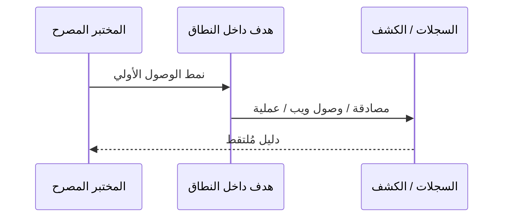

# المسار 5 · المرحلة 5.2 — أنماط الوصول الأولي في المختبر

## لماذا هذه المرحلة مهمة

الوصول الأولي هو اللحظة التي يحصل فيها الخصم (أو المختبر المصرح) على موطئ قدم. في بيئة مختبرية تمارس أنماطاً محدودة وآمنة وقابلة للملاحظة — بيانات اعتماد صالحة ضد حسابات مختبر، استغلال تطبيقات تدريبية مقصودة، أو إساءة خدمات معرّضة داخل النطاق — حتى يتمكن المدافعون من رؤية نفس السلوك ومناقشته.

الهدف ليس «اختراق أي شيء»؛ بل تنفيذ نمط وصول أولي واحد داخل النطاق موثّق في قواعد الاشتباك (المرحلة 5.1) وجعله قابلاً للملاحظة للكشف.

---

## أهداف التعلم

بنهاية هذه المرحلة ستكون قادراً على:

- اختيار نمط وصول أولي واحد مسموح به صراحة في قواعد الاشتباك الخاصة بك
- تنفيذه فقط ضد أهداف مختبرية داخل النطاق
- التقاط الأدلة (سجلات، لقطات شاشة، مخرج أدوات) التي تثبت الوصول
- وصف النمط من حيث تكتيك ATT&CK «الوصول الأولي»
- التنسيق مع شريك كشف (إن وُجد) حول ما يجب أن يُرى

---

## المتطلبات السابقة

- إكمال المرحلة 5.1 (قواعد الاشتباك وخريطة التكتيكات مكتوبة)
- أهداف مختبرية داخل النطاق ما زالت متاحة (تطبيق تدريبي، خدمة مصادقة، إلخ)
- لقطات مأخوذة قبل النشاط

---

## نقطة تحقق السلامة

1. فقط الأنماط المدرجة في قواعد الاشتباك الخاصة بك.
2. فقط المضيفات/التطبيقات داخل النطاق.
3. لا تصيد ضد بشر حقيقيين، لا استغلال يوم صفر ضد أنظمة غير تدريبية، لا مغادرة المختبر.
4. توقف فوراً عند أي ظرف توقف.
5. استعد اللقطات بعد التمرين إن تغيّرت الحالة.

---

## المفاهيم الأساسية

### 1. أنماط وصول أولي مختبرية مناسبة

| النمط | مثال مختبري | ملاحظة |
|--------|--------------|---------|
| بيانات اعتماد صالحة | دخول SSH/RDP/ويب بحساب مختبري معروف | غالباً الأبسط والأكثر قابلية للملاحظة |
| استغلال تطبيق تدريبي | تحدي DVWA / Juice Shop / WebGoat المقصود | يبقى داخل تطبيق التدريب |
| خدمة معرّضة ضعيفة | خدمة مختبرية ضعيفة عمداً داخل النطاق | فقط إن سمحت قواعد الاشتباك |
| إعادة استخدام رمز / جلسة | إعادة استخدام جلسة مختبرية مُلتقطة داخل المختبر | مسيطر عليه وموثّق |

تجنّب الأنماط التي تتطلب هندسة اجتماعية لأشخاص حقيقيين أو أهدافاً خارج قواعد الاشتباك.

### 2. القابلية للملاحظة أولاً

كل وصول أولي يجب أن يترك أدلة يمكن للمدافع البحث عنها:

- أحداث مصادقة
- سجلات وصول ويب
- تنبيهات IDS إن وُجدت
- إنشاء عمليات على المضيف

إن لم ينتج النمط أدلة، فائدته للفريق البنفسجي منخفضة.

### 3. توثيق النمط

بعد التنفيذ سجّل:

- الهدف والوقت
- النمط المستخدم
- الدليل المُلتقط
- تكتيك ATT&CK (الوصول الأولي)
- ما إذا لاحظ شريك الكشف (إن وُجد) ذلك

---

## خريطة توضيحية: وصول أولي مختبري ← دليل

---

## جولة مختبرية تفصيلية

1. أعد قراءة قواعد الاشتباك؛ أكد النمط والهدف المسموحين.
2. التقط لقطة للهدف إن لم تكن حديثة.
3. نفّذ نمط وصول أولي واحداً (مثلاً دخول ناجح بحساب مختبري بعد إخفاقات قليلة).
4. التقط أدلة من جانب المهاجم والمدافع (سجلات، شاشة).
5. أكّد أن النشاط بقي داخل النطاق.
6. وثّق النمط والأدلة وتسمية التكتيك.
7. أبلغ شريك الكشف (إن وُجد) أو سجّل ما كان يجب أن يُرى.

---

## الأخطاء الشائعة

- تجربة نمط «مثير» غير مدرج في قواعد الاشتباك.
- نسيان التقاط الأدلة من جانب المدافع.
- استخدام حسابات إنتاج أو أهداف خارج المختبر عن طريق الخطأ.
- الفشل في الاستعادة بعد تغييرات الحالة.

---

## أفضل الممارسات

- اجعل الوصول الأولي بسيطاً وقابلاً للتكرار وقابلاً للملاحظة.
- فضّل الأنماط التي تولّد سجلات مصادقة أو ويب واضحة.
- نسّق مع المسار 2 حتى يمكن اختبار الكشوفات مقابل نفس النشاط.
- وثّق كل شيء فوراً.

---

## تمرين عملي

1. نفّذ نمط وصول أولي واحداً داخل النطاق بموجب قواعد الاشتباك الخاصة بك.
2. التقط أدلة من الجانبين.
3. اكتب ملخصاً من فقرة قصيرة مع تسمية التكتيك.
4. احفظه للمشروع النهائي.

---

## أسئلة المراجعة

1. لماذا تُفضَّل القابلية للملاحظة على التعقيد في الوصول الأولي المختبري؟
2. ما الذي يجعل نمط وصول أولي غير مناسب لهذا المسار؟
3. كيف يدعم توثيق الوصول الأولي حلقة الفريق البنفسجي؟
4. ماذا تفعل قبل تنفيذ النمط؟
5. أي تكتيك ATT&CK يُطبَّق عادة على هذه المرحلة؟

---

## الملخص

- الوصول الأولي المختبري محدود بقواعد الاشتباك ومركّز على الأدلة.
- نمط واحد قابل للملاحظة أفضل من عدة أنماط غير موثّقة.
- الأدلة والربط المنتَجان هنا يغذيان الاكتشاف والفريق البنفسجي لاحقاً.

---

## المصادر وقراءات إضافية

- المرحلة 5.1 (قواعد الاشتباك)
- تكتيك الوصول الأولي في ATT&CK
- ممارسات المصادقة والويب في المسار 1 والمسار 2

يبقى كل العمل العملي مقيّداً ببيئات مختبرية مصرح بها فقط.
