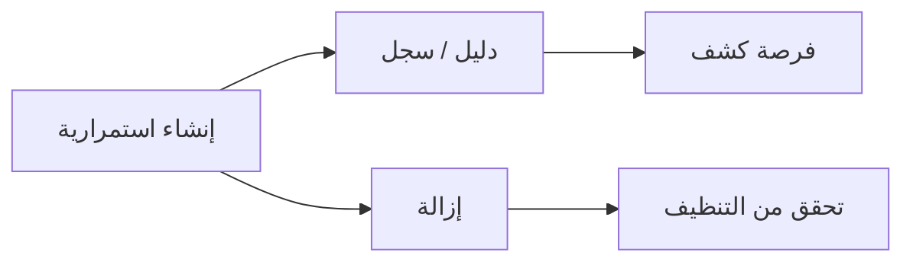

# المسار 5 · المرحلة 5.4 — فئات الاستمرارية

## لماذا هذه المرحلة مهمة

تسمح الاستمرارية للخصم بالاحتفاظ بالوصول عبر إعادة التشغيل أو إنهاء الجلسة. في المختبر تدرس *فئات* آليات الاستمرارية (مهام مجدولة، خدمات، مفاتيح تشغيل، حسابات جديدة، إلخ) وتمارس مثالاً واحداً غير تدميري وقابلاً للعكس فقط داخل النطاق، حتى يتمكن المدافعون من ممارسة اكتشافه وإزالته.

التركيز على الفئات والقابلية للملاحظة والتنظيف — لا على بناء استمرارية خفية قوية.

---

## أهداف التعلم

بنهاية هذه المرحلة ستكون قادراً على:

- سرد فئات استمرارية شائعة ذات صلة بمضيفات مختبرية
- تنفيذ مثال استمرارية واحد بسيط وقابل للعكس مسموح به في قواعد الاشتباك
- التقاط أدلة على الإنشاء والتنفيذ
- ربط النشاط بتكتيك ATT&CK «الاستمرارية»
- إزالة آلية الاستمرارية بالكامل والتحقق من التنظيف

---

## المتطلبات السابقة

- إكمال المراحل 5.1–5.3
- وصول إلى مضيف مختبري داخل النطاق حيث تسمح قواعد الاشتباك بتغييرات استمرارية محدودة
- لقطات قبل أي تغيير

---

## نقطة تحقق السلامة

1. فقط الفئات والآليات المسموحة في قواعد الاشتباك.
2. فقط على مضيفات داخل النطاق.
3. لقطة إلزامية قبل إنشاء أي استمرارية.
4. يجب إزالة كل استمرارية والتحقق منها قبل إنهاء الجلسة.
5. لا استمرارية عبر إعادة تشغيل تبقى بعد التمرين دون توثيق صريح وموافقة.

---

## المفاهيم الأساسية

### 1. فئات استمرارية شائعة (مختبرية)

| الفئة | مثال Linux | مثال Windows |
|--------|-------------|---------------|
| مهمة مجدولة | crontab، مؤقتات systemd | Scheduled Task |
| خدمة / شيطان | وحدة systemd بسيطة | خدمة Windows |
| تشغيل عند تسجيل الدخول | ملفات shell profile (بحذر) | مفتاح Run في السجل |
| حساب جديد | مستخدم مختبري مقصود | مستخدم محلي (إن سمحت قواعد الاشتباك) |
| وظيفة ويب / تطبيق | سكربت بسيط في تطبيق تدريبي | — |

اختر الأبسط والأكثر قابلية للملاحظة.

### 2. القابلية للعكس والقابلية للملاحظة

- يجب أن تتمكن من إزالة الآلية بالكامل.
- يجب أن تترك آثاراً في السجلات أو جداول المهام أو قوائم الخدمات التي يمكن للمدافع العثور عليها.

### 3. التوثيق

سجّل: ما أُنشئ، متى، كيف يُطلَق، كيف أُزيل، وأدلة قبل/بعد.

---

## خريطة توضيحية: إنشاء استمرارية ← كشف ← إزالة

---

## جولة مختبرية تفصيلية

1. التقط لقطة.
2. اختر فئة واحدة مسموحة في قواعد الاشتباك (مثلاً مهمة مجدولة تطبع رسالة أو تلمس ملفاً).
3. أنشئ الآلية؛ التقط دليل الإنشاء.
4. حفّزها مرة واحدة؛ التقط دليل التنفيذ.
5. أزل الآلية بالكامل.
6. تحقق من أن المهمة/الخدمة/المستخدم لم يعد موجوداً.
7. وثّق الدورة وربط تكتيك الاستمرارية.

---

## الأخطاء الشائعة

- إنشاء استمرارية دون لقطة.
- نسيان الإزالة وترك باب خلفي مختبري خلفك.
- اختيار آليات معقدة جداً للتحقق من الكشف.
- الاستمرارية على مضيف خارج النطاق.

---

## أفضل الممارسات

- بسيط، قابل للملاحظة، قابل للعكس.
- لقطة ← إنشاء ← دليل ← إزالة ← تحقق.
- نسّق مع المدافعين حول ما يجب أن يُنبَّه.
- لا تترك استمرارية «للمرة القادمة» دون توثيق.

---

## تمرين عملي

1. نفّذ دورة استمرارية واحدة كاملة (إنشاء، دليل، إزالة، تحقق).
2. اكتب ملخصاً قصيراً مع تسمية التكتيك.
3. احفظه للمشروع النهائي.

---

## أسئلة المراجعة

1. لماذا القابلية للعكس ضرورية في الاستمرارية المختبرية؟
2. اذكر ثلاث فئات استمرارية مناسبة للمختبر.
3. كيف يمكن للمدافعين ملاحظة المهام المجدولة الجديدة؟
4. أي تكتيك ATT&CK يُطبَّق؟
5. ماذا تفعل قبل إنشاء أي استمرارية؟

---

## الملخص

- تُدرَّس فئات الاستمرارية بمثال واحد نظيف وقابل للعكس.
- الأدلة والتنظيف غير قابلين للتفاوض.
- الدورة الموثّقة تغذي تقرير الفريق البنفسجي النهائي.

---

## المصادر وقراءات إضافية

- تكتيك الاستمرارية في ATT&CK
- المرحلة 5.1 (قواعد الاشتباك)
- ممارسات تقوية المضيف في المسار 3

يبقى كل العمل العملي مقيّداً ببيئات مختبرية مصرح بها فقط.
